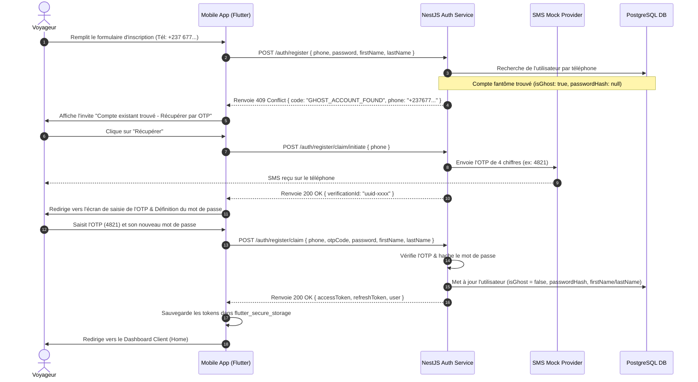
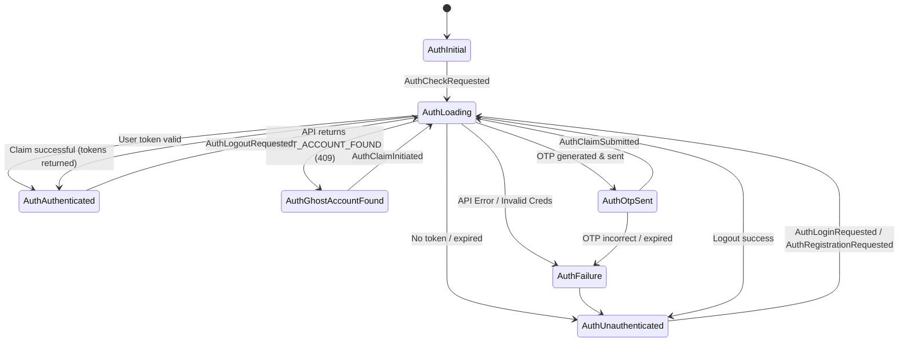

# OPEP Mobile — Authentication Design & Specifications (Flutter)

This document details the design specifications, UX/UI blueprints, and Dart BLoC state machine implementation for user authentication, registration, profiles, and the **OTP Claim Ghost Account Flow** within the OPEP mobile application.

---

## 1. Authentication Specifications Analysis

Based on the OPEP functional specifications (`cahier_de_charge (2).md`) and technical specs (`OPEP_CLAUDE (1).md`), the authentication system revolves around these core rules:

1. **Identity Key**: The primary unique identifier for client/passenger accounts is the phone number, formatted in the E.164 standard (e.g., `+237XXXXXXXXX` for Cameroon).
2. **Ghost Accounts (`isGhost: true`)**: 
   * When a passenger without a smartphone or internet access purchases a ticket physically at a center's ticket desk, a caissier (`CASHIER`) creates an account for them.
   * This account is created with `isGhost: true` and `passwordHash: null`. It stores the passenger's phone number, name (`firstName`, `lastName`), and optional CNI card number.
3. **The Claim Flow (OTP Registration)**:
   * When the passenger later downloads the mobile application, they can "claim" their existing ticket history and profile by registering with their phone number.
   * Upon identifying a matching ghost account, the application pivots from a standard registration to the **Account Claim Flow**.
   * An OTP (One-Time Password) is sent to their phone number. Upon successful OTP verification and password definition, `isGhost` is set to `false`, and the user is authenticated.
4. **Security Lockout**: After 5 consecutive failed login attempts, the account is locked for 15 minutes (enforced via Redis TTL in the backend).
5. **Token Storage**: JWT access tokens (15-minute validity) and refresh tokens (7-day validity) are stored securely on the mobile device using `flutter_secure_storage`.
6. **Multi-Role Handling**: The mobile app serves three roles, each routed to their respective dashboards:
   * `CLIENT`: Passengers who book tickets, track buses, write reviews, and open complaints.
   * `DRIVER`: Chauffeurs who view planning and share live GPS tracking.
   * `CONTROLLER`: Controllers who scan ticket QR codes and validate them online/offline.

---

## 2. Login/Signup Screen Designs (UX/UI Spec)

The screens are styled in alignment with the OPEP Design System, leveraging the Cameroon brand palette (`AppColors.primaryGreen`, `AppColors.accentYellow`, and Slate neutrals).

### 2.1 Color Tokens & Visual Guidelines
* **Primary Green**: `0xFF008751` (buttons, active input borders, indicators)
* **Accent Gold**: `0xFFFFB800` (stars, secondary badges, action highlights)
* **Warning Red**: `0xFFE31B23` (error states, lockout countdowns)
* **Backgrounds**: Gradient meshes starting from deep green transitioning to dark/light backgrounds to create depth.
* **Animations**: Hero transitions for the OPEP logo, micro-interactions on button press (scale down to `0.97`), and smooth sliding page transitions via `go_router`.

### 2.2 Screen Blueprints

#### 1. Login Screen (`login_page.dart`)
* **Hero Logo**: Centered OPEP branding logo at the top with a subtle fade-in.
* **Phone Input**:
  * Country code selector (pre-set to +237 with Cameroon flag).
  * Numeric keyboard configuration.
  * Inline validation ensuring phone meets `^\+237[68][0-9]{8}$` regex format.
* **Password Input**:
  * Hidden text entry toggled via eye icon.
* **Action Buttons**:
  * **"Se Connecter"** (Primary Raised Button): Cameroon green with white bold text.
  * **"Créer un compte"** (Text Button): Below the main button for new users.
* **Lockout Overlay**: If the API returns a 423 Lockout error (5 failed attempts), the input fields are disabled, and a countdown timer ("Compte bloqué pour 14:59 minutes") is displayed in warning red.

#### 2. Registration Screen (`register_page.dart`)
* **Form Fields**: First Name, Last Name, Phone Number, and Password.
* **Interactive Validations**:
  * Password strength gauge (requires minimum 8 characters, 1 digit, and 1 uppercase letter).
* **Smart Pivot Interceptor**:
  * When the user clicks "S'inscrire", if the backend returns a `409 Conflict` containing a ghost flag (`isGhost: true`), the app halts normal registration.
  * A modal bottom-sheet slide up:
    ```text
    ┌──────────────────────────────────────────────┐
    │  Compte existant trouvé                      │
    │  Un historique de voyage existe déjà pour   │
    │  ce numéro. Voulez-vous le récupérer ?       │
    │                                              │
    │  [ Récupérer mon compte (OTP) ]             │
    │  [ Annuler ]                                 │
    └──────────────────────────────────────────────┘
    ```

#### 3. OTP Claim Verification Screen (`otp_claim_page.dart`)
* **Header Text**: "Veuillez entrer le code de vérification envoyé au +237 X XX XX XX XX."
* **OTP Input Row**: Four separate, auto-focus text boxes that transition dynamically on input.
* **Timer Label**: Resend OTP disabled with a countdown timer ("Renvoyer le code dans 59s").
* **Confirm Button**: Initially disabled, activates when all 4 digits are completed.

---

## 3. OTP Claim Ghost Account Flow (Sequence Diagram)

The following diagram illustrates the interaction between the Client mobile app, the NestJS Backend, and the SMS Gateway.



---

## 4. User Profiles UI & Logic

The Profile tab operates differently depending on the authenticated user's role:

* **Client Profile (`CLIENT`)**:
  * **Visible Fields**: First Name, Last Name, Phone, Email (optional).
  * **Editability**: Fully editable directly in-app. Changes are sent via `PATCH /auth/me`.
  * **Dashboard Integrations**: Displays trip history statistics (Total rides, pending reservations) and reviews submitted.
* **Driver Profile (`DRIVER`)**:
  * **Visible Fields**: First Name, Last Name, Phone (read-only), Email, Photo (read-only), License Number (read-only), Driving Experience Years (read-only).
  * **Editability**: Drivers can update their email in-app, but critical files (License and Photo) are locked and editable only by the `CENTRE_MANAGER` through the administration portal to prevent fraud.
  * **Dashboard Integrations**: Displays ratings average (strictly internal review statistics) and driving compliance checklist.
* **Controller Profile (`CONTROLLER`)**:
  * **Visible Fields**: First Name, Last Name, Branch/Centre details.
  * **Sync Dashboard**: Displays offline scanner logs pending synchronization (`sqflite_sqlcipher` batch count). Provides a manual "Synchroniser maintenant" button.

---

## 5. BLoC State Machine Architecture

### 5.1 State Chart



---

## 6. Dart Code Stubs

Below are the complete, compilation-ready Dart code stubs for the authentication module, structured under Clean Architecture specifications.

### 6.1 Domain Entities

`lib/features/auth/domain/entities/user.dart`
```dart
import 'package:equatable/equatable.dart';

class UserEntity extends Equatable {
  final String id;
  final String firstName;
  final String lastName;
  final String phone;
  final String? email;
  final String role;
  final bool isActive;
  final String? companyId;
  final String? centreId;
  final bool isGhost;
  
  // Specific driver fields
  final String? photoUrl;
  final String? licenseNumber;
  final int? drivingExperienceYears;

  const UserEntity({
    required this.id,
    required this.firstName,
    required this.lastName,
    required this.phone,
    this.email,
    required this.role,
    required this.isActive,
    this.companyId,
    this.centreId,
    required this.isGhost,
    this.photoUrl,
    this.licenseNumber,
    this.drivingExperienceYears,
  });

  @override
  List<Object?> get props => [
        id,
        firstName,
        lastName,
        phone,
        email,
        role,
        isActive,
        companyId,
        centreId,
        isGhost,
        photoUrl,
        licenseNumber,
        drivingExperienceYears,
      ];
}
```

### 6.2 Data Models & DTOs

`lib/features/auth/data/models/user_model.dart`
```dart
import '../../domain/entities/user.dart';

class UserModel extends UserEntity {
  const UserModel({
    required super.id,
    required super.firstName,
    required super.lastName,
    required super.phone,
    super.email,
    required super.role,
    required super.isActive,
    super.companyId,
    super.centreId,
    required super.isGhost,
    super.photoUrl,
    super.licenseNumber,
    super.drivingExperienceYears,
  });

  factory UserModel.fromJson(Map<String, dynamic> json) {
    return UserModel(
      id: json['id'] as String,
      firstName: json['firstName'] as String,
      lastName: json['lastName'] as String,
      phone: json['phone'] as String,
      email: json['email'] as String?,
      role: json['role'] as String,
      isActive: json['isActive'] as bool,
      companyId: json['companyId'] as String?,
      centreId: json['centreId'] as String?,
      isGhost: json['isGhost'] as bool? ?? false,
      photoUrl: json['photoUrl'] as String?,
      licenseNumber: json['licenseNumber'] as String?,
      drivingExperienceYears: json['drivingExperienceYears'] as int?,
    );
  }

  Map<String, dynamic> toJson() {
    return {
      'id': id,
      'firstName': firstName,
      'lastName': lastName,
      'phone': phone,
      'email': email,
      'role': role,
      'isActive': isActive,
      'companyId': companyId,
      'centreId': centreId,
      'isGhost': isGhost,
      'photoUrl': photoUrl,
      'licenseNumber': licenseNumber,
      'drivingExperienceYears': drivingExperienceYears,
    };
  }
}
```

`lib/features/auth/data/models/auth_dtos.dart`
```dart
import 'user_model.dart';

class LoginRequestDto {
  final String phone;
  final String password;

  const LoginRequestDto({required this.phone, required this.password});

  Map<String, dynamic> toJson() => {
        'phone': phone,
        'password': password,
      };
}

class RegisterRequestDto {
  final String firstName;
  final String lastName;
  final String phone;
  final String password;

  const RegisterRequestDto({
    required this.firstName,
    required this.lastName,
    required this.phone,
    required this.password,
  });

  Map<String, dynamic> toJson() => {
        'firstName': firstName,
        'lastName': lastName,
        'phone': phone,
        'password': password,
      };
}

class ClaimAccountRequestDto {
  final String phone;
  final String otpCode;
  final String password;
  final String? firstName;
  final String? lastName;

  const ClaimAccountRequestDto({
    required this.phone,
    required this.otpCode,
    required this.password,
    this.firstName,
    this.lastName,
  });

  Map<String, dynamic> toJson() => {
        'phone': phone,
        'otpCode': otpCode,
        'password': password,
        if (firstName != null) 'firstName': firstName,
        if (lastName != null) 'lastName': lastName,
      };
}

class AuthResponseDto {
  final String accessToken;
  final String refreshToken;
  final UserModel user;

  const AuthResponseDto({
    required this.accessToken,
    required this.refreshToken,
    required this.user,
  });

  factory AuthResponseDto.fromJson(Map<String, dynamic> json) {
    return AuthResponseDto(
      accessToken: json['accessToken'] as String,
      refreshToken: json['refreshToken'] as String,
      user: UserModel.fromJson(json['user'] as Map<String, dynamic>),
    );
  }
}
```

### 6.3 Exceptions Definition

`lib/core/error/exceptions.dart`
```dart
class ServerException implements Exception {
  final String message;
  const ServerException(this.message);
  @override
  String toString() => message;
}

class GhostAccountException implements Exception {
  final String phone;
  final String message;
  const GhostAccountException({required this.phone, required this.message});
  @override
  String toString() => message;
}
```

### 6.4 Repository & DataSource Interfaces

`lib/features/auth/domain/repositories/auth_repository.dart`
```dart
import '../entities/user.dart';
import '../../data/models/auth_dtos.dart';

abstract class AuthRepository {
  Future<UserEntity?> getAuthenticatedUser();
  Future<UserEntity> login(LoginRequestDto request);
  Future<UserEntity> register(RegisterRequestDto request);
  Future<void> initiateClaim(String phone);
  Future<UserEntity> claimAccount(ClaimAccountRequestDto request);
  Future<void> logout();
}
```

`lib/features/auth/data/datasources/auth_remote_datasource.dart`
```dart
import '../models/auth_dtos.dart';

abstract class AuthRemoteDataSource {
  Future<AuthResponseDto> login(LoginRequestDto request);
  Future<AuthResponseDto> register(RegisterRequestDto request);
  Future<void> initiateClaim(String phone);
  Future<AuthResponseDto> claimAccount(ClaimAccountRequestDto request);
  Future<void> logout(String refreshToken);
}
```

### 6.5 BLoC States and Events

`lib/features/auth/presentation/bloc/auth_event.dart`
```dart
import 'package:equatable/equatable.dart';

sealed class AuthEvent extends Equatable {
  const AuthEvent();

  @override
  List<Object?> get props => [];
}

class AuthCheckRequested extends AuthEvent {}

class AuthLoginRequested extends AuthEvent {
  final String phone;
  final String password;

  const AuthLoginRequested({required this.phone, required this.password});

  @override
  List<Object?> get props => [phone, password];
}

class AuthRegistrationRequested extends AuthEvent {
  final String firstName;
  final String lastName;
  final String phone;
  final String password;

  const AuthRegistrationRequested({
    required this.firstName,
    required this.lastName,
    required this.phone,
    required this.password,
  });

  @override
  List<Object?> get props => [firstName, lastName, phone, password];
}

class AuthClaimInitiated extends AuthEvent {
  final String phone;

  const AuthClaimInitiated({required this.phone});

  @override
  List<Object?> get props => [phone];
}

class AuthClaimSubmitted extends AuthEvent {
  final String phone;
  final String otpCode;
  final String password;
  final String? firstName;
  final String? lastName;

  const AuthClaimSubmitted({
    required this.phone,
    required this.otpCode,
    required this.password,
    this.firstName,
    this.lastName,
  });

  @override
  List<Object?> get props => [phone, otpCode, password, firstName, lastName];
}

class AuthLogoutRequested extends AuthEvent {}

class AuthResetState extends AuthEvent {}
```

`lib/features/auth/presentation/bloc/auth_state.dart`
```dart
import 'package:equatable/equatable.dart';
import '../../domain/entities/user.dart';

sealed class AuthState extends Equatable {
  const AuthState();

  @override
  List<Object?> get props => [];
}

class AuthInitial extends AuthState {}

class AuthLoading extends AuthState {}

class AuthAuthenticated extends AuthState {
  final UserEntity user;

  const AuthAuthenticated(this.user);

  @override
  List<Object?> get props => [user];
}

class AuthUnauthenticated extends AuthState {}

class AuthFailure extends AuthState {
  final String message;

  const AuthFailure(this.message);

  @override
  List<Object?> get props => [message];
}

class AuthGhostAccountFound extends AuthState {
  final String phone;

  const AuthGhostAccountFound({required this.phone});

  @override
  List<Object?> get props => [phone];
}

class AuthOtpSent extends AuthState {
  final String phone;

  const AuthOtpSent({required this.phone});

  @override
  List<Object?> get props => [phone];
}
```

### 6.6 BLoC Implementation

`lib/features/auth/presentation/bloc/auth_bloc.dart`
```dart
import 'package:flutter_bloc/flutter_bloc.dart';
import '../../../../core/error/exceptions.dart';
import '../../domain/repositories/auth_repository.dart';
import '../../data/models/auth_dtos.dart';
import 'auth_event.dart';
import 'auth_state.dart';

class AuthBloc extends Bloc<AuthEvent, AuthState> {
  final AuthRepository _authRepository;

  AuthBloc({required AuthRepository authRepository})
      : _authRepository = authRepository,
        super(AuthInitial()) {
    on<AuthCheckRequested>(_onAuthCheckRequested);
    on<AuthLoginRequested>(_onAuthLoginRequested);
    on<AuthRegistrationRequested>(_onAuthRegistrationRequested);
    on<AuthClaimInitiated>(_onAuthClaimInitiated);
    on<AuthClaimSubmitted>(_onAuthClaimSubmitted);
    on<AuthLogoutRequested>(_onAuthLogoutRequested);
    on<AuthResetState>(_onAuthResetState);
  }

  Future<void> _onAuthCheckRequested(
    AuthCheckRequested event,
    Emitter<AuthState> emit,
  ) async {
    emit(AuthLoading());
    try {
      final user = await _authRepository.getAuthenticatedUser();
      if (user != null) {
        emit(AuthAuthenticated(user));
      } else {
        emit(AuthUnauthenticated());
      }
    } catch (e) {
      emit(AuthUnauthenticated());
    }
  }

  Future<void> _onAuthLoginRequested(
    AuthLoginRequested event,
    Emitter<AuthState> emit,
  ) async {
    emit(AuthLoading());
    try {
      final user = await _authRepository.login(
        LoginRequestDto(
          phone: event.phone,
          password: event.password,
        ),
      );
      emit(AuthAuthenticated(user));
    } on GhostAccountException catch (e) {
      emit(AuthGhostAccountFound(phone: e.phone));
    } catch (e) {
      emit(AuthFailure(e.toString()));
    }
  }

  Future<void> _onAuthRegistrationRequested(
    AuthRegistrationRequested event,
    Emitter<AuthState> emit,
  ) async {
    emit(AuthLoading());
    try {
      final user = await _authRepository.register(
        RegisterRequestDto(
          firstName: event.firstName,
          lastName: event.lastName,
          phone: event.phone,
          password: event.password,
        ),
      );
      emit(AuthAuthenticated(user));
    } on GhostAccountException catch (e) {
      emit(AuthGhostAccountFound(phone: e.phone));
    } catch (e) {
      emit(AuthFailure(e.toString()));
    }
  }

  Future<void> _onAuthClaimInitiated(
    AuthClaimInitiated event,
    Emitter<AuthState> emit,
  ) async {
    emit(AuthLoading());
    try {
      await _authRepository.initiateClaim(event.phone);
      emit(AuthOtpSent(phone: event.phone));
    } catch (e) {
      emit(AuthFailure(e.toString()));
    }
  }

  Future<void> _onAuthClaimSubmitted(
    AuthClaimSubmitted event,
    Emitter<AuthState> emit,
  ) async {
    emit(AuthLoading());
    try {
      final user = await _authRepository.claimAccount(
        ClaimAccountRequestDto(
          phone: event.phone,
          otpCode: event.otpCode,
          password: event.password,
          firstName: event.firstName,
          lastName: event.lastName,
        ),
      );
      emit(AuthAuthenticated(user));
    } catch (e) {
      emit(AuthFailure(e.toString()));
    }
  }

  Future<void> _onAuthLogoutRequested(
    AuthLogoutRequested event,
    Emitter<AuthState> emit,
  ) async {
    emit(AuthLoading());
    try {
      await _authRepository.logout();
      emit(AuthUnauthenticated());
    } catch (e) {
      emit(AuthFailure(e.toString()));
    }
  }

  void _onAuthResetState(
    AuthResetState event,
    Emitter<AuthState> emit,
  ) {
    emit(AuthUnauthenticated());
  }
}
```
