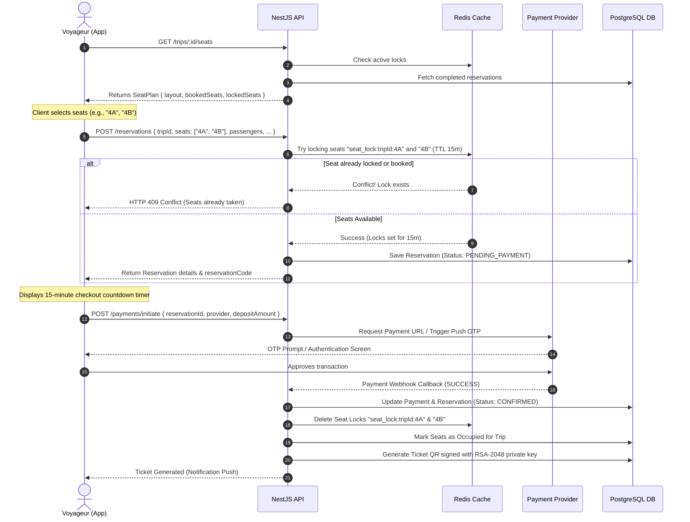

# OPEP Mobile — Search, Seat Booking & Interactive Seat Layout Design (Flutter)

This document details the UX/UI blueprints, sequence diagrams, and Clean Architecture Dart stubs for the Trip Search, Trip Results list, Detailed Trip view, dynamic interactive Seat Selection Layout, and the `SeatSelectionBloc` flow in the OPEP mobile application.

---

## 1. Specifications & Requirement Analysis

Based on `cahier_de_charge (2).md` and `OPEP_CLAUDE (1).md`, the Search and Booking modules must satisfy the following rules:

1. **Trip Search Parameters**:
   * Departure City, Arrival City, Departure Date, and Number of Passengers (Individual: 1, Group: 2 to 10).
2. **Notoriety Scoring & "Nouveau" Badge**:
   * Trip cards must display the centre's/agency's notoriety average rating score (out of 5 stars), calculated as `(driverRating + comfortRating) / 2`.
   * **Seeding Constraint**: If a centre has fewer than 5 reviews (`MIN_REVIEWS_BEFORE_PUBLIC_SCORE = 5`), the rating average is returned as `null` by the API. The UI must display a **"Nouveau"** badge instead of stars.
3. **Trip Details Requirement**:
   * Clients must be able to view details of the assigned **Bus** (model, photo, comfort indicators) and the **Driver** (name, photo, and years of driving experience) before booking.
4. **Dynamic Seat Selection Layout**:
   * The bus configuration contains a `seatLayout` JSON: `{ rows: int, cols: int, unavailableSeats: string[] }`.
   * Unavailable seats in the configuration represent physical spaces without seats (e.g., driver cabin, internal steps, or exit doors).
   * The app fetches the current seat availability status for the trip (`GET /trips/:id/seats`) yielding:
     * `bookedSeats`: Seats already booked/sold (`CONFIRMED` or `USED`).
     * `lockedSeats`: Seats temporarily locked by other pending reservations in Redis.
5. **Seat Locking (Redis TTL)**:
   * Selecting and initiating the booking locks the seats in Redis for **15 minutes**.
   * A countdown timer must be shown to the user on the payment screen. If the countdown expires, the lock is freed in Redis, and the UI redirects the user with an expiration message.
6. **Flexible Partial Payments (Acompte)**:
   * The user can pay either the **total amount** or a **partial deposit** (acompte) online (via MTN MoMo, Orange Money, or Stripe).
   * The minimum deposit percentage is dynamically determined by the centre's local config (`minDepositPercent`, defaulting to `30%` if not overridden).
   * The remaining balance (`amountDueAtCentre`) is displayed on the ticket and settled physically at the ticket counter via a caissier.

---

## 2. Screen Designs & Visual Blueprints (UX/UI Spec)

The visual design leverages the Cameroon brand palette defined in [1_flutter_core.md](file:///C:/MAMP/htdocs/Projet/Opep/apps/mobile/design/1_flutter_core.md) with smooth card transitions, micro-animations, and clean typography.

### 2.1 Screen 1: Trip Search Form (`search_page.dart`)
* **Visual Style**: Clean, modern card-based layout overlaying a subtle green gradient mesh background.
* **Fields**:
  * **Departure City & Arrival City**: Horizontal layout or stackable fields. Tapping open a fullscreen search modal with auto-suggest. A circular swap button floats on the right boundary to reverse cities.
  * **Departure Date**: Date selector showing "Aujourd'hui", "Demain", or custom calendar modal. Uses `intl` package for local French formatting (e.g., "Ven. 17 Juil.").
  * **Passengers Count**: A digital stepper button matching limits: minimum `1`, maximum `10`. Shows a badge warning if count $\ge 2$ ("Réservation de Groupe").
* **Search Call-to-Action**: Premium raised green button with a transition pulse effect.

### 2.2 Screen 2: Trip Listing (`trip_results_page.dart`)
* **Header**: Shows "Douala → Yaoundé" with date and passenger count. Horizontal date scraper to quickly change dates.
* **Travel List Cards**:
  * **Time & Duration**: Large bold departure time (e.g., **08:00**), direct path line with bus model icon, and arrival time (e.g., **11:45**) with duration badge (e.g., "3h 45m").
  * **Agency info**: Left side displays the Centre name and Company Logo.
  * **Notoriety Indicator**:
    * If `ratingAverage != null`: A gold star icon with rating text (e.g., "⭐ 4.6 (124 avis)").
    * If `ratingAverage == null`: A soft gold tag with white text containing **"Nouveau"** or "Nouveau Centre".
  * **Seats Left & Price**: Bottom row displays the remaining available seats (e.g., "12 places libres") and the price in large bold green text (e.g., **6 000 FCFA**).

```text
┌────────────────────────────────────────────────────────┐
│  08:00 ───🚌 [3h 45m] ───> 11:45                       │
│  Agence: FINEXS Voyage (Douala)                        │
│  ⭐ 4.8 (124 avis)             [ 12 places libres ]    │
│  ────────────────────────────────────────────────────  │
│  6 000 FCFA                                [ Choisir ] │
└────────────────────────────────────────────────────────┘
┌────────────────────────────────────────────────────────┐
│  09:30 ───🚌 [4h 00m] ───> 13:30                       │
│  Agence: Touristique Express (Douala)                  │
│  🏷️ Nouveau                    [ 35 places libres ]    │
│  ────────────────────────────────────────────────────  │
│  7 000 FCFA                                [ Choisir ] │
└────────────────────────────────────────────────────────┘
```

### 2.3 Screen 3: Trip Details & Dynamic Seat Grid (`trip_detail_page.dart`)
* **Top Section**:
  * **Driver Card**: Horizontal card showing driver's rounded profile picture, name, rating (internal, hidden from public profile lists but visible here), and experience badge (e.g., "Permis Cat. D • 8 ans d'expérience").
  * **Bus Card**: Displays bus photo, plate number (e.g., "LT 481 AB"), model (e.g., "Yutong 70 places"), and comfort amenities tags (AC, Wi-Fi, USB Ports).
* **Interactive Seat Grid**:
  * Centered vertical bus layout. A visual front engine/driver cabin icon is placed at the top to orient the user.
  * **Grid Scrollability**: Wrapped in a scroll view to accommodate high-capacity buses (e.g., 70 seats).
  * **Seat States**:
    * **Available**: White container with green border. Tap selects it.
    * **Selected**: Cameroon Green fill with white text.
    * **Booked (Sold)**: Dark grey fill with a white letter "X" indicator.
    * **Locked (Reserved by another)**: Gold/orange fill with a lock icon.
    * **Unavailable (Gap)**: Empty transparent space (no container) to visually create the aisle or staircases.
* **Bottom Sheet Summary**:
  * Displays: "2 Sièges Sélectionnés (3A, 3B)" and total price.
  * CTA Button: "Continuer vers les détails passagers".

### 2.4 Screen 4: Partial Payment Selector (`booking_payment_page.dart`)
* **Redis Lock Timer**: Top banners showing red warning alert: "Sièges réservés temporairement. Complétez le paiement dans **14:59**".
* **Paiement Slider**:
  * Interactive progress slider displaying the payment division.
  * Left side anchor: Minimum deposit amount (e.g., `30%`, calculated as `Total * minDepositPercent / 100`).
  * Right side anchor: Total amount (`100%`).
  * The user drags the slider to choose how much to pay now. Text updates dynamically below:
    * **"Payer en ligne"**: `X FCFA`
    * **"Solde à régler au guichet"**: `Y FCFA`
* **Payment Methods**: Grid of buttons selecting Mobile Money (MTN MoMo / Orange Money) or Card (Stripe).
* **CTA Button**: "Confirmer et Payer".

---

## 3. Booking & Seat Locking Flow (Sequence Diagram)

The diagram below details how the client mobile application interacts with the NestJS API and Redis to reserve, lock, and pay for seats.



---

## 4. Interactive Seat Layout Mechanics & Algorithm

Generating the bus seat grid requires parsing the `seatLayout` config:
1. **Dimension Parsing**: We construct a layout grid of rows and columns.
2. **Column Aisle Mapping**: 
   * In Cameroon, standard buses have $4$ columns (2 seats, aisle, 2 seats) or $5$ columns (3 seats, aisle, 2 seats) or $3$ columns for VIP coaches (2 seats, aisle, 1 seat).
   * To dynamically accommodate any layout without hardcoding the aisle column, we introduce an `aisleIndex` logic.
   * If a bus has $C$ columns, the aisle defaults to `C ~/ 2`.
   * When rendering column index $j$, if $j$ matches the aisle index, we insert a horizontal separator spacing (`SizedBox(width: aisleWidth)`) before drawing the next seat.
3. **Empty Physical Spaces**:
   * Any seat code string represented in the configuration's `unavailableSeats` array (e.g., `"1A"` for the driver's cabin or `"6C"` for steps) is rendered as a blank space (`Opacity(opacity: 0)`) which preserves grid alignment while hiding the seat widget.
4. **Identifier Formatting**:
   * Seat codes are derived dynamically based on their row and column indexes.
   * Format: `"${rowIndex}${String.fromCharCode(65 + colIndex)}"` (e.g., Row 1, Col 0 $\rightarrow$ `"1A"`, Row 10, Col 3 $\rightarrow$ `"10D"`).

---

## 5. Seat Selection BLoC State Machine Chart

The `SeatSelectionBloc` handles user selections, verifies maximum group limits, manages API loading, and triggers the checkout process.

```mermaid
stateDiagram-v2
    [*] --> SeatSelectionInitial
    
    SeatSelectionInitial --> SeatSelectionLoading : LoadSeatPlanEvent
    SeatSelectionLoading --> SeatSelectionLoaded : API success (Seat plan loaded)
    SeatSelectionLoading --> SeatSelectionError : API error
    
    state SeatSelectionLoaded {
        [*] --> DisplayLayout
        DisplayLayout --> DisplayLayout : ToggleSeatEvent (Adds/Removes seat number)
        Note right of DisplayLayout: Validation: Selected count <= 10 (Group reservation limit)
    }

    SeatSelectionLoaded --> SeatSelectionLocking : ConfirmSeatsEvent
    SeatSelectionLocking --> SeatSelectionConfirmed : Redis lock success, reservation created
    SeatSelectionLocking --> SeatSelectionError : Redis lock error / Conflict
    
    SeatSelectionConfirmed --> [*]
    SeatSelectionError --> SeatSelectionLoaded : Retry / Reload
```

---

## 6. Dart Code Stubs

Below are clean, compile-ready, and syntax-valid Dart code stubs matching the architectural rules of the OPEP project.

### 6.1 Domain Entities

`lib/features/booking/domain/entities/trip_details.dart`
```dart
import 'package:equatable/equatable.dart';

class TripDetailsEntity extends Equatable {
  final String id;
  final String departureCity;
  final String arrivalCity;
  final DateTime departureDateTime;
  final double basePrice;
  final int availableSeats;
  final String status;
  final BusEntity bus;
  final DriverEntity driver;
  final double? centreRatingAverage;
  final int centreReviewsCount;

  const TripDetailsEntity({
    required this.id,
    required this.departureCity,
    required this.arrivalCity,
    required this.departureDateTime,
    required this.basePrice,
    required this.availableSeats,
    required this.status,
    required this.bus,
    required this.driver,
    this.centreRatingAverage,
    required this.centreReviewsCount,
  });

  bool get isNewCentre => centreReviewsCount < 5 || centreRatingAverage == null;

  @override
  List<Object?> get props => [
        id,
        departureCity,
        arrivalCity,
        departureDateTime,
        basePrice,
        availableSeats,
        status,
        bus,
        driver,
        centreRatingAverage,
        centreReviewsCount,
      ];
}

class BusEntity extends Equatable {
  final String id;
  final String plateNumber;
  final String model;
  final String? photoUrl;
  final int totalSeats;
  final SeatLayoutConfigEntity seatLayout;

  const BusEntity({
    required this.id,
    required this.plateNumber,
    required this.model,
    this.photoUrl,
    required this.totalSeats,
    required this.seatLayout,
  });

  @override
  List<Object?> get props => [id, plateNumber, model, photoUrl, totalSeats, seatLayout];
}

class SeatLayoutConfigEntity extends Equatable {
  final int rows;
  final int cols;
  final List<String> unavailableSeats; // Physical empty gaps

  const SeatLayoutConfigEntity({
    required this.rows,
    required this.cols,
    required this.unavailableSeats,
  });

  @override
  List<Object?> get props => [rows, cols, unavailableSeats];
}

class DriverEntity extends Equatable {
  final String id;
  final String firstName;
  final String lastName;
  final String? photoUrl;
  final String? licenseNumber;
  final int drivingExperienceYears;

  const DriverEntity({
    required this.id,
    required this.firstName,
    required this.lastName,
    this.photoUrl,
    this.licenseNumber,
    required this.drivingExperienceYears,
  });

  String get fullName => '$firstName $lastName';

  @override
  List<Object?> get props => [id, firstName, lastName, photoUrl, licenseNumber, drivingExperienceYears];
}

class SeatPlanEntity extends Equatable {
  final SeatLayoutConfigEntity layout;
  final List<String> bookedSeats;
  final List<String> lockedSeats;

  const SeatPlanEntity({
    required this.layout,
    required this.bookedSeats,
    required this.lockedSeats,
  });

  @override
  List<Object?> get props => [layout, bookedSeats, lockedSeats];
}
```

`lib/features/booking/domain/entities/reservation.dart`
```dart
import 'package:equatable/equatable.dart';

class ReservationEntity extends Equatable {
  final String id;
  final String reservationCode;
  final String tripId;
  final String? clientId;
  final String type; // 'INDIVIDUAL' | 'GROUP'
  final double totalAmount;
  final String paymentType; // 'FULL' | 'PARTIAL'
  final double amountPaidOnline;
  final double amountDueAtCentre;
  final String status; // 'PENDING_PAYMENT', 'CONFIRMED', 'CANCELLED', 'USED', 'EXPIRED'
  final List<PassengerEntity> passengers;

  const ReservationEntity({
    required this.id,
    required this.reservationCode,
    required this.tripId,
    this.clientId,
    required this.type,
    required this.totalAmount,
    required this.paymentType,
    required this.amountPaidOnline,
    required this.amountDueAtCentre,
    required this.status,
    required this.passengers,
  });

  @override
  List<Object?> get props => [
        id,
        reservationCode,
        tripId,
        clientId,
        type,
        totalAmount,
        paymentType,
        amountPaidOnline,
        amountDueAtCentre,
        status,
        passengers,
      ];
}

class PassengerEntity extends Equatable {
  final String firstName;
  final String lastName;
  final String? idCardNumber;
  final String seatNumber;

  const PassengerEntity({
    required this.firstName,
    required this.lastName,
    this.idCardNumber,
    required this.seatNumber,
  });

  @override
  List<Object?> get props => [firstName, lastName, idCardNumber, seatNumber];
}
```

---

### 6.2 Data Models & Serialization

`lib/features/booking/data/models/trip_details_model.dart`
```dart
import '../../domain/entities/trip_details.dart';

class TripDetailsModel extends TripDetailsEntity {
  const TripDetailsModel({
    required super.id,
    required super.departureCity,
    required super.arrivalCity,
    required super.departureDateTime,
    required super.basePrice,
    required super.availableSeats,
    required super.status,
    required super.bus,
    required super.driver,
    super.centreRatingAverage,
    required super.centreReviewsCount,
  });

  factory TripDetailsModel.fromJson(Map<String, dynamic> json) {
    return TripDetailsModel(
      id: json['id'] as String,
      departureCity: json['departureCity'] as String,
      arrivalCity: json['arrivalCity'] as String,
      departureDateTime: DateTime.parse(json['departureDateTime'] as String),
      basePrice: (json['basePrice'] as num).toDouble(),
      availableSeats: json['availableSeats'] as int,
      status: json['status'] as String,
      bus: BusModel.fromJson(json['bus'] as Map<String, dynamic>),
      driver: DriverModel.fromJson(json['driver'] as Map<String, dynamic>),
      centreRatingAverage: json['centreRatingAverage'] != null
          ? (json['centreRatingAverage'] as num).toDouble()
          : null,
      centreReviewsCount: json['centreReviewsCount'] as int? ?? 0,
    );
  }
}

class BusModel extends BusEntity {
  const BusModel({
    required super.id,
    required super.plateNumber,
    required super.model,
    super.photoUrl,
    required super.totalSeats,
    required super.seatLayout,
  });

  factory BusModel.fromJson(Map<String, dynamic> json) {
    return BusModel(
      id: json['id'] as String,
      plateNumber: json['plateNumber'] as String,
      model: json['model'] as String,
      photoUrl: json['photoUrl'] as String?,
      totalSeats: json['totalSeats'] as int,
      seatLayout: SeatLayoutConfigModel.fromJson(json['seatLayout'] as Map<String, dynamic>),
    );
  }
}

class SeatLayoutConfigModel extends SeatLayoutConfigEntity {
  const SeatLayoutConfigModel({
    required super.rows,
    required super.cols,
    required super.unavailableSeats,
  });

  factory SeatLayoutConfigModel.fromJson(Map<String, dynamic> json) {
    return SeatLayoutConfigModel(
      rows: json['rows'] as int,
      cols: json['cols'] as int,
      unavailableSeats: List<String>.from(json['unavailableSeats'] as List),
    );
  }
}

class DriverModel extends DriverEntity {
  const DriverModel({
    required super.id,
    required super.firstName,
    required super.lastName,
    super.photoUrl,
    super.licenseNumber,
    required super.drivingExperienceYears,
  });

  factory DriverModel.fromJson(Map<String, dynamic> json) {
    return DriverModel(
      id: json['id'] as String,
      firstName: json['firstName'] as String,
      lastName: json['lastName'] as String,
      photoUrl: json['photoUrl'] as String?,
      licenseNumber: json['licenseNumber'] as String?,
      drivingExperienceYears: json['drivingExperienceYears'] as int? ?? 0,
    );
  }
}

class SeatPlanModel extends SeatPlanEntity {
  const SeatPlanModel({
    required super.layout,
    required super.bookedSeats,
    required super.lockedSeats,
  });

  factory SeatPlanModel.fromJson(Map<String, dynamic> json) {
    return SeatPlanModel(
      layout: SeatLayoutConfigModel.fromJson(json['layout'] as Map<String, dynamic>),
      bookedSeats: List<String>.from(json['bookedSeats'] as List),
      lockedSeats: List<String>.from(json['lockedSeats'] as List),
    );
  }
}
```

`lib/features/booking/data/models/reservation_model.dart`
```dart
import '../../domain/entities/reservation.dart';

class ReservationModel extends ReservationEntity {
  const ReservationModel({
    required super.id,
    required super.reservationCode,
    required super.tripId,
    super.clientId,
    required super.type,
    required super.totalAmount,
    required super.paymentType,
    required super.amountPaidOnline,
    required super.amountDueAtCentre,
    required super.status,
    required super.passengers,
  });

  factory ReservationModel.fromJson(Map<String, dynamic> json) {
    return ReservationModel(
      id: json['id'] as String,
      reservationCode: json['reservationCode'] as String,
      tripId: json['tripId'] as String,
      clientId: json['clientId'] as String?,
      type: json['type'] as String,
      totalAmount: (json['totalAmount'] as num).toDouble(),
      paymentType: json['paymentType'] as String,
      amountPaidOnline: (json['amountPaidOnline'] as num).toDouble(),
      amountDueAtCentre: (json['amountDueAtCentre'] as num).toDouble(),
      status: json['status'] as String,
      passengers: (json['passengers'] as List)
          .map((p) => PassengerModel.fromJson(p as Map<String, dynamic>))
          .toList(),
    );
  }
}

class PassengerModel extends PassengerEntity {
  const PassengerModel({
    required super.firstName,
    required super.lastName,
    super.idCardNumber,
    required super.seatNumber,
  });

  factory PassengerModel.fromJson(Map<String, dynamic> json) {
    return PassengerModel(
      firstName: json['firstName'] as String,
      lastName: json['lastName'] as String,
      idCardNumber: json['idCardNumber'] as String?,
      seatNumber: json['seatNumber'] as String,
    );
  }

  Map<String, dynamic> toJson() {
    return {
      'firstName': firstName,
      'lastName': lastName,
      'idCardNumber': idCardNumber,
      'seatNumber': seatNumber,
    };
  }
}

class CreateReservationRequestDto {
  final String tripId;
  final String type; // 'INDIVIDUAL' | 'GROUP'
  final List<PassengerModel> passengers;
  final String paymentProvider; // 'MTN_MOMO' | 'ORANGE_MONEY' | 'STRIPE'
  final double? depositAmount;

  const CreateReservationRequestDto({
    required this.tripId,
    required this.type,
    required this.passengers,
    required this.paymentProvider,
    this.depositAmount,
  });

  Map<String, dynamic> toJson() {
    final data = <String, dynamic>{
      'tripId': tripId,
      'type': type,
      'passengers': passengers.map((p) => p.toJson()).toList(),
      'paymentProvider': paymentProvider,
    };
    if (depositAmount != null) {
      data['depositAmount'] = depositAmount;
    }
    return data;
  }
}
```

---

### 6.3 Repositories Contract Interfaces

`lib/features/booking/domain/repositories/booking_repository.dart`
```dart
import '../../domain/entities/trip_details.dart';
import '../../domain/entities/reservation.dart';
import '../../data/models/booking_dtos.dart';

abstract class BookingRepository {
  Future<TripDetailsEntity> getTripDetails(String tripId);
  Future<SeatPlanEntity> getTripSeatPlan(String tripId);
  Future<ReservationEntity> createReservation(CreateReservationRequestDto request);
}
```

---

### 6.4 BLoC Implementation

`lib/features/booking/presentation/bloc/seat_selection_event.dart`
```dart
import 'package:equatable/equatable.dart';

abstract class SeatSelectionEvent extends Equatable {
  const SeatSelectionEvent();

  @override
  List<Object?> get props => [];
}

class LoadSeatPlanEvent extends SeatSelectionEvent {
  final String tripId;

  const LoadSeatPlanEvent(this.tripId);

  @override
  List<Object?> get props => [tripId];
}

class ToggleSeatEvent extends SeatSelectionEvent {
  final String seatNumber;

  const ToggleSeatEvent(this.seatNumber);

  @override
  List<Object?> get props => [seatNumber];
}

class ConfirmSeatsEvent extends SeatSelectionEvent {
  final String tripId;
  final String type; // 'INDIVIDUAL' | 'GROUP'

  const ConfirmSeatsEvent({required this.tripId, required this.type});

  @override
  List<Object?> get props => [tripId, type];
}
```

`lib/features/booking/presentation/bloc/seat_selection_state.dart`
```dart
import 'package:equatable/equatable.dart';
import '../../domain/entities/trip_details.dart';

abstract class SeatSelectionState extends Equatable {
  const SeatSelectionState();

  @override
  List<Object?> get props => [];
}

class SeatSelectionInitial extends SeatSelectionState {}

class SeatSelectionLoading extends SeatSelectionState {}

class SeatSelectionLoaded extends SeatSelectionState {
  final SeatPlanEntity seatPlan;
  final List<String> selectedSeats;
  final String? errorMessage;

  const SeatSelectionLoaded({
    required this.seatPlan,
    required this.selectedSeats,
    this.errorMessage,
  });

  SeatSelectionLoaded copyWith({
    SeatPlanEntity? seatPlan,
    List<String>? selectedSeats,
    String? errorMessage,
  }) {
    return SeatSelectionLoaded(
      seatPlan: seatPlan ?? this.seatPlan,
      selectedSeats: selectedSeats ?? this.selectedSeats,
      errorMessage: errorMessage,
    );
  }

  @override
  List<Object?> get props => [seatPlan, selectedSeats, errorMessage];
}

class SeatSelectionLocking extends SeatSelectionState {}

class SeatSelectionConfirmed extends SeatSelectionState {
  final List<String> confirmedSeats;
  final String tripId;
  final String reservationType;

  const SeatSelectionConfirmed({
    required this.confirmedSeats,
    required this.tripId,
    required this.reservationType,
  });

  @override
  List<Object?> get props => [confirmedSeats, tripId, reservationType];
}

class SeatSelectionError extends SeatSelectionState {
  final String message;

  const SeatSelectionError(this.message);

  @override
  List<Object?> get props => [message];
}
```

`lib/features/booking/presentation/bloc/seat_selection_bloc.dart`
```dart
import 'package:flutter_bloc/flutter_bloc.dart';
import '../../domain/repositories/booking_repository.dart';
import 'seat_selection_event.dart';
import 'seat_selection_state.dart';

class SeatSelectionBloc extends Bloc<SeatSelectionEvent, SeatSelectionState> {
  final BookingRepository _bookingRepository;

  SeatSelectionBloc({
    required BookingRepository bookingRepository,
  })  : _bookingRepository = bookingRepository,
        super(SeatSelectionInitial()) {
    on<LoadSeatPlanEvent>(_onLoadSeatPlan);
    on<ToggleSeatEvent>(_onToggleSeat);
    on<ConfirmSeatsEvent>(_onConfirmSeats);
  }

  Future<void> _onLoadSeatPlan(
    LoadSeatPlanEvent event,
    Emitter<SeatSelectionState> emit,
  ) async {
    emit(SeatSelectionLoading());
    try {
      final seatPlan = await _bookingRepository.getTripSeatPlan(event.tripId);
      emit(SeatSelectionLoaded(seatPlan: seatPlan, selectedSeats: const []));
    } catch (e) {
      emit(SeatSelectionError(e.toString()));
    }
  }

  void _onToggleSeat(
    ToggleSeatEvent event,
    Emitter<SeatSelectionState> emit,
  ) {
    final currentState = state;
    if (currentState is SeatSelectionLoaded) {
      final selected = List<String>.from(currentState.selectedSeats);
      final seat = event.seatNumber;

      if (selected.contains(seat)) {
        selected.remove(seat);
        emit(currentState.copyWith(selectedSeats: selected, errorMessage: null));
      } else {
        // Group Reservation Limit Check: Max 10 seats
        if (selected.length >= 10) {
          emit(currentState.copyWith(
            errorMessage: 'Vous ne pouvez pas sélectionner plus de 10 sièges.',
          ));
        } else {
          selected.add(seat);
          emit(currentState.copyWith(selectedSeats: selected, errorMessage: null));
        }
      }
    }
  }

  Future<void> _onConfirmSeats(
    ConfirmSeatsEvent event,
    Emitter<SeatSelectionState> emit,
  ) async {
    final currentState = state;
    if (currentState is SeatSelectionLoaded) {
      if (currentState.selectedSeats.isEmpty) {
        emit(currentState.copyWith(errorMessage: 'Veuillez sélectionner au moins un siège.'));
        return;
      }

      // Check if selected count aligns with chosen reservation type
      if (event.type == 'INDIVIDUAL' && currentState.selectedSeats.length > 1) {
        emit(currentState.copyWith(
          errorMessage: 'Une réservation individuelle ne peut contenir qu\'un seul passager.',
        ));
        return;
      }
      if (event.type == 'GROUP' && currentState.selectedSeats.length < 2) {
        emit(currentState.copyWith(
          errorMessage: 'Une réservation de groupe nécessite au moins 2 passagers.',
        ));
        return;
      }

      emit(SeatSelectionLocking());
      try {
        // Simulates validation/temporary locking step
        emit(SeatSelectionConfirmed(
          confirmedSeats: currentState.selectedSeats,
          tripId: event.tripId,
          reservationType: event.type,
        ));
      } catch (e) {
        emit(SeatSelectionError(e.toString()));
      }
    }
  }
}
```

---

### 6.5 Interactive Seat Grid Components

`lib/features/booking/presentation/widgets/seat_widget.dart`
```dart
import 'package:flutter/material.dart';
import '../../../../core/theme/app_colors.dart';

enum SeatStatus { available, selected, booked, locked }

class SeatWidget extends StatelessWidget {
  final String seatNumber;
  final SeatStatus status;
  final VoidCallback onTap;

  const SeatWidget({
    super.key,
    required this.seatNumber,
    required this.status,
    required this.onTap,
  });

  @override
  Widget build(BuildContext context) {
    Color cardColor;
    Color borderColor;
    Color textColor;
    Widget? iconOverlay;

    switch (status) {
      case SeatStatus.available:
        cardColor = Colors.white;
        borderColor = AppColors.primaryGreen;
        textColor = AppColors.primaryGreen;
        break;
      case SeatStatus.selected:
        cardColor = AppColors.primaryGreen;
        borderColor = AppColors.primaryGreenDark;
        textColor = Colors.white;
        break;
      case SeatStatus.booked:
        cardColor = Colors.grey.shade300;
        borderColor = Colors.grey.shade400;
        textColor = Colors.grey.shade600;
        iconOverlay = const Icon(Icons.close, size: 14, color: Colors.white);
        break;
      case SeatStatus.locked:
        cardColor = AppColors.accentYellow;
        borderColor = Colors.orange.shade700;
        textColor = Colors.white;
        iconOverlay = const Icon(Icons.lock, size: 12, color: Colors.white);
        break;
    }

    return GestureDetector(
      onTap: (status == SeatStatus.available || status == SeatStatus.selected) ? onTap : null,
      child: AnimatedContainer(
        duration: const Duration(milliseconds: 150),
        alignment: Alignment.center,
        decoration: BoxDecoration(
          color: cardColor,
          borderRadius: BorderRadius.circular(6.0),
          border: Border.all(color: borderColor, width: 1.5),
          boxShadow: status == SeatStatus.selected
              ? [
                  BoxShadow(
                    color: AppColors.primaryGreen.withOpacity(0.3),
                    blurRadius: 4,
                    offset: const Offset(0, 2),
                  )
                ]
              : null,
        ),
        child: iconOverlay ??
            Text(
              seatNumber,
              style: TextStyle(
                fontSize: 12,
                fontWeight: FontWeight.bold,
                color: textColor,
              ),
            ),
      ),
    );
  }
}
```

`lib/features/booking/presentation/widgets/seat_layout.dart`
```dart
import 'package:flutter/material.dart';
import '../../domain/entities/trip_details.dart';
import 'seat_widget.dart';

class SeatLayout extends StatelessWidget {
  final SeatPlanEntity seatPlan;
  final List<String> selectedSeats;
  final Function(String) onSeatToggled;

  const SeatLayout({
    super.key,
    required this.seatPlan,
    required this.selectedSeats,
    required this.onSeatToggled,
  });

  @override
  Widget build(BuildContext context) {
    final int rows = seatPlan.layout.rows;
    final int cols = seatPlan.layout.cols;
    final int aisleIndex = cols ~/ 2; // Split dynamically in the center

    return Column(
      children: [
        // Front Orientation Indicator (Bus Cabin Symbol)
        Container(
          padding: const EdgeInsets.symmetric(vertical: 8, horizontal: 16),
          decoration: BoxDecoration(
            color: Colors.grey.shade200,
            borderRadius: BorderRadius.circular(8),
            border: Border.all(color: Colors.grey.shade300),
          ),
          child: Row(
            mainAxisSize: MainAxisSize.min,
            children: const [
              Icon(Icons.directions_bus, size: 16, color: Colors.grey),
              SizedBox(width: 8),
              Text(
                'Avant du Bus (Chauffeur)',
                style: TextStyle(fontSize: 11, color: Colors.grey, fontWeight: FontWeight.w600),
              ),
            ],
          ),
        ),
        const SizedBox(height: 24),

        // Grid Generator
        ListView.separated(
          shrinkWrap: true,
          physics: const NeverScrollableScrollPhysics(),
          itemCount: rows,
          separatorBuilder: (context, index) => const SizedBox(height: 12),
          itemBuilder: (context, rowIndex) {
            // Row number starts at 1
            final int actualRowNumber = rowIndex + 1;

            return Row(
              mainAxisAlignment: MainAxisAlignment.center,
              children: List.generate(cols + 1, (colIndex) {
                // If it is the aisle position, insert separation space
                if (colIndex == aisleIndex) {
                  return const SizedBox(width: 28);
                }

                // Adjust column index for seat code calculation
                final int actualColIndex = colIndex > aisleIndex ? colIndex - 1 : colIndex;
                final String letter = String.fromCharCode(65 + actualColIndex);
                final String seatCode = '$actualRowNumber$letter';

                // Physical gap check
                if (seatPlan.layout.unavailableSeats.contains(seatCode)) {
                  return const SizedBox(width: 44, height: 40); // Preserves structure spacing
                }

                // Determine seat status
                SeatStatus status = SeatStatus.available;
                if (selectedSeats.contains(seatCode)) {
                  status = SeatStatus.selected;
                } else if (seatPlan.bookedSeats.contains(seatCode)) {
                  status = SeatStatus.booked;
                } else if (seatPlan.lockedSeats.contains(seatCode)) {
                  status = SeatStatus.locked;
                }

                return Padding(
                  padding: const EdgeInsets.symmetric(horizontal: 4.0),
                  child: SizedBox(
                    width: 44,
                    height: 40,
                    child: SeatWidget(
                      seatNumber: seatCode,
                      status: status,
                      onTap: () => onSeatToggled(seatCode),
                    ),
                  ),
                );
              }),
            );
          },
        ),
        const SizedBox(height: 24),

        // Seat State Legend Component
        _buildLegend(),
      ],
    );
  }

  Widget _buildLegend() {
    return Container(
      padding: const EdgeInsets.all(12),
      decoration: BoxDecoration(
        color: Colors.grey.shade50,
        borderRadius: BorderRadius.circular(10),
        border: Border.all(color: Colors.grey.shade200),
      ),
      child: Wrap(
        spacing: 16,
        runSpacing: 8,
        alignment: WrapAlignment.center,
        children: [
          _buildLegendItem('Libre', Colors.white, Colors.green),
          _buildLegendItem('Sélectionné', Colors.green, Colors.green),
          _buildLegendItem('Occupé', Colors.grey.shade300, Colors.grey.shade400, icon: Icons.close),
          _buildLegendItem('Bloqué (15m)', Colors.amber, Colors.orange.shade700, icon: Icons.lock),
        ],
      ),
    );
  }

  Widget _buildLegendItem(String label, Color fill, Color border, {IconData? icon}) {
    return Row(
      mainAxisSize: MainAxisSize.min,
      children: [
        Container(
          width: 20,
          height: 18,
          alignment: Alignment.center,
          decoration: BoxDecoration(
            color: fill,
            borderRadius: BorderRadius.circular(4),
            border: Border.all(color: border, width: 1),
          ),
          child: icon != null ? Icon(icon, size: 8, color: Colors.white) : null,
        ),
        const SizedBox(width: 6),
        Text(
          label,
          style: const TextStyle(fontSize: 11, fontWeight: FontWeight.w500, color: Colors.black87),
        ),
      ],
    );
  }
}
```
