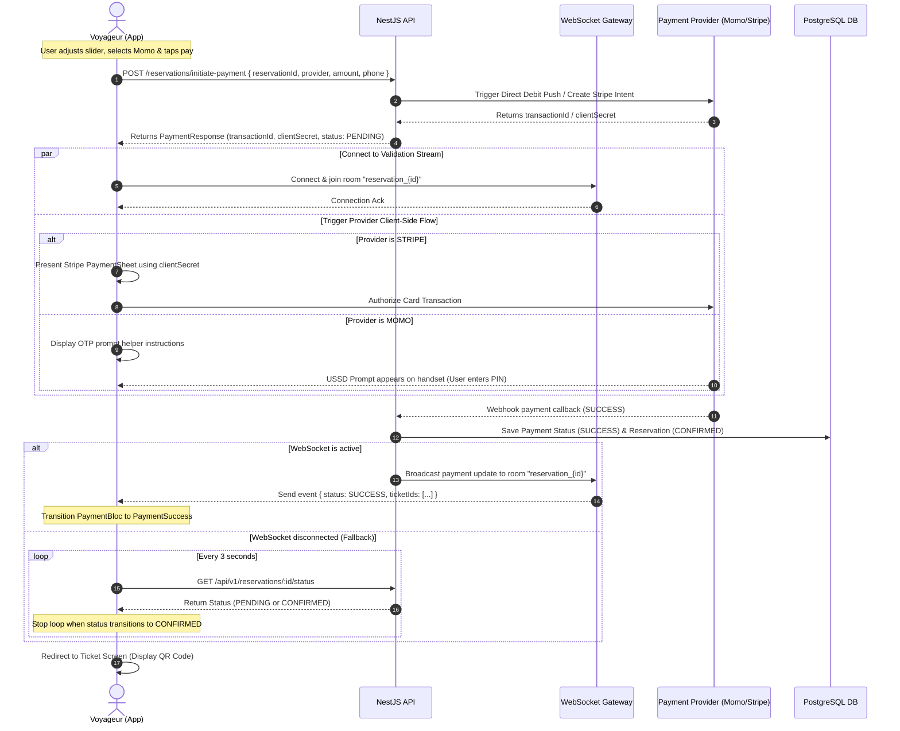
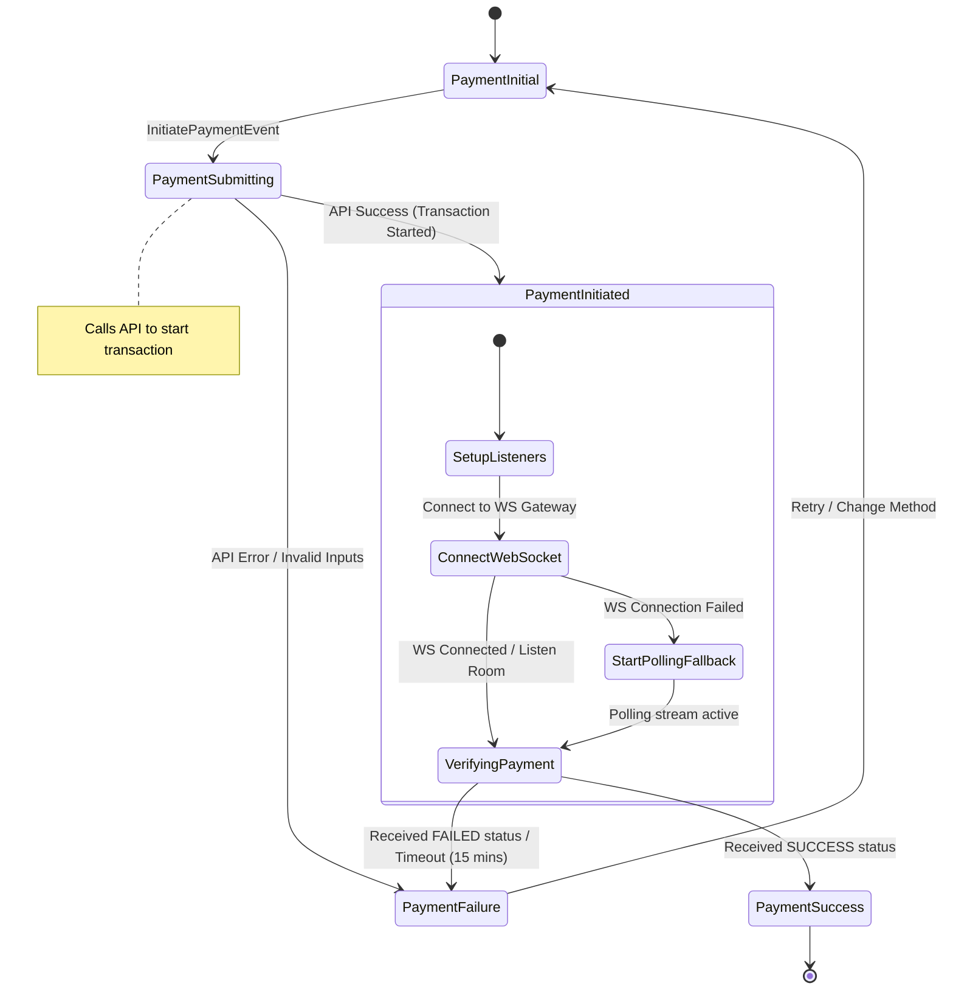

# OPEP Mobile — Payment System Design & Implementation (Flutter)

This document details the payment workflow specifications, UI components (Fractioned Payment Slider, Mobile Money MTN/Orange inputs, Stripe integration), sequence/state diagrams, and Clean Architecture Dart stubs for the payment processing and real-time status validation in the OPEP mobile application.

---

## 1. Specifications & Requirement Analysis

Based on `cahier_de_charge (2).md` and `OPEP_CLAUDE (1).md`, the payment module must satisfy the following constraints and business rules:

1. **Fractioned Payments (Acompte)**:
   * Voyageurs can pay either the **total amount (100%)** or a **partial deposit (acompte)** online to secure their booking and generate tickets.
   * The minimum deposit percentage is dynamically determined by the centre's local configuration (`minDepositPercent`, default is `30%`).
   * The remaining balance is marked as `amountDueAtCentre` (total amount minus online deposit).
   * Once a valid deposit (amount $\ge$ minimum deposit) is successfully verified, the reservation status transitions from `PENDING_PAYMENT` to `CONFIRMED`. The QR code ticket is generated immediately containing the remaining balance to be paid physically at the counter to the `CASHIER` before boarding.

2. **Mobile Money Providers**:
   * **MTN Mobile Money** and **Orange Money** are the primary payment channels in Cameroon.
   * Payment requires a valid Cameroon mobile number in E.164 format (+237 followed by 9 digits starting with 6).
   * **Validation regex**: `^(?:\+237|237)?[6](5[0-9]|7[0-9]|8[0-9]|9[0-9])[0-9]{6}$`
   * Triggering MTN or Orange payments initiates a push prompt (USSD/OTP request) to the user's handset. The app must block user input and transition into a "Verifying Transaction" state, displaying instruction steps to complete verification on their phone.

3. **Stripe Integration**:
   * Stripe handles credit/debit card transactions for international or card-carrying clients.
   * Integration leverages a native payment sheet flow. The client app initiates payment, fetches a `paymentIntent` client secret from the backend, invokes the Stripe SDK to present the Payment Sheet, and listens for the completion callback.

4. **Status Validation (WebSocket / Polling)**:
   * Mobile Money transactions are asynchronous (webhook-based). The mobile app must monitor payment state modifications reactively.
   * **Primary Channel (WebSocket)**: The client connects to the WebSocket gateway `/reservations/payment-status` and listens to updates on the room corresponding to the reservation ID: `reservation_{id}`.
   * **Fallback Channel (Polling)**: If the WebSocket connection fails or drops, the client initiates short-polling on `GET /api/v1/reservations/:id/status` every 3-5 seconds.
   * **Lock Lifetime Limitation**: The maximum validation duration is limited by the Redis seat lock TTL of **15 minutes**. If the timer reaches zero before confirmation, the UI displays an expiration screen.

---

## 2. Screen Designs & Visual Blueprints (UX/UI Spec)

The payment screen (`booking_payment_page.dart`) uses visual cues to manage state clearly:

### 2.1 Countdown Timer Banner
* A red warning banner at the top of the payment screen with a ticking clock icon:
  * **Text**: "Vos sièges sont bloqués pour 14:59. Veuillez finaliser le paiement."
  * Once the timer reaches 0, the screen transitions to an **Expiration Error** page.

### 2.2 Fractioned Payment Slider (`PaymentSlider`)
* An interactive premium slider allows users to slide between the minimum deposit percentage (`minDepositPercent`) and `100%`.
* **Visual Components**:
  * Track colors: Sleek Cameroon green (`#007A5E`) for the active track, soft grey for the inactive track.
  * Drag handle: Standard circular handle displaying the current percentage selected.
  * Below the slider, a live breakdown panel displays:
    * **Montant à payer maintenant (En Ligne)**: Large, bold green text (e.g. `4 500 FCFA`).
    * **Reste à payer au guichet (Au départ)**: Amber-colored text displaying the unpaid balance (e.g. `10 500 FCFA`).

```text
  [⏳ Vos sièges sont réservés pendant 14:59 ]
  ┌──────────────────────────────────────────┐
  │ Réservation: Yaoundé ──> Douala          │
  │ Tarif Total: 15 000 FCFA                 │
  │                                          │
  │ Choisir le montant de l'acompte :        │
  │   30% (Min)             [ 50% ]     100% │
  │   [======|===============O─────────────] │
  │                                          │
  │ 💳 Payer en ligne : 7 500 FCFA           │
  │ 💵 Solde au guichet : 7 500 FCFA         │
  └──────────────────────────────────────────┘
```

### 2.3 Mobile Money Inputs
* Tabbed selector for MTN and Orange Money. Clicking each provider highlights their respective brand colors (MTN Yellow `#FFCC00` vs Orange Orange `#F16E00`).
* A unified phone input field showing the Cameroon flag and prefix `+237`.
* Auto-formats the phone number and validates the structure before enabling the "Payer" button.

### 2.4 Status Processing Dialog
* While waiting for status verification, a modal overlay blocks interaction:
  * Shows a rotating loading spinner or Lottie animation.
  * **Text**: "Initialisation de la transaction..." followed by "En attente de votre validation. Veuillez saisir votre code PIN sur le prompt reçu sur votre téléphone."

---

## 3. Payment & Validation Flow (Sequence Diagram)

This diagram details the client application orchestrating payment with Stripe/Mobile Money, subscribing to WebSockets for status changes, and using HTTP polling as a fallback.



---

## 4. Payment BLoC State Machine Chart

The `PaymentBloc` handles all payment phases: slider calculations, validation, status monitoring, and final redirection.



---

## 5. Clean Architecture Dart Code Stubs

The following stubs are clean, syntactically correct, and follow standard architectural guidelines for the OPEP Flutter app.

### 5.1 Request DTOs & Models

`lib/features/payment/data/models/payment_request_dto.dart`
```dart
import 'package:equatable/equatable.dart';

enum PaymentProvider {
  mtnMomo,
  orangeMoney,
  stripe,
  cash,
}

extension PaymentProviderExtension on PaymentProvider {
  String get value {
    switch (this) {
      case PaymentProvider.mtnMomo:
        return 'MTN_MOMO';
      case PaymentProvider.orangeMoney:
        return 'ORANGE_MONEY';
      case PaymentProvider.stripe:
        return 'STRIPE';
      case PaymentProvider.cash:
        return 'CASH';
    }
  }
}

class InitiatePaymentRequestDto extends Equatable {
  final String reservationId;
  final PaymentProvider provider;
  final double amount;
  final String? phoneNumber; // Required for mobile money (MTN, Orange)

  const InitiatePaymentRequestDto({
    required this.reservationId,
    required this.provider,
    required this.amount,
    this.phoneNumber,
  });

  Map<String, dynamic> toJson() {
    return {
      'reservationId': reservationId,
      'paymentProvider': provider.value,
      'depositAmount': amount.toInt(),
      if (phoneNumber != null) 'phoneNumber': phoneNumber,
    };
  }

  @override
  List<Object?> get props => [reservationId, provider, amount, phoneNumber];
}
```

`lib/features/payment/data/models/payment_response_dto.dart`
```dart
import 'package:equatable/equatable.dart';

class PaymentResponseDto extends Equatable {
  final String transactionId;
  final String status; // PENDING, SUCCESS, FAILED
  final String? clientSecret; // Used for Stripe PaymentSheet setup
  final String? paymentUrl; // Option for webview redirects if needed

  const PaymentResponseDto({
    required this.transactionId,
    required this.status,
    this.clientSecret,
    this.paymentUrl,
  });

  factory PaymentResponseDto.fromJson(Map<String, dynamic> json) {
    return PaymentResponseDto(
      transactionId: json['providerTransactionId'] as String? ?? json['id'] as String? ?? '',
      status: json['status'] as String? ?? 'PENDING',
      clientSecret: json['clientSecret'] as String?,
      paymentUrl: json['paymentUrl'] as String?,
    );
  }

  @override
  List<Object?> get props => [transactionId, status, clientSecret, paymentUrl];
}
```

---

### 5.2 Real-time & Polling Transaction Status Listeners

`lib/features/payment/data/datasources/payment_remote_datasource.dart`
```dart
import 'package:dio/dio.dart';
import '../models/payment_request_dto.dart';
import '../models/payment_response_dto.dart';

abstract class PaymentRemoteDataSource {
  Future<PaymentResponseDto> initiatePayment(InitiatePaymentRequestDto request);
  Future<String> checkReservationStatus(String reservationId);
}

class PaymentRemoteDataSourceImpl implements PaymentRemoteDataSource {
  final Dio dio;

  PaymentRemoteDataSourceImpl({required this.dio});

  @override
  Future<PaymentResponseDto> initiatePayment(InitiatePaymentRequestDto request) async {
    final response = await dio.post(
      '/payments/initiate',
      data: request.toJson(),
    );
    if (response.statusCode == 200 || response.statusCode == 201) {
      return PaymentResponseDto.fromJson(response.data as Map<String, dynamic>);
    } else {
      throw DioException(
        requestOptions: response.requestOptions,
        response: response,
      );
    }
  }

  @override
  Future<String> checkReservationStatus(String reservationId) async {
    final response = await dio.get('/reservations/$reservationId/status');
    if (response.statusCode == 200) {
      final data = response.data as Map<String, dynamic>;
      return data['status'] as String? ?? 'PENDING_PAYMENT';
    }
    throw DioException(
      requestOptions: response.requestOptions,
      response: response,
    );
  }
}
```

`lib/core/network/websocket_service.dart`
```dart
import 'dart:async';
import 'dart:convert';
import 'package:web_socket_channel/web_socket_channel.dart';

class WebSocketService {
  final String baseUrl;
  WebSocketChannel? _channel;
  StreamController<Map<String, dynamic>>? _messageController;
  bool _isConnected = false;

  WebSocketService({required this.baseUrl});

  Future<void> connect() async {
    if (_isConnected) return;
    try {
      _channel = WebSocketChannel.connect(Uri.parse(baseUrl));
      _messageController = StreamController<Map<String, dynamic>>.broadcast();
      _isConnected = true;
      _channel!.stream.listen(
        (message) {
          try {
            final data = jsonDecode(message as String) as Map<String, dynamic>;
            _messageController?.add(data);
          } catch (e) {
            // Log parser failures
          }
        },
        onError: (err) {
          _isConnected = false;
          _messageController?.addError(err);
        },
        onDone: () {
          _isConnected = false;
        },
      );
    } catch (e) {
      _isConnected = false;
      rethrow;
    }
  }

  Stream<Map<String, dynamic>> listenToRoom(String reservationId) {
    if (!_isConnected || _channel == null) {
      throw Exception('WebSocket is not connected');
    }
    // Emit subscribe frame for Socket.IO-like rooms
    final subscribePayload = jsonEncode({
      'event': 'join_room',
      'data': {'room': 'reservation_$reservationId'}
    });
    _channel!.sink.add(subscribePayload);

    return _messageController!.stream.where((event) {
      final eventName = event['event'] as String?;
      final eventData = event['data'] as Map<String, dynamic>?;
      if (eventName == 'payment_status_changed' && eventData != null) {
        return eventData['reservationId'] == reservationId;
      }
      return false;
    }).map((event) => event['data'] as Map<String, dynamic>);
  }

  void disconnect() {
    _channel?.sink.close();
    _messageController?.close();
    _isConnected = false;
  }
}
```

`lib/features/payment/domain/repositories/payment_repository.dart`
```dart
import '../../data/models/payment_request_dto.dart';
import '../../data/models/payment_response_dto.dart';

abstract class PaymentRepository {
  Future<PaymentResponseDto> initiatePayment(InitiatePaymentRequestDto request);
  Stream<String> watchPaymentStatus(String reservationId);
}
```

`lib/features/payment/data/repositories/payment_repository_impl.dart`
```dart
import 'dart:async';
import '../../domain/repositories/payment_repository.dart';
import '../datasources/payment_remote_datasource.dart';
import '../../../../core/network/websocket_service.dart';
import '../models/payment_request_dto.dart';
import '../models/payment_response_dto.dart';

class PaymentRepositoryImpl implements PaymentRepository {
  final PaymentRemoteDataSource remoteDataSource;
  final WebSocketService webSocketService;

  PaymentRepositoryImpl({
    required this.remoteDataSource,
    required this.webSocketService,
  });

  @override
  Future<PaymentResponseDto> initiatePayment(InitiatePaymentRequestDto request) {
    return remoteDataSource.initiatePayment(request);
  }

  @override
  Stream<String> watchPaymentStatus(String reservationId) async* {
    // 1. Try subscribing via WebSocket
    try {
      await webSocketService.connect();
      final wsStream = webSocketService.listenToRoom(reservationId);
      
      yield* wsStream.map((data) {
        final status = data['status'] as String? ?? 'PENDING';
        return status == 'SUCCESS' ? 'CONFIRMED' : 'FAILED';
      });
      return;
    } catch (e) {
      // Failed to connect WebSocket, fail over to HTTP Polling
      webSocketService.disconnect();
    }

    // 2. HTTP Polling Fallback
    final controller = StreamController<String>();
    Timer? pollTimer;
    int pollAttempts = 0;
    const maxPollAttempts = 100; // ~5 minutes of polling

    pollTimer = Timer.periodic(const Duration(seconds: 3), (timer) async {
      pollAttempts++;
      if (pollAttempts > maxPollAttempts) {
        pollTimer?.cancel();
        controller.addError(TimeoutException('Le paiement a expiré ou la validation a pris trop de temps.'));
        controller.close();
        return;
      }
      try {
        final status = await remoteDataSource.checkReservationStatus(reservationId);
        if (status == 'CONFIRMED' || status == 'USED') {
          pollTimer?.cancel();
          controller.add(status);
          controller.close();
        } else if (status == 'CANCELLED' || status == 'EXPIRED') {
          pollTimer?.cancel();
          controller.add(status);
          controller.close();
        } else {
          controller.add('PENDING_PAYMENT');
        }
      } catch (err) {
        // Suppress errors during polling to allow recovery on next attempt
      }
    });

    yield* controller.stream;
  }
}
```

---

### 5.3 Payment BLoC Configuration

`lib/features/payment/presentation/bloc/payment_event.dart`
```dart
import 'package:equatable/equatable.dart';
import '../../data/models/payment_request_dto.dart';

abstract class PaymentEvent extends Equatable {
  const PaymentEvent();

  @override
  List<Object?> get props => [];
}

class StartPaymentEvent extends PaymentEvent {
  final String reservationId;
  final PaymentProvider provider;
  final double amount;
  final String? phoneNumber;

  const StartPaymentEvent({
    required this.reservationId,
    required this.provider,
    required this.amount,
    this.phoneNumber,
  });

  @override
  List<Object?> get props => [reservationId, provider, amount, phoneNumber];
}

class UpdatePaymentStatusEvent extends PaymentEvent {
  final String status;

  const UpdatePaymentStatusEvent(this.status);

  @override
  List<Object?> get props => [status];
}

class PaymentErrorOccurredEvent extends PaymentEvent {
  final String errorMessage;

  const PaymentErrorOccurredEvent(this.errorMessage);

  @override
  List<Object?> get props => [errorMessage];
}
```

`lib/features/payment/presentation/bloc/payment_state.dart`
```dart
import 'package:equatable/equatable.dart';
import '../../data/models/payment_response_dto.dart';

abstract class PaymentState extends Equatable {
  const PaymentState();

  @override
  List<Object?> get props => [];
}

class PaymentInitial extends PaymentState {}

class PaymentSubmitting extends PaymentState {}

class PaymentInitiatedState extends PaymentState {
  final PaymentResponseDto response;

  const PaymentInitiatedState(this.response);

  @override
  List<Object?> get props => [response];
}

class PaymentVerifyingState extends PaymentState {
  final String statusMessage;

  const PaymentVerifyingState(this.statusMessage);

  @override
  List<Object?> get props => [statusMessage];
}

class PaymentSuccessState extends PaymentState {
  final String reservationId;

  const PaymentSuccessState(this.reservationId);

  @override
  List<Object?> get props => [reservationId];
}

class PaymentFailureState extends PaymentState {
  final String error;

  const PaymentFailureState(this.error);

  @override
  List<Object?> get props => [error];
}
```

`lib/features/payment/presentation/bloc/payment_bloc.dart`
```dart
import 'dart:async';
import 'package:flutter_bloc/flutter_bloc.dart';
import 'payment_event.dart';
import 'payment_state.dart';
import '../../domain/repositories/payment_repository.dart';
import '../../data/models/payment_request_dto.dart';

class PaymentBloc extends Bloc<PaymentEvent, PaymentState> {
  final PaymentRepository repository;
  StreamSubscription<String>? _statusSubscription;

  PaymentBloc({required this.repository}) : super(PaymentInitial()) {
    on<StartPaymentEvent>(_onStartPayment);
    on<UpdatePaymentStatusEvent>(_onUpdateStatus);
    on<PaymentErrorOccurredEvent>(_onErrorOccurred);
  }

  Future<void> _onStartPayment(
    StartPaymentEvent event,
    Emitter<PaymentState> emit,
  ) async {
    emit(PaymentSubmitting());
    try {
      final dto = InitiatePaymentRequestDto(
        reservationId: event.reservationId,
        provider: event.provider,
        amount: event.amount,
        phoneNumber: event.phoneNumber,
      );

      final response = await repository.initiatePayment(dto);
      emit(PaymentInitiatedState(response));

      // Trigger UI Instructions or Card Sheets based on Provider type
      if (event.provider == PaymentProvider.stripe) {
        emit(const PaymentVerifyingState("Validation de votre carte en cours..."));
      } else {
        emit(const PaymentVerifyingState("En attente de validation Momo (saisissez votre code PIN)..."));
      }

      // Subscribe to real-time verification listener
      await _statusSubscription?.cancel();
      _statusSubscription = repository.watchPaymentStatus(event.reservationId).listen(
        (status) {
          add(UpdatePaymentStatusEvent(status));
        },
        onError: (err) {
          add(PaymentErrorOccurredEvent(err.toString()));
        },
      );
    } catch (e) {
      emit(PaymentFailureState("Échec de l'initialisation du paiement: ${e.toString()}"));
    }
  }

  void _onUpdateStatus(
    UpdatePaymentStatusEvent event,
    Emitter<PaymentState> emit,
  ) {
    if (event.status == 'CONFIRMED' || event.status == 'SUCCESS') {
      _statusSubscription?.cancel();
      emit(const PaymentSuccessState("SUCCESS"));
    } else if (event.status == 'FAILED' || event.status == 'CANCELLED' || event.status == 'EXPIRED') {
      _statusSubscription?.cancel();
      emit(PaymentFailureState("Paiement rejeté ou expiré (Statut: ${event.status})"));
    }
  }

  void _onErrorOccurred(
    PaymentErrorOccurredEvent event,
    Emitter<PaymentState> emit,
  ) {
    _statusSubscription?.cancel();
    emit(PaymentFailureState(event.errorMessage));
  }

  @override
  Future<void> close() {
    _statusSubscription?.cancel();
    return super.close();
  }
}
```

---

### 5.4 Payment Custom Widgets

`lib/features/payment/presentation/widgets/payment_slider.dart`
```dart
import 'package:flutter/material.dart';
import 'package:intl/intl.dart';

class PaymentSlider extends StatefulWidget {
  final double totalAmount;
  final double minDepositPercent;
  final Function(double depositAmount, double remainingBalance) onAmountChanged;

  const PaymentSlider({
    super.key,
    required this.totalAmount,
    required this.minDepositPercent,
    required this.onAmountChanged,
  });

  @override
  State<PaymentSlider> createState() => _PaymentSliderState();
}

class _PaymentSliderState extends State<PaymentSlider> {
  late double _currentPercent;
  final NumberFormat _currencyFormat = NumberFormat.currency(
    locale: 'fr',
    symbol: 'FCFA',
    decimalDigits: 0,
  );

  @override
  void initState() {
    super.initState();
    _currentPercent = widget.minDepositPercent;
    _updateAmounts();
  }

  void _updateAmounts() {
    final deposit = (widget.totalAmount * _currentPercent) / 100.0;
    final remaining = widget.totalAmount - deposit;
    widget.onAmountChanged(deposit, remaining);
  }

  @override
  Widget build(BuildContext context) {
    final depositAmount = (widget.totalAmount * _currentPercent) / 100.0;
    final balanceAmount = widget.totalAmount - depositAmount;

    return Card(
      elevation: 4,
      shape: RoundedRectangleBorder(borderRadius: BorderRadius.circular(16)),
      child: Padding(
        padding: const EdgeInsets.all(16.0),
        key: const Key('payment_slider_card'),
        child: Column(
          crossAxisAlignment: CrossAxisAlignment.start,
          children: [
            Text(
              "Montant de la réservation : ${_currencyFormat.format(widget.totalAmount)}",
              style: const TextStyle(fontWeight: FontWeight.bold, fontSize: 16),
            ),
            const SizedBox(height: 16),
            Row(
              mainAxisAlignment: MainAxisAlignment.spaceBetween,
              children: [
                Text(
                  "${widget.minDepositPercent.toInt()}% (Acompte Min)",
                  style: const TextStyle(fontSize: 12, color: Colors.grey),
                ),
                Text(
                  "${_currentPercent.toInt()}%",
                  style: const TextStyle(
                    fontSize: 14,
                    fontWeight: FontWeight.bold,
                    color: Color(0xFF007A5E),
                  ),
                ),
                const Text(
                  "100% (Total)",
                  style: TextStyle(fontSize: 12, color: Colors.grey),
                ),
              ],
            ),
            SliderTheme(
              data: SliderTheme.of(context).copyWith(
                activeTrackColor: const Color(0xFF007A5E),
                inactiveTrackColor: Colors.grey.shade200,
                thumbColor: const Color(0xFF007A5E),
                overlayColor: const Color(0x1F007A5E),
                trackHeight: 6.0,
              ),
              child: Slider(
                value: _currentPercent,
                min: widget.minDepositPercent,
                max: 100.0,
                divisions: (100 - widget.minDepositPercent.toInt()).clamp(1, 100),
                onChanged: (value) {
                  setState(() {
                    _currentPercent = value;
                  });
                  _updateAmounts();
                },
              ),
            ),
            const SizedBox(height: 16),
            const Divider(),
            const SizedBox(height: 8),
            Row(
              mainAxisAlignment: MainAxisAlignment.spaceBetween,
              children: [
                const Row(
                  children: [
                    Icon(Icons.payment, size: 18, color: Colors.green),
                    SizedBox(width: 6),
                    Text(
                      "Payer en ligne :",
                      style: TextStyle(fontSize: 14, fontWeight: FontWeight.w500),
                    ),
                  ],
                ),
                Text(
                  _currencyFormat.format(depositAmount),
                  style: const TextStyle(
                    fontSize: 16,
                    fontWeight: FontWeight.bold,
                    color: Colors.green,
                  ),
                ),
              ],
            ),
            const SizedBox(height: 8),
            Row(
              mainAxisAlignment: MainAxisAlignment.spaceBetween,
              children: [
                const Row(
                  children: [
                    Icon(Icons.store, size: 18, color: Colors.orange),
                    SizedBox(width: 6),
                    Text(
                      "Reste à régler au guichet :",
                      style: TextStyle(fontSize: 14, fontWeight: FontWeight.w500),
                    ),
                  ],
                ),
                Text(
                  _currencyFormat.format(balanceAmount),
                  style: const TextStyle(
                    fontSize: 16,
                    fontWeight: FontWeight.bold,
                    color: Colors.orange,
                  ),
                ),
              ],
            ),
          ],
        ),
      ),
    );
  }
}
```

`lib/features/payment/presentation/widgets/momo_phone_input.dart`
```dart
import 'package:flutter/material.dart';

class MoMoPhoneInput extends StatefulWidget {
  final String providerName; // MTN MOMO or ORANGE MONEY
  final Color themeColor;
  final Function(String? validatedNumber) onPhoneValidated;

  const MoMoPhoneInput({
    super.key,
    required this.providerName,
    required this.themeColor,
    required this.onPhoneValidated,
  });

  @override
  State<MoMoPhoneInput> createState() => _MoMoPhoneInputState();
}

class _MoMoPhoneInputState extends State<MoMoPhoneInput> {
  final TextEditingController _controller = TextEditingController();
  final _formKey = GlobalKey<FormState>();

  // Matches Cameroon format (+237 or 237) followed by 6, then (5,7,8,9), then 6 digits
  final RegExp _cameroonPhoneRegex = RegExp(
    r'^(?:\+237|237)?[6](5[0-9]|7[0-9]|8[0-9]|9[0-9])[0-9]{6}$',
  );

  @override
  void dispose() {
    _controller.dispose();
    super.dispose();
  }

  void _onChanged(String value) {
    if (_formKey.currentState?.validate() ?? false) {
      widget.onPhoneValidated(_normalizeNumber(value));
    } else {
      widget.onPhoneValidated(null);
    }
  }

  String _normalizeNumber(String raw) {
    String clean = raw.replaceAll(RegExp(r'\s+'), '');
    if (clean.startsWith('+237')) return clean;
    if (clean.startsWith('237')) return '+$clean';
    return '+237$clean';
  }

  @override
  Widget build(BuildContext context) {
    return Form(
      key: _formKey,
      child: Column(
        crossAxisAlignment: CrossAxisAlignment.start,
        children: [
          Text(
            "Numéro de téléphone ${widget.providerName}",
            style: const TextStyle(fontWeight: FontWeight.w600, fontSize: 14),
          ),
          const SizedBox(height: 8),
          TextFormField(
            controller: _controller,
            keyboardType: TextInputType.phone,
            onChanged: _onChanged,
            decoration: InputDecoration(
              hintText: "Ex: 677 12 34 56",
              prefixIcon: Container(
                padding: const EdgeInsets.symmetric(horizontal: 12, vertical: 14),
                child: const Row(
                  mainAxisSize: MainAxisSize.min,
                  children: [
                    Text(
                      "🇨🇲",
                      style: TextStyle(fontSize: 20),
                    ),
                    SizedBox(width: 6),
                    Text(
                      "+237",
                      style: TextStyle(fontWeight: FontWeight.bold, fontSize: 15),
                    ),
                  ],
                ),
              ),
              focusedBorder: OutlineInputBorder(
                borderSide: BorderSide(color: widget.themeColor, width: 2.0),
                borderRadius: BorderRadius.circular(12),
              ),
              border: OutlineInputBorder(
                borderRadius: BorderRadius.circular(12),
              ),
            ),
            validator: (value) {
              if (value == null || value.trim().isEmpty) {
                return 'Veuillez saisir votre numéro de téléphone';
              }
              final normalized = _normalizeNumber(value);
              if (!_cameroonPhoneRegex.hasMatch(normalized)) {
                return 'Format de téléphone invalide (Cameroun)';
              }
              return null;
            },
          ),
        ],
      ),
    );
  }
}
```
