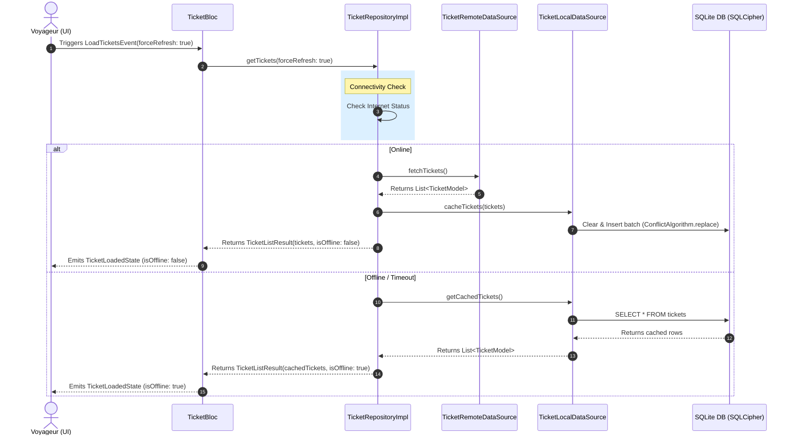
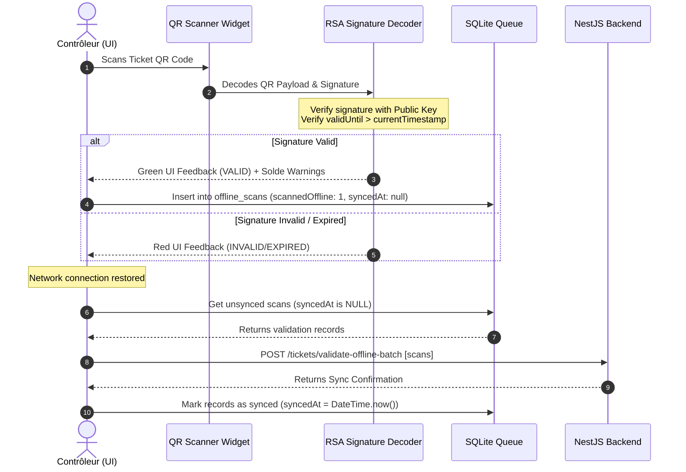

# OPEP Mobile — Passenger Tickets & Offline Caching Design (Flutter)

This document details the functional specifications, visual designs, offline database caching schema, and Clean Architecture Dart stubs for the ticket module of the OPEP mobile application. It covers passenger ticket listing, full-screen QR ticket rendering, balance due warning banners, and the local SQLite caching layer (equipped with SQLCipher capability) for offline ticket verification and access.

---

## 1. Specifications & Requirement Analysis

Based on `cahier_de_charge (2).md` and `OPEP_CLAUDE (1).md`, the ticketing and local caching module satisfies the following functional requirements and business rules:

1. **Ticket Generation & Confirmed Status**:
   * Tickets are generated automatically (via backend BullMQ jobs) once a reservation status is set to `CONFIRMED`.
   * A reservation achieves `CONFIRMED` status when the client pays either the **entire amount (100%)** or a **partial deposit (acompte)** that is greater than or equal to the centre's configured `minDepositPercent` (default: `30%`).

2. **Fractioned Payment Balance Warnings (`amountDueAtCentre`)**:
   * If the reservation payment is partial, a remaining balance is recorded as `amountDueAtCentre` (computed as `totalAmount - amountPaidOnline`).
   * **Rule 10 (Non-Negotiable)**: The solde dû (balance due) **does not block boarding** of the passenger.
   * However, the passenger must pay the remaining balance to the `CASHIER` at the center's counter before the trip's departure.
   * To prevent confusion, the mobile application must clearly display a prominent **warning alert** on both the ticket list card and the ticket detail screen when `amountDueAtCentre > 0`.

3. **Offline Caching Layer Strategy**:
   * Intermittent internet connectivity is common in the interurban transport corridors of Cameroon.
   * **Network-First Strategy**: The app tries to fetch passenger tickets from the API via REST. Upon success, the retrieved tickets are persisted in the local SQLite database.
   * **Local Fallback**: If the API call fails due to connection loss or timeout, the app fails over to the local SQLite cache to display tickets. 
   * A visual indicator ("Mode Hors-ligne") is displayed to inform the user that the list is served from cached local data.

4. **Security & Offline Ticket Verification (Controller Mode)**:
   * The ticket's QR code wraps a JSON payload representing the ticket details, signed using the backend's RSA private key.
   * The payload contains: `ticketId`, `reservationCode`, `passengerName`, `seatNumber`, `tripId`, `departureCity`, `arrivalCity`, `departureDateTime`, `validUntil`, `centreId`, `amountDueAtCentre`, `busPlateNumber`, `driverName`, and `issuedAt`.
   * The `qrSignature` string contains the RSA Base64 signature.
   * The `CONTROLLER`'s app loads the platform's RSA public key at startup (stored in the secure storage and SQLite cache).
   * Offline scan verification parses the QR, verifies the cryptographic signature, checks that `validUntil` > `now()`, and lists the `amountDueAtCentre` for information.
   * Validated scans are stored in a local SQLite validation queue and synced back to NestJS in batches when network connectivity is recovered.

---

## 2. Screen Designs & Visual Blueprints (UX/UI Spec)

The tickets section is accessed from the "Mes Tickets" navigation tab.

### 2.1 Ticket Listing Screen (`tickets_list_page.dart`)
* **Layout**:
  * Tab Bar containing two sections: **À venir** (Upcoming trips) and **Historique** (Past or used tickets).
  * Pull-to-refresh widget (`RefreshIndicator`) to force updates from the API.
  * Search bar allowing the user to search tickets by City, Chauffeur, or Reservation Code.
* **Offline Status Banner**:
  * An unobtrusive, elegant amber banner at the top of the list when showing cached data.
  * **Text**: "⚠️ Affichage hors-ligne. Les informations peuvent ne pas être à jour."
* **Ticket Card Widget**:
  * High-contrast design featuring departure/arrival cities, departure date/time, seat number, and booking code.
  * If `amountDueAtCentre > 0`, a warning footer is appended to the card:
    * Background: Light orange (`#FFF3CD`).
    * Icon: Alert icon (`Icons.warning_amber_rounded`) in amber (`#856404`).
    * **Text**: "Reste à payer : **X XAF** au guichet."

```text
  ┌────────────────────────────────────────────────────────┐
  │ 🔍 Rechercher un ticket...                              │
  ├────────────────────────────────────────────────────────┤
  │    [ À VENIR ]                  [ HISTORIQUE ]         │
  ├────────────────────────────────────────────────────────┤
  │ ⚠️ Affichage hors-ligne. Données locales uniquement.    │
  │                                                        │
  │ ┌────────────────────────────────────────────────────┐ │
  │ │  Yaoundé ──> Douala                      08:00     │ │
  │ │  Date: 15 Juil 2026                      Siège: 3B │ │
  │ │  Compagnie: Finexs Voyage                Code: JDX9│ │
  │ │ ────────────────────────────────────────────────── │ │
  │ │  ⚠️ Solde de 4 500 XAF à régler au guichet.         │ │
  │ └────────────────────────────────────────────────────┘ │
  │                                                        │
  └────────────────────────────────────────────────────────┘
```

### 2.2 Full-Screen Ticket & QR Rendering Screen (`ticket_detail_page.dart`)
* **Auto-Brightness Override**:
  * Displaying a QR code requires high screen contrast for scanners to read it.
  * When entering this screen, the app uses a platform channel (e.g. `screen_brightness` plugin logic) to boost brightness to `100%`. The brightness is restored to the system default when the user pops or leaves the screen.
* **Layout**:
  * **QR Section**: A white card displaying a crisp, generated QR code (using `qr_flutter`) containing the `qrPayload` + `qrSignature` string.
  * **Trip summary**:
    * Departure/Arrival cities, scheduled departure time, seat number.
    * Progress indicator or visual separator.
  * **Balance Due Alert Box**:
    * If `amountDueAtCentre > 0`, a prominent card displays:
      * **Header**: "⚠️ ATTENTION : SOLDE DÛ DE X FCFA" in high-contrast red/amber text.
      * **Description**: "Ce ticket est valide pour l'embarquement, mais vous devez payer le solde restant de X FCFA au guichet de l'agence avant le départ."
  * **Details panels**:
    * **Voyageur**: Name, CNI number.
    * **Véhicule**: Bus model, plate number, layout position.
    * **Chauffeur**: Profile summary (name, experience).

---

## 3. Architecture & Data Flows

### 3.1 Network-First with Cache Fallback Policy
This diagram illustrates how the `TicketRepository` retrieves data, refreshes the local SQLite cache, and handles connection failures gracefully.



### 3.2 Controller Scan Validation & Offline Queue
This diagram outlines the process by which a controller scans a QR code, performs offline cryptographic verification, and queues the scan details locally.



---

## 4. SQLite Caching Database Schema

Below is the SQLite table schema used in the local data layer. It mirrors the backend TypeORM `Ticket` and `Passenger` relational structure, denormalized for optimized local querying.

### Table: `tickets`

| Column | SQL Type | Constraint | Description |
|---|---|---|---|
| `id` | TEXT | PRIMARY KEY | Unique identifier (UUID string) |
| `passengerId` | TEXT | NOT NULL | UUID of the associated Passenger |
| `reservationId` | TEXT | NOT NULL | UUID of the parent Reservation |
| `reservationCode` | TEXT | NOT NULL | 8-character reservation code |
| `passengerName` | TEXT | NOT NULL | Concat of passenger first and last name |
| `seatNumber` | TEXT | NOT NULL | Allocated seat (e.g. "3B") |
| `tripId` | TEXT | NOT NULL | UUID of the associated trip |
| `departureCity` | TEXT | NOT NULL | Voyage departure terminal city |
| `arrivalCity` | TEXT | NOT NULL | Voyage arrival terminal city |
| `departureDateTime` | TEXT | NOT NULL | ISO 8601 string of departure time |
| `validUntil` | TEXT | NOT NULL | ISO 8601 expiration threshold |
| `centreId` | TEXT | NOT NULL | UUID of local centre |
| `amountDueAtCentre` | REAL | NOT NULL | Remaining balance (XAF) |
| `busPlateNumber` | TEXT | NOT NULL | Bus registration identifier |
| `driverName` | TEXT | NOT NULL | Assigned driver's name |
| `issuedAt` | TEXT | NOT NULL | ISO 8601 generation date |
| `status` | TEXT | NOT NULL | VALID, USED, CANCELLED, EXPIRED |
| `qrPayload` | TEXT | NOT NULL | Base64 encoded JSON string |
| `qrSignature` | TEXT | NOT NULL | Base64 encoded RSA signature string |
| `scannedAt` | TEXT | NULLABLE | ISO 8601 timestamp of validation scan |
| `scannedOffline` | INTEGER | DEFAULT 0 | boolean mapping (0 = online scan, 1 = offline scan) |
| `syncedAt` | TEXT | NULLABLE | ISO 8601 timestamp of sync with central server |

---

## 5. Clean Architecture Dart Code Stubs

### 5.1 Domain Entity: Ticket
`lib/features/tickets/domain/entities/ticket.dart`
```dart
import 'package:equatable/equatable.dart';

class Ticket extends Equatable {
  final String id;
  final String passengerId;
  final String reservationId;
  final String reservationCode;
  final String passengerName;
  final String seatNumber;
  final String tripId;
  final String departureCity;
  final String arrivalCity;
  final DateTime departureDateTime;
  final DateTime validUntil;
  final String centreId;
  final double amountDueAtCentre;
  final String busPlateNumber;
  final String driverName;
  final DateTime issuedAt;
  final String status;
  final String qrPayload;
  final String qrSignature;
  final DateTime? scannedAt;
  final bool scannedOffline;
  final DateTime? syncedAt;

  const Ticket({
    required this.id,
    required this.passengerId,
    required this.reservationId,
    required this.reservationCode,
    required this.passengerName,
    required this.seatNumber,
    required this.tripId,
    required this.departureCity,
    required this.arrivalCity,
    required this.departureDateTime,
    required this.validUntil,
    required this.centreId,
    required this.amountDueAtCentre,
    required this.busPlateNumber,
    required this.driverName,
    required this.issuedAt,
    required this.status,
    required this.qrPayload,
    required this.qrSignature,
    this.scannedAt,
    required this.scannedOffline,
    this.syncedAt,
  });

  bool get hasBalanceDue => amountDueAtCentre > 0;

  bool get isExpired => DateTime.now().isAfter(validUntil);

  @override
  List<Object?> get props => [
        id,
        passengerId,
        reservationId,
        reservationCode,
        passengerName,
        seatNumber,
        tripId,
        departureCity,
        arrivalCity,
        departureDateTime,
        validUntil,
        centreId,
        amountDueAtCentre,
        busPlateNumber,
        driverName,
        issuedAt,
        status,
        qrPayload,
        qrSignature,
        scannedAt,
        scannedOffline,
        syncedAt,
      ];
}
```

### 5.2 Data Model: TicketModel
`lib/features/tickets/data/models/ticket_model.dart`
```dart
import '../../domain/entities/ticket.dart';

class TicketModel extends Ticket {
  const TicketModel({
    required super.id,
    required super.passengerId,
    required super.reservationId,
    required super.reservationCode,
    required super.passengerName,
    required super.seatNumber,
    required super.tripId,
    required super.departureCity,
    required super.arrivalCity,
    required super.departureDateTime,
    required super.validUntil,
    required super.centreId,
    required super.amountDueAtCentre,
    required super.busPlateNumber,
    required super.driverName,
    required super.issuedAt,
    required super.status,
    required super.qrPayload,
    required super.qrSignature,
    super.scannedAt,
    required super.scannedOffline,
    super.syncedAt,
  });

  /// Factory to parse the JSON received from NestJS API `/tickets` endpoints.
  factory TicketModel.fromJson(Map<String, dynamic> json) {
    return TicketModel(
      id: json['id'] as String,
      passengerId: json['passengerId'] as String,
      reservationId: json['reservationId'] as String,
      reservationCode: json['reservationCode'] as String,
      passengerName: json['passengerName'] as String,
      seatNumber: json['seatNumber'] as String,
      tripId: json['tripId'] as String,
      departureCity: json['departureCity'] as String,
      arrivalCity: json['arrivalCity'] as String,
      departureDateTime: DateTime.parse(json['departureDateTime'] as String),
      validUntil: DateTime.parse(json['validUntil'] as String),
      centreId: json['centreId'] as String,
      amountDueAtCentre: (json['amountDueAtCentre'] as num).toDouble(),
      busPlateNumber: json['busPlateNumber'] as String,
      driverName: json['driverName'] as String,
      issuedAt: DateTime.parse(json['issuedAt'] as String),
      status: json['status'] as String,
      qrPayload: json['qrPayload'] as String,
      qrSignature: json['qrSignature'] as String,
      scannedAt: json['scannedAt'] != null
          ? DateTime.parse(json['scannedAt'] as String)
          : null,
      scannedOffline: json['scannedOffline'] as bool? ?? false,
      syncedAt: json['syncedAt'] != null
          ? DateTime.parse(json['syncedAt'] as String)
          : null,
    );
  }

  /// Converts model back to JSON format.
  Map<String, dynamic> toJson() {
    return {
      'id': id,
      'passengerId': passengerId,
      'reservationId': reservationId,
      'reservationCode': reservationCode,
      'passengerName': passengerName,
      'seatNumber': seatNumber,
      'tripId': tripId,
      'departureCity': departureCity,
      'arrivalCity': arrivalCity,
      'departureDateTime': departureDateTime.toIso8601String(),
      'validUntil': validUntil.toIso8601String(),
      'centreId': centreId,
      'amountDueAtCentre': amountDueAtCentre,
      'busPlateNumber': busPlateNumber,
      'driverName': driverName,
      'issuedAt': issuedAt.toIso8601String(),
      'status': status,
      'qrPayload': qrPayload,
      'qrSignature': qrSignature,
      'scannedAt': scannedAt?.toIso8601String(),
      'scannedOffline': scannedOffline,
      'syncedAt': syncedAt?.toIso8601String(),
    };
  }

  /// Factory to map the database structure (e.g. converting SQLite integers to boolean values).
  factory TicketModel.fromDbMap(Map<String, dynamic> map) {
    return TicketModel(
      id: map['id'] as String,
      passengerId: map['passengerId'] as String,
      reservationId: map['reservationId'] as String,
      reservationCode: map['reservationCode'] as String,
      passengerName: map['passengerName'] as String,
      seatNumber: map['seatNumber'] as String,
      tripId: map['tripId'] as String,
      departureCity: map['departureCity'] as String,
      arrivalCity: map['arrivalCity'] as String,
      departureDateTime: DateTime.parse(map['departureDateTime'] as String),
      validUntil: DateTime.parse(map['validUntil'] as String),
      centreId: map['centreId'] as String,
      amountDueAtCentre: (map['amountDueAtCentre'] as num).toDouble(),
      busPlateNumber: map['busPlateNumber'] as String,
      driverName: map['driverName'] as String,
      issuedAt: DateTime.parse(map['issuedAt'] as String),
      status: map['status'] as String,
      qrPayload: map['qrPayload'] as String,
      qrSignature: map['qrSignature'] as String,
      scannedAt: map['scannedAt'] != null
          ? DateTime.parse(map['scannedAt'] as String)
          : null,
      scannedOffline: (map['scannedOffline'] as int) == 1,
      syncedAt: map['syncedAt'] != null
          ? DateTime.parse(map['syncedAt'] as String)
          : null,
    );
  }

  /// Exports mapping format matching the local SQLite schema properties.
  Map<String, dynamic> toDbMap() {
    return {
      'id': id,
      'passengerId': passengerId,
      'reservationId': reservationId,
      'reservationCode': reservationCode,
      'passengerName': passengerName,
      'seatNumber': seatNumber,
      'tripId': tripId,
      'departureCity': departureCity,
      'arrivalCity': arrivalCity,
      'departureDateTime': departureDateTime.toIso8601String(),
      'validUntil': validUntil.toIso8601String(),
      'centreId': centreId,
      'amountDueAtCentre': amountDueAtCentre,
      'busPlateNumber': busPlateNumber,
      'driverName': driverName,
      'issuedAt': issuedAt.toIso8601String(),
      'status': status,
      'qrPayload': qrPayload,
      'qrSignature': qrSignature,
      'scannedAt': scannedAt?.toIso8601String(),
      'scannedOffline': scannedOffline ? 1 : 0,
      'syncedAt': syncedAt?.toIso8601String(),
    };
  }
}
```

### 5.3 Local Cache Storage: TicketDatabaseHelper
`lib/core/storage/ticket_database_helper.dart`
```dart
import 'package:path/path.dart';
import 'package:sqflite/sqflite.dart';
import '../../features/tickets/data/models/ticket_model.dart';

class TicketDatabaseHelper {
  static final TicketDatabaseHelper instance = TicketDatabaseHelper._init();
  static Database? _database;

  TicketDatabaseHelper._init();

  Future<Database> get database async {
    if (_database != null) return _database!;
    _database = await _initDB('opep_offline.db');
    return _database!;
  }

  Future<Database> _initDB(String filePath) async {
    final dbPath = await getDatabasesPath();
    final path = join(dbPath, filePath);

    // In production, sqflite_sqlcipher is utilized for AES-256 database encryption:
    // import 'package:sqflite_sqlcipher/sqflite.dart';
    // final secureKey = await getIt<SecureStorageService>().getDatabasePassword();
    // return await openDatabase(path, version: 1, onCreate: _createDB, password: secureKey);
    
    return await openDatabase(path, version: 1, onCreate: _createDB);
  }

  Future<void> _createDB(Database db, int version) async {
    // Creating tickets cache storage
    await db.execute('''
      CREATE TABLE tickets (
        id TEXT PRIMARY KEY,
        passengerId TEXT NOT NULL,
        reservationId TEXT NOT NULL,
        reservationCode TEXT NOT NULL,
        passengerName TEXT NOT NULL,
        seatNumber TEXT NOT NULL,
        tripId TEXT NOT NULL,
        departureCity TEXT NOT NULL,
        arrivalCity TEXT NOT NULL,
        departureDateTime TEXT NOT NULL,
        validUntil TEXT NOT NULL,
        centreId TEXT NOT NULL,
        amountDueAtCentre REAL NOT NULL,
        busPlateNumber TEXT NOT NULL,
        driverName TEXT NOT NULL,
        issuedAt TEXT NOT NULL,
        status TEXT NOT NULL,
        qrPayload TEXT NOT NULL,
        qrSignature TEXT NOT NULL,
        scannedAt TEXT,
        scannedOffline INTEGER DEFAULT 0,
        syncedAt TEXT
      )
    ''');

    // Create index on departure DateTime for fast ticket lists querying
    await db.execute('''
      CREATE INDEX idx_tickets_departure ON tickets (departureDateTime)
    ''');
  }

  /// Deletes and rewrites local ticket caches dynamically.
  Future<void> cacheTickets(List<TicketModel> tickets) async {
    final db = await database;
    
    // Execute cache insertion within a single local transaction
    await db.transaction((txn) async {
      for (final ticket in tickets) {
        await txn.insert(
          'tickets',
          ticket.toDbMap(),
          conflictAlgorithm: ConflictAlgorithm.replace,
        );
      }
    });
  }

  /// Retrieves list of cached tickets sorted by departure time.
  Future<List<TicketModel>> getCachedTickets() async {
    final db = await database;
    final List<Map<String, dynamic>> maps = await db.query(
      'tickets',
      orderBy: 'departureDateTime DESC',
    );

    return maps.map((map) => TicketModel.fromDbMap(map)).toList();
  }

  /// Retrieves details of a specific ticket.
  Future<TicketModel?> getCachedTicketById(String id) async {
    final db = await database;
    final List<Map<String, dynamic>> maps = await db.query(
      'tickets',
      where: 'id = ?',
      whereArgs: [id],
    );

    if (maps.isNotEmpty) {
      return TicketModel.fromDbMap(maps.first);
    }
    return null;
  }

  /// Manually clears cached records (e.g. on User Logout).
  Future<void> clearCache() async {
    final db = await database;
    await db.delete('tickets');
  }

  /// Close database instance.
  Future<void> close() async {
    final db = _database;
    if (db != null) {
      await db.close();
      _database = null;
    }
  }
}
```

### 5.4 Data Sources (Remote & Local Cache)
`lib/features/tickets/data/datasources/ticket_local_datasource.dart`
```dart
import '../../../../core/storage/ticket_database_helper.dart';
import '../models/ticket_model.dart';

abstract class TicketLocalDataSource {
  Future<List<TicketModel>> getCachedTickets();
  Future<TicketModel?> getCachedTicketById(String ticketId);
  Future<void> cacheTickets(List<TicketModel> tickets);
  Future<void> clearCache();
}

class TicketLocalDataSourceImpl implements TicketLocalDataSource {
  final TicketDatabaseHelper databaseHelper;

  TicketLocalDataSourceImpl({required this.databaseHelper});

  @override
  Future<List<TicketModel>> getCachedTickets() {
    return databaseHelper.getCachedTickets();
  }

  @override
  Future<TicketModel?> getCachedTicketById(String ticketId) {
    return databaseHelper.getCachedTicketById(ticketId);
  }

  @override
  Future<void> cacheTickets(List<TicketModel> tickets) {
    return databaseHelper.cacheTickets(tickets);
  }

  @override
  Future<void> clearCache() {
    return databaseHelper.clearCache();
  }
}
```

`lib/features/tickets/data/datasources/ticket_remote_datasource.dart`
```dart
import 'package:dio/dio.dart';
import '../models/ticket_model.dart';

abstract class TicketRemoteDataSource {
  Future<List<TicketModel>> fetchTickets();
  Future<TicketModel> fetchTicketDetail(String ticketId);
}

class TicketRemoteDataSourceImpl implements TicketRemoteDataSource {
  final Dio dio;

  TicketRemoteDataSourceImpl({required this.dio});

  @override
  Future<List<TicketModel>> fetchTickets() async {
    final response = await dio.get('/tickets');
    final data = response.data as List;
    return data
        .map((json) => TicketModel.fromJson(json as Map<String, dynamic>))
        .toList();
  }

  @override
  Future<TicketModel> fetchTicketDetail(String ticketId) async {
    final response = await dio.get('/tickets/$ticketId');
    return TicketModel.fromJson(response.data as Map<String, dynamic>);
  }
}
```

### 5.5 Repository Layer (Interface & Concrete Implementation)
`lib/features/tickets/domain/repositories/ticket_repository.dart`
```dart
import '../entities/ticket.dart';

class TicketListResult {
  final List<Ticket> tickets;
  final bool isOffline;

  const TicketListResult({required this.tickets, required this.isOffline});
}

class TicketDetailResult {
  final Ticket ticket;
  final bool isOffline;

  const TicketDetailResult({required this.ticket, required this.isOffline});
}

abstract class TicketRepository {
  Future<TicketListResult> getTickets({bool forceRefresh = false});
  Future<TicketDetailResult> getTicketDetail(String ticketId);
  Future<List<Ticket>> getCachedTickets();
  Future<Ticket?> getCachedTicketById(String ticketId);
}
```

`lib/features/tickets/data/repositories/ticket_repository_impl.dart`
```dart
import 'dart:io';
import 'package:connectivity_plus/connectivity_plus.dart';
import '../../domain/entities/ticket.dart';
import '../../domain/repositories/ticket_repository.dart';
import '../datasources/ticket_local_datasource.dart';
import '../datasources/ticket_remote_datasource.dart';

class TicketRepositoryImpl implements TicketRepository {
  final TicketRemoteDataSource remoteDataSource;
  final TicketLocalDataSource localDataSource;
  final Connectivity connectivity;

  TicketRepositoryImpl({
    required this.remoteDataSource,
    required this.localDataSource,
    required this.connectivity,
  });

  @override
  Future<TicketListResult> getTickets({bool forceRefresh = false}) async {
    final connection = await connectivity.checkConnectivity();
    final isOnline = connection != ConnectivityResult.none;

    if (isOnline) {
      try {
        final remoteTickets = await remoteDataSource.fetchTickets();
        await localDataSource.cacheTickets(remoteTickets);
        return TicketListResult(tickets: remoteTickets, isOffline: false);
      } on SocketException {
        // Handle physical network outage despite connectivity status report
      } catch (_) {
        // Log error and fall back to local cache
      }
    }

    // Cache fallback execution
    final localTickets = await localDataSource.getCachedTickets();
    if (localTickets.isNotEmpty) {
      return TicketListResult(tickets: localTickets, isOffline: true);
    }

    throw Exception('Aucune connexion Internet et aucun ticket stocké localement.');
  }

  @override
  Future<TicketDetailResult> getTicketDetail(String ticketId) async {
    final connection = await connectivity.checkConnectivity();
    final isOnline = connection != ConnectivityResult.none;

    if (isOnline) {
      try {
        final remoteTicket = await remoteDataSource.fetchTicketDetail(ticketId);
        await localDataSource.cacheTickets([remoteTicket]);
        return TicketDetailResult(ticket: remoteTicket, isOffline: false);
      } on SocketException {
        // Failover
      } catch (_) {
        // Failover
      }
    }

    final localTicket = await localDataSource.getCachedTicketById(ticketId);
    if (localTicket != null) {
      return TicketDetailResult(ticket: localTicket, isOffline: true);
    }

    throw Exception('Détail du ticket indisponible hors-ligne.');
  }

  @override
  Future<List<Ticket>> getCachedTickets() async {
    return await localDataSource.getCachedTickets();
  }

  @override
  Future<Ticket?> getCachedTicketById(String ticketId) async {
    return await localDataSource.getCachedTicketById(ticketId);
  }
}
```

### 5.6 Presentation Layer: BLoC Implementation
`lib/features/tickets/presentation/bloc/ticket_event.dart`
```dart
import 'package:equatable/equatable.dart';

abstract class TicketEvent extends Equatable {
  const TicketEvent();

  @override
  List<Object?> get props => [];
}

class LoadTicketsEvent extends TicketEvent {
  final bool forceRefresh;

  const LoadTicketsEvent({this.forceRefresh = false});

  @override
  List<Object?> get props => [forceRefresh];
}

class LoadTicketDetailEvent extends TicketEvent {
  final String ticketId;

  const LoadTicketDetailEvent({required this.ticketId});

  @override
  List<Object?> get props => [ticketId];
}
```

`lib/features/tickets/presentation/bloc/ticket_state.dart`
```dart
import 'package:equatable/equatable.dart';
import '../../domain/entities/ticket.dart';

abstract class TicketState extends Equatable {
  const TicketState();

  @override
  List<Object?> get props => [];
}

class TicketInitial extends TicketState {}

class TicketLoading extends TicketState {}

class TicketLoaded extends TicketState {
  final List<Ticket> tickets;
  final bool isOffline;
  final String? message;

  const TicketLoaded({
    required this.tickets,
    required this.isOffline,
    this.message,
  });

  TicketLoaded copyWith({
    List<Ticket>? tickets,
    bool? isOffline,
    String? message,
  }) {
    return TicketLoaded(
      tickets: tickets ?? this.tickets,
      isOffline: isOffline ?? this.isOffline,
      message: message ?? this.message,
    );
  }

  @override
  List<Object?> get props => [tickets, isOffline, message];
}

class TicketDetailLoaded extends TicketState {
  final Ticket ticket;
  final bool isOffline;

  const TicketDetailLoaded({
    required this.ticket,
    required this.isOffline,
  });

  @override
  List<Object?> get props => [ticket, isOffline];
}

class TicketError extends TicketState {
  final String message;
  final bool isOfflineFallback;

  const TicketError({
    required this.message,
    this.isOfflineFallback = false,
  });

  @override
  List<Object?> get props => [message, isOfflineFallback];
}
```

`lib/features/tickets/presentation/bloc/ticket_bloc.dart`
```dart
import 'package:flutter_bloc/flutter_bloc.dart';
import '../../domain/repositories/ticket_repository.dart';
import 'ticket_event.dart';
import 'ticket_state.dart';

class TicketBloc extends Bloc<TicketEvent, TicketState> {
  final TicketRepository _ticketRepository;

  TicketBloc({
    required TicketRepository ticketRepository,
  })  : _ticketRepository = ticketRepository,
        super(TicketInitial()) {
    on<LoadTicketsEvent>(_onLoadTickets);
    on<LoadTicketDetailEvent>(_onLoadTicketDetail);
  }

  Future<void> _onLoadTickets(
    LoadTicketsEvent event,
    Emitter<TicketState> emit,
  ) async {
    emit(TicketLoading());
    try {
      final result = await _ticketRepository.getTickets(
        forceRefresh: event.forceRefresh,
      );
      
      String? infoMessage;
      if (result.isOffline) {
        infoMessage = "Affichage hors-ligne. Connexion Internet perdue.";
      }
      
      emit(TicketLoaded(
        tickets: result.tickets,
        isOffline: result.isOffline,
        message: infoMessage,
      ));
    } catch (e) {
      // Direct absolute local storage failover execution
      try {
        final cached = await _ticketRepository.getCachedTickets();
        if (cached.isNotEmpty) {
          emit(TicketLoaded(
            tickets: cached,
            isOffline: true,
            message: "Échec réseau. Affichage des données locales stockées.",
          ));
        } else {
          emit(const TicketError(
            message: "Erreur de connexion. Impossible de charger vos tickets.",
            isOfflineFallback: false,
          ));
        }
      } catch (_) {
        emit(TicketError(
          message: "Une erreur est survenue lors de la récupération des données.",
          isOfflineFallback: false,
        ));
      }
    }
  }

  Future<void> _onLoadTicketDetail(
    LoadTicketDetailEvent event,
    Emitter<TicketState> emit,
  ) async {
    emit(TicketLoading());
    try {
      final result = await _ticketRepository.getTicketDetail(event.ticketId);
      emit(TicketDetailLoaded(
        ticket: result.ticket,
        isOffline: result.isOffline,
      ));
    } catch (e) {
      // Local caching fallback detail retrieval
      try {
        final cachedTicket = await _ticketRepository.getCachedTicketById(
          event.ticketId,
        );
        if (cachedTicket != null) {
          emit(TicketDetailLoaded(
            ticket: cachedTicket,
            isOffline: true,
          ));
        } else {
          emit(const TicketError(
            message: "Détails du ticket introuvables hors-ligne.",
            isOfflineFallback: true,
          ));
        }
      } catch (_) {
        emit(TicketError(
          message: e.toString(),
          isOfflineFallback: true,
        ));
      }
    }
  }
}
```
