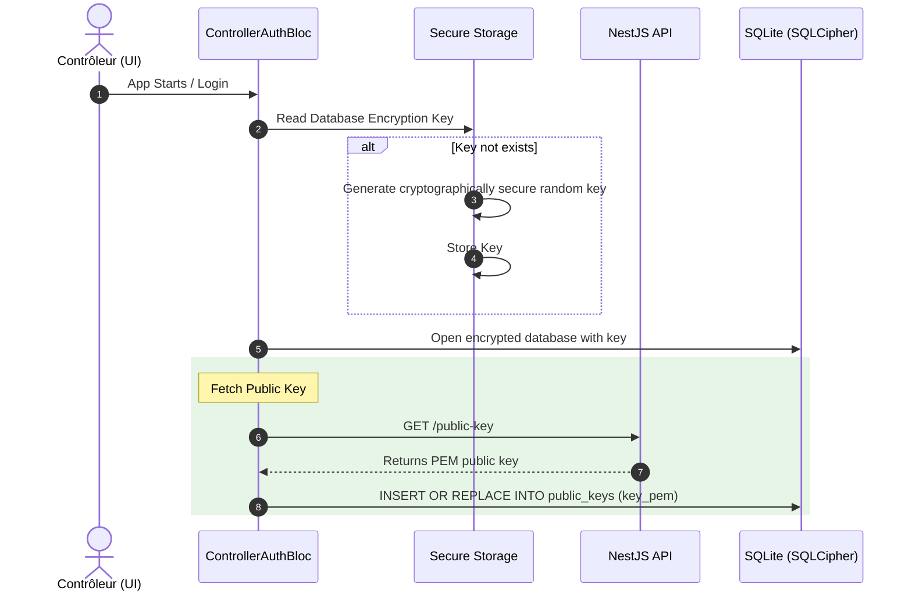
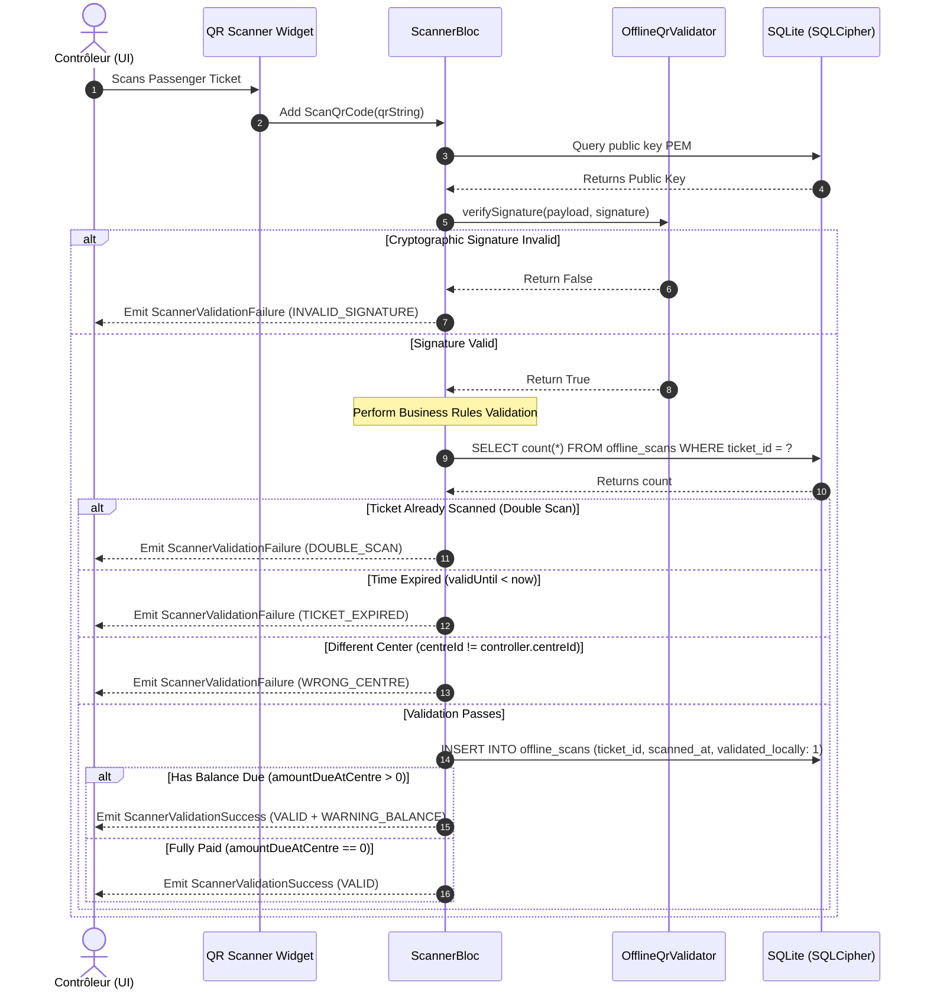
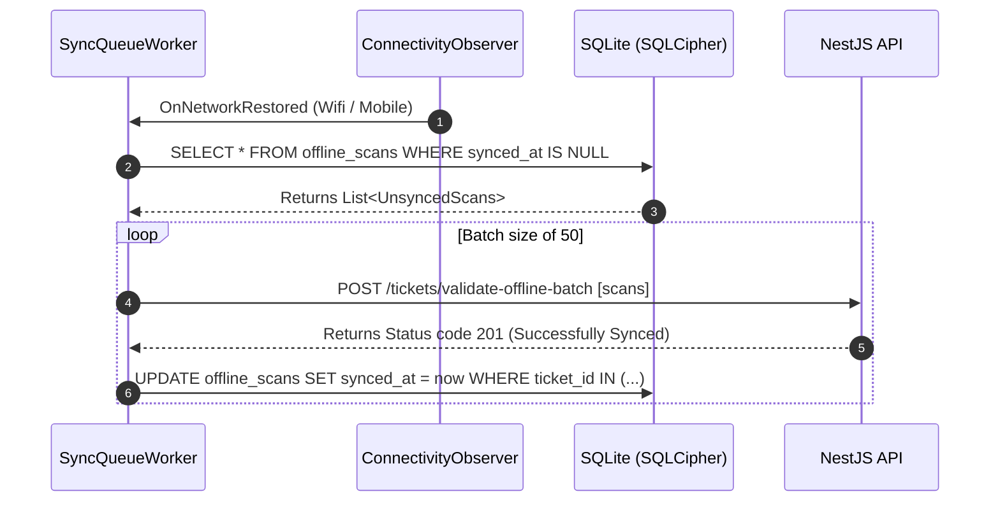

# OPEP Mobile — Controller Mode & Offline QR Scanning Design (Flutter)

This document details the functional specifications, visual feedback designs, cryptographic validation rules, local secure database schema, and Clean Architecture Dart code stubs for the **Controller Mode** and **Offline QR Scanning** modules of the OPEP mobile application.

---

## 1. Specifications & Requirement Analysis

Based on `cahier_de_charge (2).md` and `OPEP_CLAUDE (1).md`, the controller offline scanning module satisfies the following requirements:

1. **Controller Role & Scope**:
   * Only users with `UserRole.CONTROLLER` can access the scanning functionality.
   * **Rule 7.2 (Non-Negotiable)**: Controllers can only validate tickets belonging to their own local center (`centreId`).

2. **Public Key Management & Secure Local Storage**:
   * The app fetches the backend's RSA public key via the public endpoint `GET /api/v1/public-key`.
   * The retrieved public key PEM is saved in the local database.
   * To prevent reverse engineering or key tampering on the device, the local SQLite database is encrypted using **SQLCipher** (`sqflite_sqlcipher`).
   * The database encryption password is automatically generated on first boot and stored securely in **Keychain/Keystore** via `flutter_secure_storage`.

3. **Offline Cryptographic QR Validation**:
   * The QR code scanned by the controller contains the base64-encoded payload and signature separated by a dot (`.`), in the format: `<payloadBase64>.<signatureBase64>`.
   * **Cryptographic Verification**:
     * The payload is decoded to a JSON string.
     * The signature is decoded to raw bytes.
     * The signature is cryptographically validated against the payload using **PointyCastle** (RSA-PSS padding, SHA-256 hash).
   * **Temporal Validation**:
     * Check if `DateTime.now()` is before the ticket's `validUntil` time (typically `departureDateTime` + 2 hours).
   * **Scope Validation**:
     * The ticket's `centreId` must match the controller's `centreId`.
   * **Double Scan Prevention (Local & Offline)**:
     * Check the local SQLite database for existing records of the same `ticketId` to prevent reusing a ticket offline.

4. **Scan Visual Feedbacks (UX/UI)**:
   * **VALID STATE (Green)**: High-contrast green background with a checkmark, passenger name, seat number, route details, and a clear message "Embarquement Autorisé".
   * **VALID WITH BALANCE DUE STATE (Amber/Orange Warning)**:
     * **Rule 10 (Non-Negotiable)**: A remaining balance (`amountDueAtCentre > 0`) **does not block boarding**.
     * The UI displays a warning banner: *"Solde dû de X XAF à payer au guichet."* with an amber/orange background, alongside the green authorization.
   * **INVALID/EXPIRED STATE (Red)**: High-contrast red background with an error symbol and specific failure message:
     * *Signature invalide* (forged ticket).
     * *Ticket déjà utilisé / scanné* (double boarding prevention).
     * *Voyage expiré* (validUntil exceeded).
     * *Mauvaise succursale* (ticket is for a trip from another center).

5. **Sync Queue Database & Workers**:
   * Validated offline scans are queued locally in the SQLCipher database.
   * A background worker monitors network changes using `connectivity_plus`.
   * Once connection is restored (or when a manual "Sychroniser" button is pressed), the queue batch-uploads the scans to NestJS via `POST /tickets/validate-offline-batch`.
   * Successfully synced scans are marked as synchronized locally (`syncedAt = DateTime.now()`).

---

## 2. Architecture & Data Flows

### 2.1 Public Key Download & Secure Storage Flow


### 2.2 Offline QR Code Validation Flow


### 2.3 Offline Validation Sync Flow


---

## 3. SQLCipher Database Schema

SQLite tables defined in `DatabaseHelper` to manage offline states securely.

### Table: `public_keys`
Stores the active cryptographic key downloaded from the server to avoid reliance on hardcoded code certificates.

| Column | Type | Constraint | Description |
|---|---|---|---|
| `id` | TEXT | PRIMARY KEY | Unique identifier (e.g. "active_public_key") |
| `key_pem` | TEXT | NOT NULL | The RSA public key in PEM format |
| `downloaded_at` | TEXT | NOT NULL | ISO 8601 string of when downloaded |
| `is_active` | INTEGER | DEFAULT 1 | 1 = active, 0 = inactive |

### Table: `offline_scans`
Holds validation records scanned offline waiting for internet connection.

| Column | Type | Constraint | Description |
|---|---|---|---|
| `id` | TEXT | PRIMARY KEY | Unique UUID string for the scan entry |
| `ticket_id` | TEXT | NOT NULL | UUID of the scanned ticket |
| `qr_payload` | TEXT | NOT NULL | Raw decrypted JSON payload of the ticket |
| `scanned_at` | TEXT | NOT NULL | ISO 8601 timestamp of scan execution |
| `controller_id` | TEXT | NOT NULL | UUID of the controller who scanned the ticket |
| `device_id` | TEXT | NOT NULL | Unique physical device identifier |
| `trip_id` | TEXT | NOT NULL | UUID of the trip associated with the ticket |
| `validated_locally` | INTEGER | NOT NULL | 1 = Yes (cryptographically verified locally) |
| `validation_result` | TEXT | NOT NULL | Stringified JSON with local validation details |
| `synced_at` | TEXT | NULLABLE | ISO 8601 timestamp of sync with central server |

---

## 4. Visual Layout Specifications

### 4.1 Valid Ticket UI (Success - Green)
* **Background**: Emerald Green (`#0F9D58` / HSL 150, 83%, 34%) with soft gradient.
* **Header Icon**: Animated checkmark inside a white circular border.
* **Metadata display**:
  * Passenger Name: Bold large white typography (e.g., Outfit font).
  * Seat Number & Trip Code: High contrast white tag.
  * Destination: Yaoundé ──> Douala.
* **Footer Status**: *"VALIDE - BON VOYAGE"*

### 4.2 Valid with Balance Due UI (Success Warning - Orange Banner)
* **Background**: Emerald Green with an overlay warning banner on top.
* **Warning Banner**:
  * Height: 70dp.
  * Color: Bright Amber/Orange (`#F4B400` / HSL 43, 100%, 48%).
  * Icon: Pulse Alert icon (`Icons.monetization_on` or `Icons.warning`).
  * Text color: High-contrast Dark Brown (`#5C3E00`).
  * **Text**: *"ATTENTION: SOLDE DE 4,500 XAF À RÉGLER AU GUICHET"*
  * **Rule 10 application**: A subtext says: *"L'accès à bord est autorisé. Veuillez rediriger le passager vers la caisse."*

### 4.3 Invalid Ticket UI (Failure - Red)
* **Background**: Deep Crimson Red (`#DB4437` / HSL 4, 69%, 54%).
* **Header Icon**: Cross mark (`Icons.cancel_rounded`) in white.
* **Error Text**: Bold white description stating the precise rejection reason (e.g., *"SIGNATURE INVALIDE - TICKET FALSIFIÉ"* or *"TICKET DÉJÀ SCANNE À 07:54"*).

---

## 5. Clean Architecture Dart Code Stubs

All stubs are syntax-valid, clean, and typed with production-ready imports.

### 5.1 Database Helper (`DatabaseHelper`)
`lib/core/storage/database_helper.dart`
```dart
import 'dart:convert';
import 'package:path/path.dart';
import 'package:sqflite_sqlcipher/sqflite.dart';
import 'package:flutter_secure_storage/flutter_secure_storage.dart';

class DatabaseHelper {
  static DatabaseHelper? _instance;
  static Database? _database;
  static const String _dbName = 'opep_secure_controller.db';
  static const String _secureStorageKey = 'sqlcipher_db_passkey';
  
  final FlutterSecureStorage _secureStorage = const FlutterSecureStorage();

  DatabaseHelper._internal();

  factory DatabaseHelper() {
    _instance ??= DatabaseHelper._internal();
    return _instance!;
  }

  /// Opens the database with SQLCipher encryption.
  Future<Database> get database async {
    if (_database != null) return _database!;
    _database = await _initDatabase();
    return _database!;
  }

  Future<Database> _initDatabase() async {
    // 1. Fetch or generate the encryption passkey from flutter_secure_storage
    String? passkey = await _secureStorage.read(key: _secureStorageKey);
    if (passkey == null) {
      passkey = _generateSecurePasskey();
      await _secureStorage.write(key: _secureStorageKey, value: passkey);
    }

    // 2. Resolve database file path on platform
    final databasesPath = await getDatabasesPath();
    final dbFilePath = join(databasesPath, _dbName);

    // 3. Open Database using SQLCipher password parameter
    return await openDatabase(
      dbFilePath,
      password: passkey,
      version: 1,
      onCreate: _onCreate,
    );
  }

  String _generateSecurePasskey() {
    // Generates a random secure string for encryption keys.
    final timestamp = DateTime.now().microsecondsSinceEpoch;
    final randomPart = (timestamp % 1000000).toString().padLeft(6, '0');
    return 'opep_cipher_key_v1_${timestamp}_$randomPart';
  }

  Future<void> _onCreate(Database db, int version) async {
    // Create the public keys storage table
    await db.execute('''
      CREATE TABLE public_keys (
        id TEXT PRIMARY KEY,
        key_pem TEXT NOT NULL,
        downloaded_at TEXT NOT NULL,
        is_active INTEGER NOT NULL DEFAULT 1
      )
    ''');

    // Create the offline scans sync queue table
    await db.execute('''
      CREATE TABLE offline_scans (
        id TEXT PRIMARY KEY,
        ticket_id TEXT NOT NULL,
        qr_payload TEXT NOT NULL,
        scanned_at TEXT NOT NULL,
        controller_id TEXT NOT NULL,
        device_id TEXT NOT NULL,
        trip_id TEXT NOT NULL,
        validated_locally INTEGER NOT NULL,
        validation_result TEXT NOT NULL,
        synced_at TEXT
      )
    ''');
  }

  // --- Cryptographic Public Key Accessors ---

  Future<void> savePublicKey(String pem) async {
    final db = await database;
    await db.insert(
      'public_keys',
      {
        'id': 'active_public_key',
        'key_pem': pem,
        'downloaded_at': DateTime.now().toIso8601String(),
        'is_active': 1,
      },
      conflictAlgorithm: ConflictAlgorithm.replace,
    );
  }

  Future<String?> getActivePublicKey() async {
    final db = await database;
    final List<Map<String, dynamic>> maps = await db.query(
      'public_keys',
      where: 'id = ? AND is_active = ?',
      whereArgs: ['active_public_key', 1],
      limit: 1,
    );
    if (maps.isEmpty) return null;
    return maps.first['key_pem'] as String;
  }

  // --- Offline Scan Queue Methods ---

  Future<void> enqueueOfflineScan(Map<String, dynamic> scanData) async {
    final db = await database;
    await db.insert(
      'offline_scans',
      scanData,
      conflictAlgorithm: ConflictAlgorithm.fail,
    );
  }

  Future<List<Map<String, dynamic>>> getUnsyncedScans() async {
    final db = await database;
    return await db.query(
      'offline_scans',
      where: 'synced_at IS NULL',
      orderBy: 'scanned_at ASC',
    );
  }

  Future<void> markScansAsSynced(List<String> scanIds) async {
    final db = await database;
    final nowIso = DateTime.now().toIso8601String();
    
    await db.transaction((txn) async {
      for (final id in scanIds) {
        await txn.update(
          'offline_scans',
          {'synced_at': nowIso},
          where: 'id = ?',
          whereArgs: [id],
        );
      }
    });
  }

  Future<bool> checkLocalDoubleScan(String ticketId) async {
    final db = await database;
    final List<Map<String, dynamic>> results = await db.query(
      'offline_scans',
      columns: ['id'],
      where: 'ticket_id = ?',
      whereArgs: [ticketId],
      limit: 1,
    );
    return results.isNotEmpty;
  }

  Future<void> clearDatabase() async {
    final db = await database;
    await db.delete('offline_scans');
    await db.delete('public_keys');
  }
}
```

### 5.2 Cryptographic Offline QR Validator (`OfflineQrValidator`)
`lib/features/offline/qr_validator.dart`
```dart
import 'dart:convert';
import 'dart:typed_data';
import 'package:pointycastle/export.dart';

class OfflineQrValidator {
  final RSAPublicKey publicKey;

  const OfflineQrValidator({required this.publicKey});

  /// Validates standard RSA-PSS SHA-256 signature in Dart without network access.
  ///
  /// The [qrString] must be formatted as: `<payloadBase64>.<signatureBase64>`
  bool verifyTicketQrSignature(String qrString) {
    try {
      final parts = qrString.split('.');
      if (parts.length != 2) return false;

      final String payloadBase64 = parts[0];
      final String signatureBase64 = parts[1];

      // Decode bytes
      final Uint8List dataBytes = utf8.encode(payloadBase64);
      final Uint8List signatureBytes = base64.decode(signatureBase64);

      // Initialize RSA-PSS verifier in PointyCastle
      final verifier = Signer('SHA-256/PSS-Signature/RSA');
      
      // Initialize with public key (false = verification mode)
      verifier.init(
        false, 
        PublicKeyParameter<RSAPublicKey>(publicKey),
      );

      final pssSignature = PSSSignature(signatureBytes);
      return verifier.verifySignature(dataBytes, pssSignature);
    } catch (_) {
      return false; // Cryptographic parse or validation error
    }
  }

  /// Helper parser to transform RSA Public Key PEM strings into PointyCastle RSAPublicKey object.
  static RSAPublicKey parsePemPublicKey(String pemString) {
    try {
      // 1. Clean header, footer, and spaces
      final cleanPem = pemString
          .replaceAll('-----BEGIN PUBLIC KEY-----', '')
          .replaceAll('-----END PUBLIC KEY-----', '')
          .replaceAll(RegExp(r'\s+'), '');
      
      final bytes = base64.decode(cleanPem);
      final parser = ASN1Parser(bytes);
      
      // 2. Decode the outer SubjectPublicKeyInfo Sequence
      final outerSeq = parser.nextObject() as ASN1Sequence;
      
      // 3. Extract the second element, which is the public key Bit String
      final publicKeyBitString = outerSeq.elements[1] as ASN1BitString;
      final bitStringBytes = publicKeyBitString.valueBytes();
      
      // 4. Skip DER padding bytes offset (usually 0x00 indicating no unused bits)
      final int startOffset = bitStringBytes[0] == 0x00 ? 1 : 0;
      final innerBytes = bitStringBytes.sublist(startOffset);
      
      // 5. Parse inner RSAPublicKey sequence (modulus, exponent)
      final innerParser = ASN1Parser(innerBytes);
      final innerSeq = innerParser.nextObject() as ASN1Sequence;
      
      final modulus = innerSeq.elements[0] as ASN1Integer;
      final exponent = innerSeq.elements[1] as ASN1Integer;

      return RSAPublicKey(modulus.integer!, exponent.integer!);
    } catch (e) {
      throw FormatException('Failed parsing RSA PEM Public Key: $e');
    }
  }
}
```

### 5.3 BLoC Layer logic (`ScannerBloc`)
`lib/features/driver/presentation/bloc/scanner_bloc.dart`
```dart
import 'dart:convert';
import 'package:flutter_bloc/flutter_bloc.dart';
import 'package:equatable/equatable.dart';
import '../../../../core/storage/database_helper.dart';
import '../../../../features/offline/qr_validator.dart';

// --- Events ---

abstract class ScannerEvent extends Equatable {
  const ScannerEvent();

  @override
  List<Object?> get props => [];
}

class InitializeScanner extends ScannerEvent {}

class ScanQrCodeEvent extends ScannerEvent {
  final String qrString;
  final String controllerId;
  final String controllerCentreId;
  final String deviceId;

  const ScanQrCodeEvent({
    required this.qrString,
    required this.controllerId,
    required this.controllerCentreId,
    required this.deviceId,
  });

  @override
  List<Object?> get props => [qrString, controllerId, controllerCentreId, deviceId];
}

class ResetScanner extends ScannerEvent {}

// --- States ---

abstract class ScannerState extends Equatable {
  const ScannerState();

  @override
  List<Object?> get props => [];
}

class ScannerInitial extends ScannerState {}

class ScannerLoading extends ScannerState {}

class ScannerReady extends ScannerState {}

class ScannerValidationSuccess extends ScannerState {
  final String ticketId;
  final String passengerName;
  final String seatNumber;
  final String departureCity;
  final String arrivalCity;
  final String departureDateTime;
  final double amountDueAtCentre;
  final bool hasBalanceDue;
  final bool validatedOffline;

  const ScannerValidationSuccess({
    required this.ticketId,
    required this.passengerName,
    required this.seatNumber,
    required this.departureCity,
    required this.arrivalCity,
    required this.departureDateTime,
    required this.amountDueAtCentre,
    required this.hasBalanceDue,
    required this.validatedOffline,
  });

  @override
  List<Object?> get props => [
        ticketId,
        passengerName,
        seatNumber,
        departureCity,
        arrivalCity,
        departureDateTime,
        amountDueAtCentre,
        hasBalanceDue,
        validatedOffline,
      ];
}

class ScannerValidationFailure extends ScannerState {
  final String errorMessage;
  final String errorCode;

  const ScannerValidationFailure({
    required this.errorMessage,
    required this.errorCode,
  });

  @override
  List<Object?> get props => [errorMessage, errorCode];
}

// --- BLoC Implementation ---

class ScannerBloc extends Bloc<ScannerEvent, ScannerState> {
  final DatabaseHelper _dbHelper = DatabaseHelper();

  ScannerBloc() : super(ScannerInitial()) {
    on<InitializeScanner>(_onInitializeScanner);
    on<ScanQrCodeEvent>(_onScanQrCode);
    on<ResetScanner>(_onResetScanner);
  }

  Future<void> _onInitializeScanner(
    InitializeScanner event,
    Emitter<ScannerState> emit,
  ) async {
    emit(ScannerLoading());
    try {
      final publicKey = await _dbHelper.getActivePublicKey();
      if (publicKey == null) {
        emit(const ScannerValidationFailure(
          errorMessage: 'Clé publique RSA absente. Veuillez vous connecter en ligne pour la synchroniser.',
          errorCode: 'MISSING_PUBLIC_KEY',
        ));
        return;
      }
      emit(ScannerReady());
    } catch (e) {
      emit(ScannerValidationFailure(
        errorMessage: 'Échec de configuration du scanner : $e',
        errorCode: 'INIT_ERROR',
      ));
    }
  }

  Future<void> _onScanQrCode(
    ScanQrCodeEvent event,
    Emitter<ScannerState> emit,
  ) async {
    emit(ScannerLoading());

    try {
      // 1. Resolve cryptography public key
      final String? publicKeyPem = await _dbHelper.getActivePublicKey();
      if (publicKeyPem == null) {
        emit(const ScannerValidationFailure(
          errorMessage: 'Clé publique introuvable. Effectuez un rechargement en ligne.',
          errorCode: 'MISSING_PUBLIC_KEY',
        ));
        return;
      }

      final key = OfflineQrValidator.parsePemPublicKey(publicKeyPem);
      final validator = OfflineQrValidator(publicKey: key);

      // 2. Perform Cryptographic signature validation
      final bool isSignatureValid = validator.verifyTicketQrSignature(event.qrString);
      if (!isSignatureValid) {
        emit(const ScannerValidationFailure(
          errorMessage: 'Signature cryptographique invalide. Ticket falsifié ou corrompu.',
          errorCode: 'INVALID_SIGNATURE',
        ));
        return;
      }

      // 3. Decode payload from string format (<payloadBase64>.<signatureBase64>)
      final parts = event.qrString.split('.');
      final String payloadJsonString = utf8.decode(base64.decode(parts[0]));
      final Map<String, dynamic> payload = json.decode(payloadJsonString) as Map<String, dynamic>;

      // 4. Validate metadata parameters
      final String ticketId = payload['ticketId'] as String;
      final String tripId = payload['tripId'] as String;
      final String departureCity = payload['departureCity'] as String;
      final String arrivalCity = payload['arrivalCity'] as String;
      final String passengerName = payload['passengerName'] as String;
      final String seatNumber = payload['seatNumber'] as String;
      final String departureDateTimeStr = payload['departureDateTime'] as String;
      final double amountDue = (payload['amountDueAtCentre'] as num).toDouble();
      final String ticketCentreId = payload['centreId'] as String;
      final DateTime validUntil = DateTime.parse(payload['validUntil'] as String);

      // Business Rule 7.2: Verify center matching controller center restriction
      if (ticketCentreId != event.controllerCentreId) {
        emit(const ScannerValidationFailure(
          errorMessage: "Ce ticket appartient à une autre succursale. Action interdite.",
          errorCode: 'WRONG_CENTRE',
        ));
        return;
      }

      // Time checking verification (expired ticket)
      if (DateTime.now().isAfter(validUntil)) {
        emit(const ScannerValidationFailure(
          errorMessage: "Ce ticket de voyage a expiré.",
          errorCode: 'TICKET_EXPIRED',
        ));
        return;
      }

      // 5. Double Scan Verification (prevent replay attacks offline)
      final bool isAlreadyScannedLocally = await _dbHelper.checkLocalDoubleScan(ticketId);
      if (isAlreadyScannedLocally) {
        emit(const ScannerValidationFailure(
          errorMessage: 'Ticket déjà utilisé ou scanné.',
          errorCode: 'DOUBLE_SCAN',
        ));
        return;
      }

      // 6. Persist local check validation status in database queue
      final String scanUUID = 'offline_scan_${DateTime.now().millisecondsSinceEpoch}_$ticketId';
      final Map<String, dynamic> scanRecord = {
        'id': scanUUID,
        'ticket_id': ticketId,
        'qr_payload': parts[0],
        'scanned_at': DateTime.now().toIso8601String(),
        'controller_id': event.controllerId,
        'device_id': event.deviceId,
        'trip_id': tripId,
        'validated_locally': 1,
        'validation_result': json.encode({
          'valid': true,
          'validated_offline': true,
          'amountDue': amountDue,
        }),
        'synced_at': null,
      };

      await _dbHelper.enqueueOfflineScan(scanRecord);

      // 7. Success state emission (Green or Amber warning UI triggers)
      emit(ScannerValidationSuccess(
        ticketId: ticketId,
        passengerName: passengerName,
        seatNumber: seatNumber,
        departureCity: departureCity,
        arrivalCity: arrivalCity,
        departureDateTime: departureDateTimeStr,
        amountDueAtCentre: amountDue,
        hasBalanceDue: amountDue > 0,
        validatedOffline: true,
      ));

    } catch (e) {
      emit(ScannerValidationFailure(
        errorMessage: 'Erreur technique lors de la validation : $e',
        errorCode: 'VALIDATION_EXCEPTION',
      ));
    }
  }

  void _onResetScanner(ResetScanner event, Emitter<ScannerState> emit) {
    emit(ScannerReady());
  }
}
```

### 5.4 Sync Queue Database Worker (`SyncQueueWorker`)
`lib/features/offline/sync_queue_worker.dart`
```dart
import 'dart:async';
import 'package:connectivity_plus/connectivity_plus.dart';
import 'package:dio/dio.dart';
import '../../core/storage/database_helper.dart';

class SyncQueueWorker {
  final DatabaseHelper _dbHelper = DatabaseHelper();
  final Dio _dio;
  final Connectivity _connectivity = Connectivity();
  
  StreamSubscription<List<ConnectivityResult>>? _subscription;
  bool _isSyncing = false;

  SyncQueueWorker({required Dio dio}) : _dio = dio;

  /// Initializes the background worker to listen for network state restoration.
  void start() {
    _subscription = _connectivity.onConnectivityChanged.listen((List<ConnectivityResult> results) {
      // If any of connection type is restored (mobile, wifi, ethernet)
      final hasConnection = results.any((result) => result != ConnectivityResult.none);
      if (hasConnection) {
        syncQueueWithBackend();
      }
    });
  }

  /// Cancels background worker network state tracking subscriptions.
  void stop() {
    _subscription?.cancel();
  }

  /// Processes local database scans and submits them to the NestJS batch endpoints.
  Future<void> syncQueueWithBackend() async {
    if (_isSyncing) return;
    _isSyncing = true;

    try {
      final List<Map<String, dynamic>> unsyncedScans = await _dbHelper.getUnsyncedScans();
      if (unsyncedScans.isEmpty) {
        _isSyncing = false;
        return;
      }

      // Map models schema to NestJS CreateOfflineScanDto array
      final List<Map<String, dynamic>> batchPayload = unsyncedScans.map((scan) {
        return {
          'ticketId': scan['ticket_id'],
          'qrPayload': scan['qr_payload'], // Sends base64 block
          'scannedAt': scan['scanned_at'],
          'controllerId': scan['controller_id'],
          'deviceId': scan['device_id'],
          'tripId': scan['trip_id'],
          'validatedLocally': scan['validated_locally'] == 1,
        };
      }).toList();

      // Submit batch to backend API REST endpoint
      // Base URL resolved via DI settings
      final response = await _dio.post(
        '/tickets/validate-offline-batch',
        data: {'scans': batchPayload},
      );

      if (response.statusCode == 201 || response.statusCode == 200) {
        // Retrieve batch IDs that were successfully updated in this process
        final List<String> successfullySyncedIds = unsyncedScans
            .map((scan) => scan['id'] as String)
            .toList();
        
        await _dbHelper.markScansAsSynced(successfullySyncedIds);
      }
    } catch (e) {
      // Sync failed. Will retry on next connection change or manual trigger.
      // Log errors locally for telemetry
    } finally {
      _isSyncing = false;
    }
  }
}
```

---

## 6. Verification and Implementation Checklist

For the mobile engineering team implementing this feature:

* [ ] **PointyCastle configuration**: Confirm `SHA-256/PSS-Signature/RSA` is registered in PointyCastle algorithms lists on startup if default registry trees are trimmed.
* [ ] **Android Keystore / iOS Keychain Setup**: Verify `flutter_secure_storage` configuration overrides for key protection tags (e.g. `encryptedSharedPreferences` on Android).
* [ ] **NestJS Synchronizer Validation**: Test sending a raw `qrPayload` string containing malicious JSON formatting to batch endpoint to ensure API handles parser errors gracefully.
* [ ] **Local double scanning offline check**: Verify that scanning the same ticket ID sequentially within 2 seconds properly throws `DOUBLE_SCAN` state without query loops.
* [ ] **SQLCipher package initialization**: Ensure native binaries are compiled correctly (`sqlite3` linkers overridden by `sqlcipher` library configurations).
