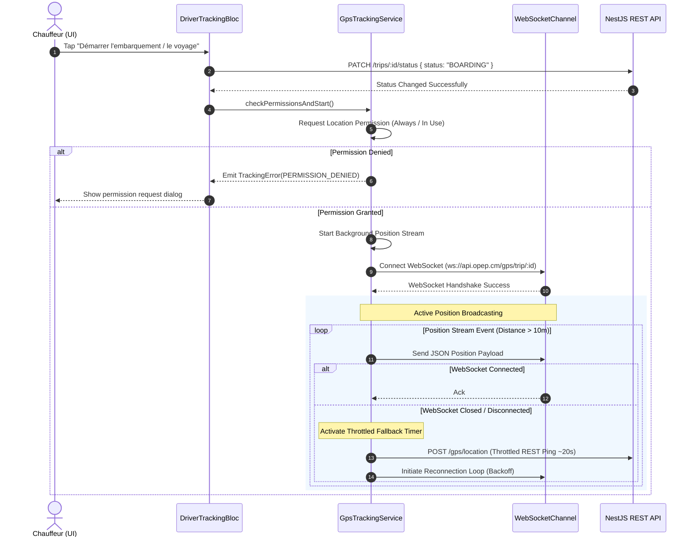
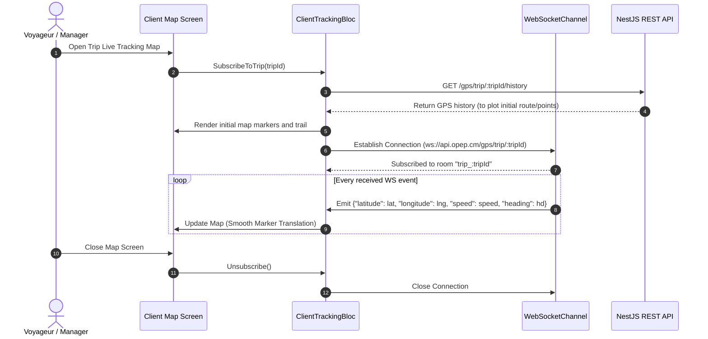

# OPEP Mobile — Driver Planning & GPS Tracking Design (Flutter)

This document details the functional specifications, visual designs, communication schemas, and Clean Architecture Dart code stubs for the **Driver Planning Layout**, **Background Geolocator Service**, **Active Trip GPS Share Controls**, **WebSocket Location Ping Transmitter**, and **Client-Side Map Tracking Widget** for the OPEP mobile application.

---

## 1. Specifications & Requirement Analysis

Based on `cahier_de_charge (2).md` and `OPEP_CLAUDE (1).md`, the Driver Planning and GPS Tracking modules must satisfy the following criteria:

1. **Driver Daily Schedule & Planning Layout**:
   * Chauffeurs (`UserRole.DRIVER`) can view their daily list of assigned trips (`Trip` entity).
   * A trip cannot exist or be started without a bus and a driver assigned from the center.
   * Visual indicators must highlight trip statuses: `CREATED` (Scheduled), `BOARDING` (Embarquement), `IN_PROGRESS` (En Cours), `COMPLETED` (Terminé), and `CANCELLED` (Annulé).
   * The Driver UI must offer a prominent trigger to start a trip (transitioning it to `BOARDING`), which enables GPS tracking controls.

2. **Background Geolocator Service**:
   * Tracks GPS coordinates in the background (even if the app is minimized) during `BOARDING` and `IN_PROGRESS` trip states.
   * Handles run-time location permissions: requesting location services permissions (both "While in Use" and "Always" authorization) and GPS enablement.
   * Utilizes the `geolocator` package with high-accuracy settings and filters updates based on distance/time to balance battery life and precision.

3. **Active Trip Share Controls**:
   * **Start/Stop Controls**: A dedicated interactive toggle switch or button allows drivers to manually initiate or cease GPS sharing.
   * **Dual-Channel Transmitter**:
     * **Primary Channel**: Real-time WebSocket connection to send high-frequency coordinates (pings) immediately when changed.
     * **Fallback REST Channel**: A throttled REST ping (`POST /gps/location`) fallback that triggers every 15–30 seconds as a backup if the WebSocket drops, ensuring no data loss during connection disruptions.

4. **WebSocket GPS Location Ping Transmitter**:
   * Connects to backend NestJS WebSocket gateway (`/gps/trip/:tripId`).
   * Handles lifecycle and state events (connected, disconnected, reconnecting, error).
   * Implements robust **exponential backoff reconnection logic** to recover automatically from tunnel or cell tower drops during interurban travel.
   * Serializes position payloads with trip ID, coordinates, speed, heading, altitude, and timestamp.

5. **Client-Side Map Tracking Widget**:
   * Embedded inside the client/passenger "Mes Réservations" or "Suivi Voyage" details, as well as the center manager's tracking view.
   * Renders the journey route on an interactive OpenStreetMap layer using `flutter_map` (v7.0.0 syntax).
   * Subscribes to the trip's live GPS coordinates via WebSockets, smoothly animating the bus marker.
   * Displays travel metadata overlay (current status, current speed, last updated time).

---

## 2. Architecture & Data Flows

### 2.1 Driver GPS Tracking Initialization & Lifecycle


### 2.2 Client Live Map Tracking Flow


---

## 3. Data Models and Communication Schemas

### 3.1 Trip Status Enum
```dart
enum TripStatus {
  created,
  boarding,
  inProgress,
  completed,
  cancelled;

  String toJson() => name.toUpperCase();
  
  static TripStatus fromJson(String jsonValue) {
    return TripStatus.values.firstWhere(
      (e) => e.name.toUpperCase() == jsonValue.toUpperCase(),
      orElse: () => TripStatus.created,
    );
  }
}
```

### 3.2 GPS Position Payload (WS & REST)
The payload format shared between NestJS backend and Flutter app:

```json
{
  "tripId": "d3b07384-d113-4c90-9c24-4fcdcfc51bf5",
  "latitude": 4.051056,
  "longitude": 9.767868,
  "speed": 65.4,
  "heading": 85.2,
  "altitude": 12.0,
  "timestamp": "2026-07-12T20:55:00.000Z"
}
```

---

## 4. UI/UX Layout Designs

### 4.1 Driver Planning & Active Share Control
The screen displays scheduled trips, allowing drivers to change status and manage location broadcasts.

```
+-------------------------------------------------------------+
| [<-]                  MON PLANNING DU JOUR                  |
+-------------------------------------------------------------+
|                                                             |
|   VOYAGE EN COURS / ACTIF                                   |
|   +-----------------------------------------------------+   |
|   | Douala (Gare) ===> Yaoundé (Mvan)                    |   |
|   | Bus: CE 123 AB (Gros porteur)                       |   |
|   | Départ: 08:30 (Aujourd'hui)                         |   |
|   | Statut: [ EN COURS DE ROUTE ] (IN_PROGRESS)         |   |
|   |                                                     |   |
|   |   Partage GPS Temps Réel                            |   |
|   |   +---------------------------------------------+   |   |
|   |   | (()) LIVE | Transmetteur Actif              |   |   |
|   |   | Lat: 4.05105  |  Lng: 9.76786 | Speed: 68km/h|  |   |
|   |   +---------------------------------------------+   |   |
|   |                                                     |   |
|   |   [  BOUTON: ARRÊTER LE PARTAGE DE POSITION  ]      |   |
|   |   (Toggles Geolocator Background service and WS)    |   |
|   +-----------------------------------------------------+   |
|                                                             |
|   VOYAGES PLANIFIÉS DU JOUR                                 |
|   +-----------------------------------------------------+   |
|   | Yaoundé (Mvan) ===> Douala (Gare)                   |   |
|   | Bus: CE 123 AB | Départ: 15:30                      |   |
|   | Statut: [ PLANIFIÉ ] (CREATED)                      |   |
|   |                                                     |   |
|   |   [  BOUTON: DÉMARRER L'EMBARQUEMENT  ]             |   |
|   |   (Changes state to BOARDING & prepares GPS)        |   |
|   +-----------------------------------------------------+   |
|                                                             |
+-------------------------------------------------------------+
```

### 4.2 Client Map Live Tracker Widget
Used by passengers or branch managers to visually monitor the bus location.

```
+-------------------------------------------------------------+
| [<-]                   SUIVI EN TEMPS RÉEL                  |
+-------------------------------------------------------------+
|  Statut: [ EN COURS ] | Vitesse: 72 km/h | MAJ: Il y a 5s   |
+-------------------------------------------------------------+
|                                                             |
|  +-------------------------------------------------------+  |
|  | [ + ]                                                 |  |
|  |                                (Destination Yaoundé)  |  |
|  |                                        [O]            |  |
|  |                                       /               |  |
|  |                                      /                |  |
|  |                                  [Bus Marker 🚌]      |  |
|  |                                   /                   |  |
|  |                                  /                    |  |
|  |                                 /                     |  |
|  |           [O]------------------'                      |  |
|  |     (Départ Douala)                                   |  |
|  |                                                       |  |
|  | [ - ]                                                 |  |
|  +-------------------------------------------------------+  |
|                                                             |
|  INFORMATIONS VOYAGE                                        |
|  Bus: Toyota Coaster CE 890 XY | Chauffeur: Roger Milla     |
|  Étape actuelle: En route vers Yaoundé (N3)                 |
+-------------------------------------------------------------+
```

---

## 5. Dart Code Implementation

The following syntax-valid Dart stubs implement the core requirements of Driver Planning and GPS Sharing under Clean Architecture boundaries (Services, BLoC, and View widgets).

### 5.1 GpsPosition Model
Representing coordinate pings sent or received.

```dart
// filepath: C:/MAMP/htdocs/Projet/Opep/apps/mobile/lib/features/tracking/data/models/gps_position.dart
import 'package:equatable/equatable.dart';

class GpsPosition extends Equatable {
  final String tripId;
  final double latitude;
  final double longitude;
  final double speed;
  final double heading;
  final double altitude;
  final DateTime timestamp;

  const GpsPosition({
    required this.tripId,
    required this.latitude,
    required this.longitude,
    required this.speed,
    required this.heading,
    required this.altitude,
    required this.timestamp,
  });

  Map<String, dynamic> toJson() {
    return {
      'tripId': tripId,
      'latitude': latitude,
      'longitude': longitude,
      'speed': speed,
      'heading': heading,
      'altitude': altitude,
      'timestamp': timestamp.toIso8601String(),
    };
  }

  factory GpsPosition.fromJson(Map<String, dynamic> json) {
    return GpsPosition(
      tripId: json['tripId'] as String,
      latitude: (json['latitude'] as num).toDouble(),
      longitude: (json['longitude'] as num).toDouble(),
      speed: (json['speed'] as num).toDouble(),
      heading: (json['heading'] as num).toDouble(),
      altitude: (json['altitude'] as num).toDouble(),
      timestamp: DateTime.parse(json['timestamp'] as String),
    );
  }

  @override
  List<Object?> get props => [
        tripId,
        latitude,
        longitude,
        speed,
        heading,
        altitude,
        timestamp,
      ];
}
```

### 5.2 WebSocket Connection Listener with Reconnection
Enforces network stability and reconnect behaviors with exponential backoff.

```dart
// filepath: C:/MAMP/htdocs/Projet/Opep/apps/mobile/lib/core/network/websocket_connection_listener.dart
import 'dart:async';
import 'dart:convert';
import 'package:web_socket_channel/web_socket_channel.dart';

enum WebSocketConnectionState { disconnected, connecting, connected }

class WebSocketConnectionListener {
  final Uri wsUri;
  WebSocketChannel? _channel;
  StreamController<dynamic>? _messageController;
  final StreamController<WebSocketConnectionState> _stateController =
      StreamController<WebSocketConnectionState>.broadcast();

  bool _isDisposed = false;
  bool _shouldReconnect = false;
  int _reconnectDelaySeconds = 2;
  static const int _maxReconnectDelaySeconds = 60;
  
  StreamSubscription? _channelSubscription;

  WebSocketConnectionListener({required this.wsUri});

  Stream<dynamic> get messages => _messageController?.stream ?? const Stream.empty();
  Stream<WebSocketConnectionState> get connectionState => _stateController.stream;

  void connect() {
    if (_isDisposed) return;
    _shouldReconnect = true;
    _establishConnection();
  }

  void _establishConnection() {
    _stateController.add(WebSocketConnectionState.connecting);
    _channelSubscription?.cancel();

    try {
      _channel = WebSocketChannel.connect(wsUri);
      _messageController ??= StreamController<dynamic>.broadcast();

      _channelSubscription = _channel!.stream.listen(
        (message) {
          _reconnectDelaySeconds = 2; // Reset backoff on success
          _stateController.add(WebSocketConnectionState.connected);
          _messageController?.add(message);
        },
        onError: (error) {
          _stateController.add(WebSocketConnectionState.disconnected);
          _handleReconnection();
        },
        onDone: () {
          _stateController.add(WebSocketConnectionState.disconnected);
          _handleReconnection();
        },
      );
    } catch (e) {
      _stateController.add(WebSocketConnectionState.disconnected);
      _handleReconnection();
    }
  }

  void send(dynamic data) {
    if (_channel != null && _channel?.sink != null) {
      final payload = data is Map ? json.encode(data) : data;
      _channel!.sink.add(payload);
    }
  }

  void _handleReconnection() {
    if (!_shouldReconnect || _isDisposed) return;

    Timer(Duration(seconds: _reconnectDelaySeconds), () {
      if (!_shouldReconnect || _isDisposed) return;
      
      // Calculate next backoff step (exponential)
      _reconnectDelaySeconds = (_reconnectDelaySeconds * 2)
          .clamp(2, _maxReconnectDelaySeconds);
          
      _establishConnection();
    });
  }

  void disconnect() {
    _shouldReconnect = false;
    _channelSubscription?.cancel();
    _channel?.sink.close();
    _channel = null;
    _stateController.add(WebSocketConnectionState.disconnected);
  }

  void dispose() {
    _isDisposed = true;
    disconnect();
    _messageController?.close();
    _stateController.close();
  }
}
```

### 5.3 Background Gps Tracking Service
Integrates `geolocator` and coordinates REST Fallback / WS distribution.

```dart
// filepath: C:/MAMP/htdocs/Projet/Opep/apps/mobile/lib/features/tracking/data/services/gps_tracking_service.dart
import 'dart:async';
import 'package:geolocator/geolocator.dart';
import 'package:dio/dio.dart';
import '../../../../core/network/websocket_connection_listener.dart';
import '../models/gps_position.dart';

class GpsTrackingService {
  final Dio _dio;
  final String _wsBaseUrl;
  final String _restBaseUrl;
  
  WebSocketConnectionListener? _wsListener;
  StreamSubscription<Position>? _positionSubscription;
  Timer? _fallbackRestTimer;
  GpsPosition? _lastSentPosition;
  bool _isTracking = false;

  GpsTrackingService({
    required Dio dio,
    required String wsBaseUrl,
    required String restBaseUrl,
  })  : _dio = dio,
        _wsBaseUrl = wsBaseUrl,
        _restBaseUrl = restBaseUrl;

  bool get isTracking => _isTracking;

  Future<bool> requestPermissions() async {
    bool serviceEnabled;
    LocationPermission permission;

    serviceEnabled = await Geolocator.isLocationServiceEnabled();
    if (!serviceEnabled) {
      return false;
    }

    permission = await Geolocator.checkPermission();
    if (permission == LocationPermission.denied) {
      permission = await Geolocator.requestPermission();
      if (permission == LocationPermission.denied) {
        return false;
      }
    }

    if (permission == LocationPermission.deniedForever) {
      return false;
    }

    return true;
  }

  Future<void> startTracking({required String tripId}) async {
    if (_isTracking) return;

    final hasPermission = await requestPermissions();
    if (!hasPermission) {
      throw Exception('GPS Permissions not granted');
    }

    _isTracking = true;

    // 1. Initialize WebSocket Connection
    final wsUri = Uri.parse('$_wsBaseUrl/gps/trip/$tripId');
    _wsListener = WebSocketConnectionListener(wsUri: wsUri);
    _wsListener!.connect();

    // 2. Configure Geolocator Settings
    const locationSettings = LocationSettings(
      accuracy: LocationAccuracy.high,
      distanceFilter: 10, // Send updates when driver moves 10 meters
    );

    // 3. Listen to Position Stream
    _positionSubscription = Geolocator.getPositionStream(
      locationSettings: locationSettings,
    ).listen((Position position) {
      _broadcastPosition(tripId, position);
    });

    // 4. Start Fallback Throttled REST Pings Timer (every 20s as backup)
    _fallbackRestTimer = Timer.periodic(const Duration(seconds: 20), (timer) {
      _sendThrottledRestPing(tripId);
    });
  }

  void _broadcastPosition(String tripId, Position position) {
    final gpsPos = GpsPosition(
      tripId: tripId,
      latitude: position.latitude,
      longitude: position.longitude,
      speed: position.speed,
      heading: position.heading,
      altitude: position.altitude,
      timestamp: position.timestamp ?? DateTime.now(),
    );

    _lastSentPosition = gpsPos;

    // Send via Primary WS Channel
    _wsListener?.send(gpsPos.toJson());
  }

  Future<void> _sendThrottledRestPing(String tripId) async {
    if (_lastSentPosition == null) return;

    try {
      // Sends REST ping to backend fallback endpoint
      await _dio.post(
        '$_restBaseUrl/gps/location',
        data: _lastSentPosition!.toJson(),
        options: Options(
          headers: {'X-Throttled-Ping': 'true'},
        ),
      );
    } catch (e) {
      // Silent error logging, standard fallback tolerance
    }
  }

  Future<void> stopTracking() async {
    _isTracking = false;
    
    await _positionSubscription?.cancel();
    _positionSubscription = null;
    
    _fallbackRestTimer?.cancel();
    _fallbackRestTimer = null;

    _wsListener?.disconnect();
    _wsListener?.dispose();
    _wsListener = null;
    
    _lastSentPosition = null;
  }
}
```

### 5.4 Driver Trip Schedule & Tracking BLoC
Governs logic workflow: listing today's driver planning, status transition updates, and geolocator service lifecycle hooks.

```dart
// filepath: C:/MAMP/htdocs/Projet/Opep/apps/mobile/lib/features/driver/presentation/bloc/driver_tracking_bloc.dart
import 'package:flutter_bloc/flutter_bloc.dart';
import 'package:equatable/equatable.dart';
import 'package:dio/dio.dart';
import '../../../tracking/data/services/gps_tracking_service.dart';

// --- Events ---
abstract class DriverTrackingEvent extends Equatable {
  const DriverTrackingEvent();

  @override
  List<Object?> get props => [];
}

class LoadDailyScheduleEvent extends DriverTrackingEvent {}

class StartTripBoardingEvent extends DriverTrackingEvent {
  final String tripId;
  const StartTripBoardingEvent({required this.tripId});

  @override
  List<Object?> get props => [tripId];
}

class ToggleSharingGpsEvent extends DriverTrackingEvent {
  final String tripId;
  final bool startSharing;
  const ToggleSharingGpsEvent({required this.tripId, required this.startSharing});

  @override
  List<Object?> get props => [tripId, startSharing];
}

// --- State ---
abstract class DriverTrackingState extends Equatable {
  const DriverTrackingState();

  @override
  List<Object?> get props => [];
}

class DriverTrackingInitial extends DriverTrackingState {}

class DailyScheduleLoading extends DriverTrackingState {}

class DailyScheduleLoaded extends DriverTrackingState {
  final List<dynamic> trips;
  final String? activeTripId;
  final bool isSharingGps;

  const DailyScheduleLoaded({
    required this.trips,
    this.activeTripId,
    required this.isSharingGps,
  });

  DailyScheduleLoaded copyWith({
    List<dynamic>? trips,
    String? activeTripId,
    bool? isSharingGps,
  }) {
    return DailyScheduleLoaded(
      trips: trips ?? this.trips,
      activeTripId: activeTripId ?? this.activeTripId,
      isSharingGps: isSharingGps ?? this.isSharingGps,
    );
  }

  @override
  List<Object?> get props => [trips, activeTripId, isSharingGps];
}

class DriverTrackingError extends DriverTrackingState {
  final String message;
  const DriverTrackingError({required this.message});

  @override
  List<Object?> get props => [message];
}

// --- BLoC ---
class DriverTrackingBloc extends Bloc<DriverTrackingEvent, DriverTrackingState> {
  final GpsTrackingService _gpsService;
  final Dio _dio;

  DriverTrackingBloc({
    required GpsTrackingService gpsService,
    required Dio dio,
  })  : _gpsService = gpsService,
        _dio = dio,
        super(DriverTrackingInitial()) {
    on<LoadDailyScheduleEvent>(_onLoadDailySchedule);
    on<StartTripBoardingEvent>(_onStartTripBoarding);
    on<ToggleSharingGpsEvent>(_onToggleSharingGps);
  }

  Future<void> _onLoadDailySchedule(
    LoadDailyScheduleEvent event,
    Emitter<DriverTrackingState> emit,
  ) async {
    emit(DailyScheduleLoading());
    try {
      final response = await _dio.get('/trips/driver/today');
      final tripsList = response.data as List<dynamic>;
      
      // Determine if there is already a trip marked BOARDING or IN_PROGRESS
      String? activeId;
      for (var trip in tripsList) {
        final status = trip['status'] as String;
        if (status == 'BOARDING' || status == 'IN_PROGRESS') {
          activeId = trip['id'] as String;
          break;
        }
      }

      emit(DailyScheduleLoaded(
        trips: tripsList,
        activeTripId: activeId,
        isSharingGps: _gpsService.isTracking,
      ));
    } catch (e) {
      emit(DriverTrackingError(message: 'Impossible de charger le planning : $e'));
    }
  }

  Future<void> _onStartTripBoarding(
    StartTripBoardingEvent event,
    Emitter<DriverTrackingState> emit,
  ) async {
    final currentState = state;
    if (currentState is! DailyScheduleLoaded) return;

    emit(DailyScheduleLoading());
    try {
      // 1. Transition Trip Status to BOARDING on backend
      await _dio.patch('/trips/${event.tripId}/status', data: {
        'status': 'BOARDING',
      });

      // 2. Start Geolocator & WebSocket Sharing
      await _gpsService.startTracking(tripId: event.tripId);

      // 3. Reload schedule to update local values
      add(LoadDailyScheduleEvent());
    } catch (e) {
      emit(DriverTrackingError(message: "Échec de l'embarquement : $e"));
      // Rollback to previous state list
      emit(currentState);
    }
  }

  Future<void> _onToggleSharingGps(
    ToggleSharingGpsEvent event,
    Emitter<DriverTrackingState> emit,
  ) async {
    final currentState = state;
    if (currentState is! DailyScheduleLoaded) return;

    try {
      if (event.startSharing) {
        await _gpsService.startTracking(tripId: event.tripId);
      } else {
        await _gpsService.stopTracking();
      }

      emit(currentState.copyWith(isSharingGps: _gpsService.isTracking));
    } catch (e) {
      emit(DriverTrackingError(message: 'Erreur changement de partage GPS : $e'));
      emit(currentState);
    }
  }
}
```

### 5.5 Client Map Tracking Widget
Widget subscribing to real-time coordinate updates from the target trip and plotting the visual markers.

```dart
// filepath: C:/MAMP/htdocs/Projet/Opep/apps/mobile/lib/features/tracking/presentation/widgets/client_map_tracking.dart
import 'dart:convert';
import 'package:flutter/material.dart';
import 'package:flutter_map/flutter_map.dart';
import 'package:latlong2/latlong2.dart';
import '../../../../core/network/websocket_connection_listener.dart';
import '../../data/models/gps_position.dart';

class ClientMapTracking extends StatefulWidget {
  final String tripId;
  final String wsBaseUrl;
  final LatLng departureCoordinates;
  final LatLng arrivalCoordinates;

  const ClientMapTracking({
    super.key,
    required this.tripId,
    required this.wsBaseUrl,
    required this.departureCoordinates,
    required this.arrivalCoordinates,
  });

  @override
  State<ClientMapTracking> createState() => _ClientMapTrackingState();
}

class _ClientMapTrackingState extends State<ClientMapTracking> {
  WebSocketConnectionListener? _wsListener;
  WebSocketConnectionState _connectionState = WebSocketConnectionState.disconnected;
  
  LatLng? _busPosition;
  double _currentSpeed = 0.0;
  DateTime? _lastUpdate;
  final MapController _mapController = MapController();

  @override
  void initState() {
    super.initState();
    _initializeWebSocket();
  }

  void _initializeWebSocket() {
    final wsUri = Uri.parse('${widget.wsBaseUrl}/gps/trip/${widget.tripId}');
    _wsListener = WebSocketConnectionListener(wsUri: wsUri);
    
    // Connect & listen to WebSocket updates
    _wsListener!.connect();
    
    _wsListener!.connectionState.listen((state) {
      if (mounted) {
        setState(() {
          _connectionState = state;
        });
      }
    });

    _wsListener!.messages.listen((rawMessage) {
      if (mounted) {
        try {
          final Map<String, dynamic> jsonMap = rawMessage is String 
              ? json.decode(rawMessage) as Map<String, dynamic>
              : rawMessage as Map<String, dynamic>;
              
          final position = GpsPosition.fromJson(jsonMap);
          
          setState(() {
            _busPosition = LatLng(position.latitude, position.longitude);
            _currentSpeed = position.speed;
            _lastUpdate = position.timestamp;
          });
          
          // Center map to dynamic bus updates
          _mapController.move(_busPosition!, _mapController.camera.zoom);
        } catch (e) {
          // Failure decoding position JSON from websocket ping
        }
      }
    });
  }

  @override
  void dispose() {
    _wsListener?.disconnect();
    _wsListener?.dispose();
    _mapController.dispose();
    super.dispose();
  }

  @override
  Widget build(BuildContext context) {
    // Default fallback center is the midway point between departure and arrival
    final defaultCenter = LatLng(
      (widget.departureCoordinates.latitude + widget.arrivalCoordinates.latitude) / 2,
      (widget.departureCoordinates.longitude + widget.arrivalCoordinates.longitude) / 2,
    );

    return Scaffold(
      body: Stack(
        children: [
          // FlutterMap configuration aligning with package flutter_map v7.0.0
          FlutterMap(
            mapController: _mapController,
            options: MapOptions(
              initialCenter: _busPosition ?? defaultCenter,
              initialZoom: 11.0,
            ),
            children: [
              TileLayer(
                urlTemplate: 'https://tile.openstreetmap.org/{z}/{x}/{y}.png',
                userAgentPackageName: 'com.opep.app',
              ),
              PolylineLayer(
                polylines: [
                  Polyline(
                    points: [
                      widget.departureCoordinates,
                      if (_busPosition != null) _busPosition!,
                      widget.arrivalCoordinates,
                    ],
                    color: Colors.blueAccent,
                    strokeWidth: 4.0,
                  ),
                ],
              ),
              MarkerLayer(
                markers: [
                  // Departure Marker
                  Marker(
                    point: widget.departureCoordinates,
                    width: 40.0,
                    height: 40.0,
                    child: const Icon(
                      Icons.location_on,
                      color: Colors.green,
                      size: 35,
                    ),
                  ),
                  // Arrival Marker
                  Marker(
                    point: widget.arrivalCoordinates,
                    width: 40.0,
                    height: 40.0,
                    child: const Icon(
                      Icons.flag,
                      color: Colors.red,
                      size: 35,
                    ),
                  ),
                  // Active Driver Bus Marker
                  if (_busPosition != null)
                    Marker(
                      point: _busPosition!,
                      width: 50.0,
                      height: 50.0,
                      child: Container(
                        decoration: BoxDecoration(
                          color: Colors.blue,
                          shape: BoxShape.circle,
                          border: Border.all(color: Colors.white, width: 2.0),
                          boxShadow: const [
                            BoxShadow(
                              color: Colors.black26,
                              blurRadius: 6,
                              offset: Offset(0, 3),
                            ),
                          ],
                        ),
                        child: const Icon(
                          Icons.directions_bus,
                          color: Colors.white,
                          size: 24,
                        ),
                      ),
                    ),
                ],
              ),
            ],
          ),
          
          // Connection & Information Overlay Card
          Positioned(
            top: 40,
            left: 16,
            right: 16,
            child: Card(
              shape: RoundedRectangleBorder(
                borderRadius: BorderRadius.circular(12),
              ),
              color: Colors.white.withOpacity(0.95),
              elevation: 4,
              child: Padding(
                padding: const EdgeInsets.all(12),
                child: Row(
                  children: [
                    _buildConnectionIndicator(),
                    const SizedBox(width: 12),
                    Expanded(
                      child: Column(
                        crossAxisAlignment: CrossAxisAlignment.start,
                        mainAxisSize: MainAxisSize.min,
                        children: [
                          Text(
                            _busPosition != null 
                                ? 'En Cours de Route' 
                                : 'En attente de signal GPS',
                            style: const TextStyle(
                              fontWeight: FontWeight.bold,
                              fontSize: 15,
                            ),
                          ),
                          const SizedBox(height: 2),
                          Text(
                            _busPosition != null
                                ? 'Vitesse : ${_currentSpeed.toStringAsFixed(1)} km/h'
                                : 'Chauffeur inactif',
                            style: TextStyle(
                              color: Colors.grey[700],
                              fontSize: 13,
                            ),
                          ),
                        ],
                      ),
                    ),
                    if (_lastUpdate != null)
                      Text(
                        'MAJ: ${_formatTime(_lastUpdate!)}',
                        style: TextStyle(
                          color: Colors.grey[600],
                          fontSize: 11,
                        ),
                      ),
                  ],
                ),
              ),
            ),
          ),
        ],
      ),
    );
  }

  Widget _buildConnectionIndicator() {
    Color color;
    String label;
    switch (_connectionState) {
      case WebSocketConnectionState.connected:
        color = Colors.green;
        label = 'LIVE';
        break;
      case WebSocketConnectionState.connecting:
        color = Colors.amber;
        label = 'CONNECT';
        break;
      case WebSocketConnectionState.disconnected:
      default:
        color = Colors.red;
        label = 'OFFLINE';
        break;
    }

    return Column(
      mainAxisSize: MainAxisSize.min,
      children: [
        Container(
          width: 14,
          height: 14,
          decoration: BoxDecoration(
            color: color,
            shape: BoxShape.circle,
          ),
        ),
        const SizedBox(height: 2),
        Text(
          label,
          style: TextStyle(
            fontSize: 9,
            fontWeight: FontWeight.bold,
            color: color,
          ),
        ),
      ],
    );
  }

  String _formatTime(DateTime time) {
    return '${time.hour.toString().padLeft(2, '0')}:${time.minute.toString().padLeft(2, '0')}:${time.second.toString().padLeft(2, '0')}';
  }
}
```
