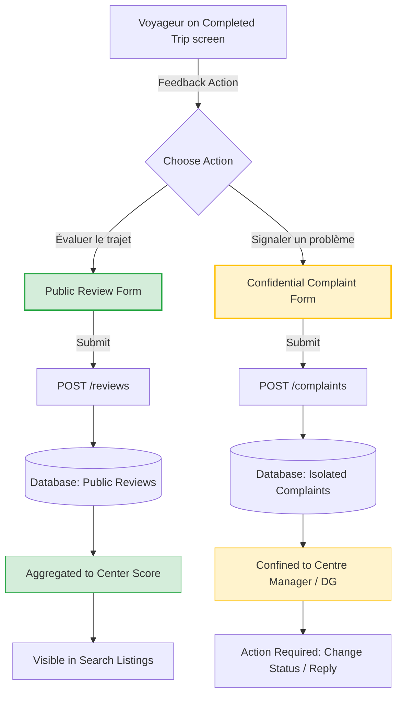

# OPEP Mobile — Reviews & Complaints Design & Specifications (Flutter)

This document details the functional specifications, UX/UI blueprints, visual separation strategy, BLoC state machines, and clean, compile-ready Dart code stubs for travel ratings (Reviews) and support cases (Complaints) in the OPEP mobile application.

---

## 1. Specifications & Visual Separation Analysis

Based on `cahier_de_charge (2).md` (Section 5.7) and `OPEP_CLAUDE (1).md` (Sections 5.13 and 5.14), the feedback system is split into two distinct channels. Although both are post-travel actions, they address different use cases and feed separate data flows:

1. **Reviews (Avis - Public)**: Directly influences the notoriety ranking of companies and centres. It is open to the public but strictly restricted to passengers who completed a trip with a ticket marked as `USED`.
2. **Complaints (Litiges - Confidential)**: Private communication channel between the traveler and the agency (DG and Centre Manager). It is never shared with third parties, other agencies, or the Super Admin (`ADMIN_PLATFORM`).

### 1.1 Contrast Matrix

| Feature | Reviews (Avis Publics) | Complaints (Réclamations & Litiges) |
|---|---|---|
| **Objective** | Rate the chauffeur and comfort to calculate the public notoriety score. | Private incident resolution (e.g. luggage, safety, cleanliness, delay). |
| **Eligibility** | Strictly post-travel (`Trip` is `COMPLETED` and `Ticket` is `USED`). | Anytime. Can be general or linked to a past/current trip. |
| **Visibility** | **Public**. Aggregated star ratings are shown to all prospective travelers. | **Confidential**. Restricted strictly to the centre's Manager and company's DG. |
| **Platform Access** | Yes (visible globally). | **Strictly Blocked**. Even the Platform Super Admin has no read access to descriptions. |
| **Key Fields** | Driver Rating (1-5), Comfort Rating (1-5), Comment. | Category, Description, optional Trip Reference. |
| **Workflow Impact** | Modifies the Centre rating average (`averageRating`). | Initiates support ticket status (`PENDING`, `INVESTIGATING`, `RESOLVED`). |

### 1.2 Separation Flow Diagram



---

## 2. Screen Blueprints (UX/UI Spec)

The UI enforces this split through visual branding cues (colors, iconography, and text notes).

### 2.1 Completed Trip Hub Screen Layout

On a completed trip details screen, the two actions are displayed as card components with contrasting styles to prevent misinterpretation:

```text
┌────────────────────────────────────────────────────────┐
│  Voyage : Douala ──> Yaoundé                           │
│  Statut : Terminé ✅  | Date : 15/01/2025               │
├────────────────────────────────────────────────────────┤
│                                                        │
│  ⭐ Évaluez votre expérience                           │
│  Aidez la communauté en évaluant publiquement le       │
│  chauffeur et le confort de votre trajet.              │
│                                                        │
│  [ NOTER CE VOYAGE ] (Cameroon Green Style)            │
│                                                        │
├────────────────────────────────────────────────────────┤
│                                                        │
│  🔐 Signaler un litige (Privé)                         │
│  Un bagage perdu, un incident de sécurité ou un        │
│  comportement anormal ? Écrivez à l'agence en privé.  │
│                                                        │
│  [ DÉPOSER UNE RÉCLAMATION ] (Amber Warning Style)     │
│                                                        │
└────────────────────────────────────────────────────────┘
```

### 2.2 Review Modal Bottom-Sheet Blueprint
* **Header**: "Évaluez votre trajet"
* **Driver Section**: Row of 5 star icons with caption "Chauffeur (Paul Mbarga)"
* **Comfort Section**: Row of 5 star icons with caption "Confort du véhicule"
* **Comment Area**: Multiline TextField (Hint: "Comment s'est passé votre voyage ? (Optionnel)")
* **Branding**: Cameroon Green accents (`#008751`) and Gold stars (`#FFB800`).

### 2.3 Complaint Form Screen Blueprint
* **Header**: "Déposer une réclamation" (Amber theme badge)
* **Private Badge Banner**:
  ```text
  ┌──────────────────────────────────────────────────────┐
  │ 🔐 Réclamation Confidentielle                        │
  │ Ce message sera transmis directement au Manager de   │
  │ l'agence concernée. Il n'est pas public et le        │
  │ Super-Administrateur OPEP n'y a pas accès.           │
  └──────────────────────────────────────────────────────┘
  ```
* **Category Dropdown**: Category Selection (Securité, Comportement, Retard, Propreté, Bagages, Autre).
* **Trip Link Input**: Read-only trip code widget.
* **Description Area**: Large text area with validation (minimum 20 characters required).
* **Submit CTA**: "Envoyer le litige" with Amber background (`#F16E00`).

---

## 3. Dart Code Stubs — Domain & Data Layers

Below are the compilation-ready Clean Architecture Dart code stubs for the feedback features.

### 3.1 Review Domain Entity & Model

`lib/features/reviews/domain/entities/review.dart`
```dart
import 'package:equatable/equatable.dart';

class ReviewEntity extends Equatable {
  final String id;
  final String tripId;
  final String ticketId;
  final double driverRating;
  final double comfortRating;
  final String? comment;
  final DateTime createdAt;

  const ReviewEntity({
    required this.id,
    required this.tripId,
    required this.ticketId,
    required this.driverRating,
    required this.comfortRating,
    this.comment,
    required this.createdAt,
  });

  @override
  List<Object?> get props => [
        id,
        tripId,
        ticketId,
        driverRating,
        comfortRating,
        comment,
        createdAt,
      ];
}
```

`lib/features/reviews/data/models/review_model.dart`
```dart
import '../../domain/entities/review.dart';

class ReviewModel extends ReviewEntity {
  const ReviewModel({
    required super.id,
    required super.tripId,
    required super.ticketId,
    required super.driverRating,
    required super.comfortRating,
    super.comment,
    required super.createdAt,
  });

  factory ReviewModel.fromJson(Map<String, dynamic> json) {
    return ReviewModel(
      id: json['id'] as String,
      tripId: json['tripId'] as String,
      ticketId: json['ticketId'] as String,
      driverRating: (json['driverRating'] as num).toDouble(),
      comfortRating: (json['comfortRating'] as num).toDouble(),
      comment: json['comment'] as String?,
      createdAt: DateTime.parse(json['createdAt'] as String),
    );
  }

  Map<String, dynamic> toJson() {
    return {
      'id': id,
      'tripId': tripId,
      'ticketId': ticketId,
      'driverRating': driverRating,
      'comfortRating': comfortRating,
      'comment': comment,
      'createdAt': createdAt.toIso8601String(),
    };
  }
}
```

`lib/features/reviews/data/models/review_request_dto.dart`
```dart
class ReviewRequestDto {
  final String tripId;
  final String ticketId;
  final double driverRating;
  final double comfortRating;
  final String? comment;

  const ReviewRequestDto({
    required this.tripId,
    required this.ticketId,
    required this.driverRating,
    required this.comfortRating,
    this.comment,
  });

  Map<String, dynamic> toJson() {
    return {
      'tripId': tripId,
      'ticketId': ticketId,
      'driverRating': driverRating,
      'comfortRating': comfortRating,
      if (comment != null) 'comment': comment,
    };
  }
}
```

### 3.2 Complaint Domain Entity & Model

`lib/features/complaints/domain/entities/complaint.dart`
```dart
import 'package:equatable/equatable.dart';

enum ComplaintCategory {
  safety,
  behavior,
  delay,
  cleanliness,
  luggage,
  other,
}

extension ComplaintCategoryExtension on ComplaintCategory {
  String toServerString() {
    switch (this) {
      case ComplaintCategory.safety:
        return 'SAFETY';
      case ComplaintCategory.behavior:
        return 'BEHAVIOR';
      case ComplaintCategory.delay:
        return 'DELAY';
      case ComplaintCategory.cleanliness:
        return 'CLEANLINESS';
      case ComplaintCategory.luggage:
        return 'LUGGAGE';
      case ComplaintCategory.other:
        return 'OTHER';
    }
  }

  static ComplaintCategory fromServerString(String val) {
    switch (val.toUpperCase()) {
      case 'SAFETY':
        return ComplaintCategory.safety;
      case 'BEHAVIOR':
        return ComplaintCategory.behavior;
      case 'DELAY':
        return ComplaintCategory.delay;
      case 'CLEANLINESS':
        return ComplaintCategory.cleanliness;
      case 'LUGGAGE':
        return ComplaintCategory.luggage;
      default:
        return ComplaintCategory.other;
    }
  }

  String toUserFriendlyFrench() {
    switch (this) {
      case ComplaintCategory.safety:
        return 'Sécurité routière / Technique';
      case ComplaintCategory.behavior:
        return 'Comportement du personnel';
      case ComplaintCategory.delay:
        return 'Retard de bus / Horaires';
      case ComplaintCategory.cleanliness:
        return 'Propreté du véhicule';
      case ComplaintCategory.luggage:
        return 'Perte / Casse de bagages';
      case ComplaintCategory.other:
        return 'Autre problème';
    }
  }
}

class ComplaintEntity extends Equatable {
  final String id;
  final String? tripId;
  final ComplaintCategory category;
  final String description;
  final String status; // 'PENDING', 'IN_INVESTIGATION', 'RESOLVED'
  final String? agencyResponse;
  final DateTime createdAt;

  const ComplaintEntity({
    required this.id,
    this.tripId,
    required this.category,
    required this.description,
    required this.status,
    this.agencyResponse,
    required this.createdAt,
  });

  @override
  List<Object?> get props => [
        id,
        tripId,
        category,
        description,
        status,
        agencyResponse,
        createdAt,
      ];
}
```

`lib/features/complaints/data/models/complaint_model.dart`
```dart
import '../../domain/entities/complaint.dart';

class ComplaintModel extends ComplaintEntity {
  const ComplaintModel({
    required super.id,
    super.tripId,
    required super.category,
    required super.description,
    required super.status,
    super.agencyResponse,
    required super.createdAt,
  });

  factory ComplaintModel.fromJson(Map<String, dynamic> json) {
    return ComplaintModel(
      id: json['id'] as String,
      tripId: json['tripId'] as String?,
      category: ComplaintCategoryExtension.fromServerString(json['category'] as String),
      description: json['description'] as String,
      status: json['status'] as String,
      agencyResponse: json['agencyResponse'] as String?,
      createdAt: DateTime.parse(json['createdAt'] as String),
    );
  }

  Map<String, dynamic> toJson() {
    return {
      'id': id,
      'tripId': tripId,
      'category': category.toServerString(),
      'description': description,
      'status': status,
      'agencyResponse': agencyResponse,
      'createdAt': createdAt.toIso8601String(),
    };
  }
}
```

`lib/features/complaints/data/models/complaint_request_dto.dart`
```dart
import '../../domain/entities/complaint.dart';

class ComplaintRequestDto {
  final String? tripId;
  final ComplaintCategory category;
  final String description;

  const ComplaintRequestDto({
    this.tripId,
    required this.category,
    required this.description,
  });

  Map<String, dynamic> toJson() {
    return {
      if (tripId != null) 'tripId': tripId,
      'category': category.toServerString(),
      'description': description,
    };
  }
}
```

### 3.3 Abstract Repository Interfaces

`lib/features/reviews/domain/repositories/review_repository.dart`
```dart
import '../entities/review.dart';
import '../../data/models/review_request_dto.dart';

abstract class ReviewRepository {
  Future<ReviewEntity> submitReview(ReviewRequestDto request);
  Future<List<ReviewEntity>> getCentreReviews(String centreId, {int page = 1});
}
```

`lib/features/complaints/domain/repositories/complaint_repository.dart`
```dart
import '../entities/complaint.dart';
import '../../data/models/complaint_request_dto.dart';

abstract class ComplaintRepository {
  Future<ComplaintEntity> submitComplaint(ComplaintRequestDto request);
  Future<List<ComplaintEntity>> getMyComplaints();
  Future<ComplaintEntity> getComplaintDetail(String id);
}
```

---

## 4. BLoC State Machines

Here are the State and Event definitions, along with standard event-handling implementations for the BLoCs.

### 4.1 ReviewBloc Implementation

`lib/features/reviews/presentation/bloc/review_event.dart`
```dart
import 'package:equatable/equatable.dart';
import '../../../data/models/review_request_dto.dart';

sealed class ReviewEvent extends Equatable {
  const ReviewEvent();

  @override
  List<Object?> get props => [];
}

class SubmitReviewRequested extends ReviewEvent {
  final ReviewRequestDto request;

  const SubmitReviewRequested(this.request);

  @override
  List<Object?> get props => [request];
}

class ResetReviewState extends ReviewEvent {}
```

`lib/features/reviews/presentation/bloc/review_state.dart`
```dart
import 'package:equatable/equatable.dart';
import '../../domain/entities/review.dart';

sealed class ReviewState extends Equatable {
  const ReviewState();

  @override
  List<Object?> get props => [];
}

class ReviewInitial extends ReviewState {}

class ReviewLoading extends ReviewState {}

class ReviewSuccess extends ReviewState {
  final ReviewEntity review;

  const ReviewSuccess(this.review);

  @override
  List<Object?> get props => [review];
}

class ReviewFailure extends ReviewState {
  final String errorMessage;

  const ReviewFailure(this.errorMessage);

  @override
  List<Object?> get props => [errorMessage];
}
```

`lib/features/reviews/presentation/bloc/review_bloc.dart`
```dart
import 'package:flutter_bloc/flutter_bloc.dart';
import '../../domain/repositories/review_repository.dart';
import 'review_event.dart';
import 'review_state.dart';

class ReviewBloc extends Bloc<ReviewEvent, ReviewState> {
  final ReviewRepository _reviewRepository;

  ReviewBloc({required ReviewRepository reviewRepository})
      : _reviewRepository = reviewRepository,
        super(ReviewInitial()) {
    on<SubmitReviewRequested>(_onSubmitReviewRequested);
    on<ResetReviewState>(_onResetReviewState);
  }

  Future<void> _onSubmitReviewRequested(
    SubmitReviewRequested event,
    Emitter<ReviewState> emit,
  ) async {
    emit(ReviewLoading());
    try {
      final review = await _reviewRepository.submitReview(event.request);
      emit(ReviewSuccess(review));
    } catch (e) {
      emit(ReviewFailure(e.toString()));
    }
  }

  void _onResetReviewState(
    ResetReviewState event,
    Emitter<ReviewState> emit,
  ) {
    emit(ReviewInitial());
  }
}
```

<h3>4.2 ComplaintBloc Implementation</h3>

`lib/features/complaints/presentation/bloc/complaint_event.dart`
```dart
import 'package:equatable/equatable.dart';
import '../../../data/models/complaint_request_dto.dart';

sealed class ComplaintEvent extends Equatable {
  const ComplaintEvent();

  @override
  List<Object?> get props => [];
}

class SubmitComplaintRequested extends ComplaintEvent {
  final ComplaintRequestDto request;

  const SubmitComplaintRequested(this.request);

  @override
  List<Object?> get props => [request];
}

class ResetComplaintState extends ComplaintEvent {}
```

`lib/features/complaints/presentation/bloc/complaint_state.dart`
```dart
import 'package:equatable/equatable.dart';
import '../../domain/entities/complaint.dart';

sealed class ComplaintState extends Equatable {
  const ComplaintState();

  @override
  List<Object?> get props => [];
}

class ComplaintInitial extends ComplaintState {}

class ComplaintLoading extends ComplaintState {}

class ComplaintSuccess extends ComplaintState {
  final ComplaintEntity complaint;

  const ComplaintSuccess(this.complaint);

  @override
  List<Object?> get props => [complaint];
}

class ComplaintFailure extends ComplaintState {
  final String errorMessage;

  const ComplaintFailure(this.errorMessage);

  @override
  List<Object?> get props => [errorMessage];
}
```

`lib/features/complaints/presentation/bloc/complaint_bloc.dart`
```dart
import 'package:flutter_bloc/flutter_bloc.dart';
import '../../domain/repositories/complaint_repository.dart';
import 'complaint_event.dart';
import 'complaint_state.dart';

class ComplaintBloc extends Bloc<ComplaintEvent, ComplaintState> {
  final ComplaintRepository _complaintRepository;

  ComplaintBloc({required ComplaintRepository complaintRepository})
      : _complaintRepository = complaintRepository,
        super(ComplaintInitial()) {
    on<SubmitComplaintRequested>(_onSubmitComplaintRequested);
    on<ResetComplaintState>(_onResetComplaintState);
  }

  Future<void> _onSubmitComplaintRequested(
    SubmitComplaintRequested event,
    Emitter<ComplaintState> emit,
  ) async {
    emit(ComplaintLoading());
    try {
      final complaint = await _complaintRepository.submitComplaint(event.request);
      emit(ComplaintSuccess(complaint));
    } catch (e) {
      emit(ComplaintFailure(e.toString()));
    }
  }

  void _onResetComplaintState(
    ResetComplaintState event,
    Emitter<ComplaintState> emit,
  ) {
    emit(ComplaintInitial());
  }
}
```

---

## 5. UI Elements & Form Components

Below are reusable, syntax-valid Dart Flutter widgets designed in alignment with the OPEP Design System.

### 5.1 Reusable Custom Rating Bar (Avis Star Selector)

This custom widget renders a row of interactive stars without forcing external package lock-in, falling back on standard Material design tokens.

`lib/shared/widgets/opep_rating_bar.dart`
```dart
import 'package:flutter/material.dart';

class OpepRatingBar extends StatefulWidget {
  final double initialRating;
  final double minRating;
  final double maxRating;
  final int starCount;
  final double size;
  final Color activeColor;
  final Color inactiveColor;
  final Function(double) onRatingChanged;

  const OpepRatingBar({
    super.key,
    this.initialRating = 0.0,
    this.minRating = 1.0,
    this.maxRating = 5.0,
    this.starCount = 5,
    this.size = 36.0,
    this.activeColor = const Color(0xFFFFB800), // Gold
    this.inactiveColor = const Color(0xFFE2E8F0), // Slate grey
    required this.onRatingChanged,
  });

  @override
  State<OpepRatingBar> createState() => _OpepRatingBarState();
}

class _OpepRatingBarState extends State<OpepRatingBar> {
  late double _currentRating;

  @override
  void initState() {
    super.initState();
    _currentRating = widget.initialRating;
  }

  Widget _buildStar(int index) {
    IconData icon;
    Color color;

    if (index >= _currentRating) {
      icon = Icons.star_border_rounded;
      color = widget.inactiveColor;
    } else if (index > _currentRating - 1 && index < _currentRating) {
      icon = Icons.star_half_rounded;
      color = widget.activeColor;
    } else {
      icon = Icons.star_rounded;
      color = widget.activeColor;
    }

    return GestureDetector(
      onTap: () {
        setState(() {
          _currentRating = index + 1.0;
        });
        widget.onRatingChanged(_currentRating);
      },
      child: Padding(
        padding: const EdgeInsets.symmetric(horizontal: 4.0),
        child: Icon(
          icon,
          size: widget.size,
          color: color,
        ),
      ),
    );
  }

  @override
  Widget build(BuildContext context) {
    return Row(
      mainAxisSize: MainAxisSize.min,
      children: List.generate(widget.starCount, (index) => _buildStar(index)),
    );
  }
}
```

### 5.2 Complaint Category Dropdown Widget

`lib/features/complaints/presentation/widgets/complaint_category_dropdown.dart`
```dart
import 'package:flutter/material.dart';
import '../../domain/entities/complaint.dart';

class ComplaintCategoryDropdown extends StatelessWidget {
  final ComplaintCategory? selectedValue;
  final ValueChanged<ComplaintCategory?> onChanged;

  const ComplaintCategoryDropdown({
    super.key,
    required this.selectedValue,
    required this.onChanged,
  });

  @override
  Widget build(BuildContext context) {
    return Container(
      padding: const EdgeInsets.symmetric(horizontal: 12, vertical: 4),
      decoration: BoxDecoration(
        color: const Color(0xFFF8FAFC), // Slate 50
        border: Border.all(color: const Color(0xFFCBD5E1)), // Slate 300
        borderRadius: BorderRadius.circular(10),
      ),
      child: DropdownButtonHideUnderline(
        child: DropdownButton<ComplaintCategory>(
          value: selectedValue,
          isExpanded: true,
          hint: const Text(
            'Sélectionner la catégorie du litige',
            style: TextStyle(color: Color(0xFF64748B)), // Slate 500
          ),
          dropdownColor: Colors.white,
          icon: const Icon(Icons.arrow_drop_down_rounded, color: Color(0xFF475569)),
          onChanged: onChanged,
          items: ComplaintCategory.values.map((ComplaintCategory cat) {
            return DropdownMenuItem<ComplaintCategory>(
              value: cat,
              child: Text(
                cat.toUserFriendlyFrench(),
                style: const TextStyle(
                  color: Color(0xFF1E293B), // Slate 800
                  fontSize: 15,
                  fontWeight: FontWeight.w500,
                ),
              ),
            );
          }).toList(),
        ),
      ),
    );
  }
}
```

### 5.3 Feedback Text Area

`lib/shared/widgets/feedback_text_area.dart`
```dart
import 'package:flutter/material.dart';

class FeedbackTextArea extends StatelessWidget {
  final TextEditingController controller;
  final String hintText;
  final int minLength;
  final int maxLength;
  final String? Function(String?)? validator;

  const FeedbackTextArea({
    super.key,
    required this.controller,
    required this.hintText,
    this.minLength = 0,
    this.maxLength = 500,
    this.validator,
  });

  @override
  Widget build(BuildContext context) {
    return TextFormField(
      controller: controller,
      maxLines: 5,
      maxLength: maxLength,
      style: const TextStyle(color: Color(0xFF1E293B), fontSize: 15),
      decoration: InputDecoration(
        hintText: hintText,
        hintStyle: const TextStyle(color: Color(0xFF94A3B8)), // Slate 400
        fillColor: const Color(0xFFF8FAFC),
        filled: true,
        contentPadding: const EdgeInsets.all(16),
        counterText: '',
        enabledBorder: OutlineInputBorder(
          borderRadius: BorderRadius.circular(10),
          borderSide: const BorderSide(color: Color(0xFFCBD5E1)),
        ),
        focusedBorder: OutlineInputBorder(
          borderRadius: BorderRadius.circular(10),
          borderSide: const BorderSide(color: Color(0xFF008751), width: 1.5), // Cameroon green
        ),
        errorBorder: OutlineInputBorder(
          borderRadius: BorderRadius.circular(10),
          borderSide: const BorderSide(color: Color(0xFFE31B23)), // Red
        ),
        focusedErrorBorder: OutlineInputBorder(
          borderRadius: BorderRadius.circular(10),
          borderSide: const BorderSide(color: Color(0xFFE31B23), width: 1.5),
        ),
      ),
      validator: validator ?? (value) {
        if (value == null || value.trim().isEmpty) {
          if (minLength > 0) {
            return 'Ce champ est requis.';
          }
          return null;
        }
        if (value.trim().length < minLength) {
          return 'Veuillez saisir au moins $minLength caractères.';
        }
        return null;
      },
    );
  }
}
```

---

## 6. Implementation Forms

These form classes orchestrate BLoC communication, showing loading dialogs and showing green/amber overlays corresponding to reviews and complaints.

### 6.1 ReviewForm (Avis Section)

`lib/features/reviews/presentation/widgets/review_form.dart`
```dart
import 'package:flutter/material.dart';
import 'package:flutter_bloc/flutter_bloc.dart';
import '../../data/models/review_request_dto.dart';
import '../../../../shared/widgets/opep_rating_bar.dart';
import '../../../../shared/widgets/feedback_text_area.dart';
import '../bloc/review_bloc.dart';
import '../bloc/review_event.dart';
import '../bloc/review_state.dart';

class ReviewForm extends StatefulWidget {
  final String tripId;
  final String ticketId;
  final VoidCallback onSuccess;

  const ReviewForm({
    super.key,
    required this.tripId,
    required this.ticketId,
    required this.onSuccess,
  });

  @override
  State<ReviewForm> createState() => _ReviewFormState();
}

class _ReviewFormState extends State<ReviewForm> {
  final _formKey = GlobalKey<FormState>();
  final _commentController = TextEditingController();
  double _driverRating = 0.0;
  double _comfortRating = 0.0;

  @override
  void dispose() {
    _commentController.dispose();
    super.dispose();
  }

  void _submitForm() {
    if (_driverRating == 0.0 || _comfortRating == 0.0) {
      ScaffoldMessenger.of(context).showSnackBar(
        const SnackBar(
          content: Text('Veuillez attribuer une note pour le chauffeur et le confort.'),
          backgroundColor: Color(0xFFE31B23),
        ),
      );
      return;
    }

    if (_formKey.currentState!.validate()) {
      final request = ReviewRequestDto(
        tripId: widget.tripId,
        ticketId: widget.ticketId,
        driverRating: _driverRating,
        comfortRating: _comfortRating,
        comment: _commentController.text.trim().isEmpty ? null : _commentController.text.trim(),
      );

      context.read<ReviewBloc>().add(SubmitReviewRequested(request));
    }
  }

  @override
  Widget build(BuildContext context) {
    return BlocConsumer<ReviewBloc, ReviewState>(
      listener: (context, state) {
        if (state is ReviewSuccess) {
          ScaffoldMessenger.of(context).showSnackBar(
            const SnackBar(
              content: Text('Merci ! Votre avis public a été enregistré.'),
              backgroundColor: Color(0xFF008751),
            ),
          );
          widget.onSuccess();
        } else if (state is ReviewFailure) {
          ScaffoldMessenger.of(context).showSnackBar(
            SnackBar(
              content: Text('Erreur: ${state.errorMessage}'),
              backgroundColor: const Color(0xFFE31B23),
            ),
          );
        }
      },
      builder: (context, state) {
        final isLoading = state is ReviewLoading;

        return Form(
          key: _formKey,
          child: Column(
            crossAxisAlignment: CrossAxisAlignment.start,
            mainAxisSize: MainAxisSize.min,
            children: [
              const Text(
                'Note du Chauffeur',
                style: TextStyle(
                  fontSize: 16,
                  fontWeight: FontWeight.bold,
                  color: Color(0xFF1E293B),
                ),
              ),
              const SizedBox(height: 8),
              OpepRatingBar(
                initialRating: _driverRating,
                onRatingChanged: (rating) {
                  setState(() {
                    _driverRating = rating;
                  });
                },
              ),
              const SizedBox(height: 20),
              const Text(
                'Confort du Véhicule',
                style: TextStyle(
                  fontSize: 16,
                  fontWeight: FontWeight.bold,
                  color: Color(0xFF1E293B),
                ),
              ),
              const SizedBox(height: 8),
              OpepRatingBar(
                initialRating: _comfortRating,
                onRatingChanged: (rating) {
                  setState(() {
                    _comfortRating = rating;
                  });
                },
              ),
              const SizedBox(height: 20),
              const Text(
                'Commentaire (Optionnel)',
                style: TextStyle(
                  fontSize: 16,
                  fontWeight: FontWeight.bold,
                  color: Color(0xFF1E293B),
                ),
              ),
              const SizedBox(height: 8),
              FeedbackTextArea(
                controller: _commentController,
                hintText: 'Partagez des détails sur la ponctualité, la conduite...',
                maxLength: 300,
              ),
              const SizedBox(height: 24),
              SizedBox(
                width: double.infinity,
                height: 50,
                child: ElevatedButton(
                  onPressed: isLoading ? null : _submitForm,
                  style: ElevatedButton.styleFrom(
                    backgroundColor: const Color(0xFF008751), // Cameroon Green
                    foregroundColor: Colors.white,
                    disabledBackgroundColor: const Color(0xFFCBD5E1),
                    shape: RoundedRectangleBorder(
                      borderRadius: BorderRadius.circular(10),
                    ),
                    elevation: 0,
                  ),
                  child: isLoading
                      ? const SizedBox(
                          height: 24,
                          width: 24,
                          child: CircularProgressIndicator(
                            strokeWidth: 2.5,
                            valueColor: AlwaysStoppedAnimation<Color>(Colors.white),
                          ),
                        )
                      : const Text(
                          'Publier mon avis',
                          style: TextStyle(
                            fontSize: 16,
                            fontWeight: FontWeight.bold,
                          ),
                        ),
                ),
              ),
            ],
          ),
        );
      },
    );
  }
}
```

### 6.2 ComplaintForm (Litiges Section)

`lib/features/complaints/presentation/widgets/complaint_form.dart`
```dart
import 'package:flutter/material.dart';
import 'package:flutter_bloc/flutter_bloc.dart';
import '../../domain/entities/complaint.dart';
import '../../data/models/complaint_request_dto.dart';
import '../../../../shared/widgets/feedback_text_area.dart';
import 'complaint_category_dropdown.dart';
import '../bloc/complaint_bloc.dart';
import '../bloc/complaint_event.dart';
import '../bloc/complaint_state.dart';

class ComplaintForm extends StatefulWidget {
  final String? tripId;
  final VoidCallback onSuccess;

  const ComplaintForm({
    super.key,
    this.tripId,
    required this.onSuccess,
  });

  @override
  State<ComplaintForm> createState() => _ComplaintFormState();
}

class _ComplaintFormState extends State<ComplaintForm> {
  final _formKey = GlobalKey<FormState>();
  final _descriptionController = TextEditingController();
  ComplaintCategory? _selectedCategory;

  @override
  void dispose() {
    _descriptionController.dispose();
    super.dispose();
  }

  void _submitForm() {
    if (_selectedCategory == null) {
      ScaffoldMessenger.of(context).showSnackBar(
        const SnackBar(
          content: Text('Veuillez sélectionner une catégorie de litige.'),
          backgroundColor: Color(0xFFF16E00), // Amber
        ),
      );
      return;
    }

    if (_formKey.currentState!.validate()) {
      final request = ComplaintRequestDto(
        tripId: widget.tripId,
        category: _selectedCategory!,
        description: _descriptionController.text.trim(),
      );

      context.read<ComplaintBloc>().add(SubmitComplaintRequested(request));
    }
  }

  @override
  Widget build(BuildContext context) {
    return BlocConsumer<ComplaintBloc, ComplaintState>(
      listener: (context, state) {
        if (state is ComplaintSuccess) {
          ScaffoldMessenger.of(context).showSnackBar(
            const SnackBar(
              content: Text('Litige soumis. L\'agence traitera votre dossier dans les plus brefs délais.'),
              backgroundColor: Color(0xFFF16E00), // Amber
            ),
          );
          widget.onSuccess();
        } else if (state is ComplaintFailure) {
          ScaffoldMessenger.of(context).showSnackBar(
            SnackBar(
              content: Text('Erreur: ${state.errorMessage}'),
              backgroundColor: const Color(0xFFE31B23),
            ),
          );
        }
      },
      builder: (context, state) {
        final isLoading = state is ComplaintLoading;

        return Form(
          key: _formKey,
          child: Column(
            crossAxisAlignment: CrossAxisAlignment.start,
            mainAxisSize: MainAxisSize.min,
            children: [
              // Confidentiality Banner Info
              Container(
                padding: const EdgeInsets.all(12),
                decoration: BoxDecoration(
                  color: const Color(0xFFFEF3C7), // Amber 100
                  borderRadius: BorderRadius.circular(8),
                  border: Border.all(color: const Color(0xFFFCD34D)), // Amber 300
                ),
                child: Row(
                  crossAxisAlignment: CrossAxisAlignment.start,
                  children: [
                    const Icon(
                      Icons.lock_outline_rounded,
                      color: Color(0xFFB45309), // Amber 700
                      size: 20,
                    ),
                    const SizedBox(width: 10),
                    Expanded(
                      child: Text(
                        'Signalement privé et crypté. L\'agence est le seul destinataire. Ni OPEP ni les autres passagers ne peuvent y accéder.',
                        style: TextStyle(
                          color: const Color(0xFF78350F), // Amber 900
                          fontSize: 13,
                          fontWeight: FontWeight.w500,
                        ),
                      ),
                    ),
                  ],
                ),
              ),
              const SizedBox(height: 20),
              const Text(
                'Catégorie du Problème',
                style: TextStyle(
                  fontSize: 16,
                  fontWeight: FontWeight.bold,
                  color: Color(0xFF1E293B),
                ),
              ),
              const SizedBox(height: 8),
              ComplaintCategoryDropdown(
                selectedValue: _selectedCategory,
                onChanged: (category) {
                  setState(() {
                    _selectedCategory = category;
                  });
                },
              ),
              if (widget.tripId != null) ...[
                const SizedBox(height: 20),
                const Text(
                  'Voyage Associé',
                  style: TextStyle(
                    fontSize: 16,
                    fontWeight: FontWeight.bold,
                    color: Color(0xFF1E293B),
                  ),
                ),
                const SizedBox(height: 8),
                Container(
                  width: double.infinity,
                  padding: const EdgeInsets.symmetric(horizontal: 12, vertical: 12),
                  decoration: BoxDecoration(
                    color: const Color(0xFFEDF2F7), // Neutral grey
                    borderRadius: BorderRadius.circular(10),
                  ),
                  child: Row(
                    children: [
                      const Icon(Icons.confirmation_num_outlined, color: Color(0xFF4A5568), size: 18),
                      const SizedBox(width: 8),
                      Text(
                        'Réf: ${widget.tripId}',
                        style: const TextStyle(
                          color: Color(0xFF2D3748),
                          fontFamily: 'monospace',
                          fontWeight: FontWeight.bold,
                        ),
                      ),
                    ],
                  ),
                ),
              ],
              const SizedBox(height: 20),
              const Text(
                'Description du litige',
                style: TextStyle(
                  fontSize: 16,
                  fontWeight: FontWeight.bold,
                  color: Color(0xFF1E293B),
                ),
              ),
              const SizedBox(height: 8),
              FeedbackTextArea(
                controller: _descriptionController,
                hintText: 'Veuillez expliquer en détail l\'incident survenu (min. 20 caractères)...',
                minLength: 20,
                maxLength: 600,
              ),
              const SizedBox(height: 24),
              SizedBox(
                width: double.infinity,
                height: 50,
                child: ElevatedButton(
                  onPressed: isLoading ? null : _submitForm,
                  style: ElevatedButton.styleFrom(
                    backgroundColor: const Color(0xFFF16E00), // Amber Warning/Action
                    foregroundColor: Colors.white,
                    disabledBackgroundColor: const Color(0xFFCBD5E1),
                    shape: RoundedRectangleBorder(
                      borderRadius: BorderRadius.circular(10),
                    ),
                    elevation: 0,
                  ),
                  child: isLoading
                      ? const SizedBox(
                          height: 24,
                          width: 24,
                          child: CircularProgressIndicator(
                            strokeWidth: 2.5,
                            valueColor: AlwaysStoppedAnimation<Color>(Colors.white),
                          ),
                        )
                      : const Text(
                          'Soumettre la réclamation',
                          style: TextStyle(
                            fontSize: 16,
                            fontWeight: FontWeight.bold,
                          ),
                        ),
                ),
              ),
            ],
          ),
        );
      },
    );
  }
}
```
